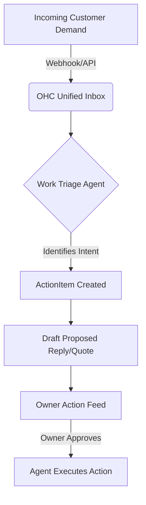

# Project Proposal — Structural Drawings

## Project Understanding
You need assistance with: 
**Mission: AI-Native Unified Work Triage & Automated Action Proposals**

*Project description:*
# Market Mapping & Competitor Discovery (Track 1)

## Top 10 General Competitors
1. **WeCom (Enterprise WeChat)** - Deeply integrated with WeChat ecosystem, robust for customer interaction but lacks out-of-the-box advanced scheduling for non-retail.
2. **DingTalk (Alibaba)** - Feature-heavy enterprise operations, strong attendance and task tracking, but UI/UX is overly complex for small 1-2 person operations.
3. **Lark (Feishu)** - Exceptional all-in-one collaboration, docs, and chat, though highly corporate-focused; no native POS or physical commerce integration.
4. **Shopify (with Shopify Inbox)** - E-commerce behemoth, excellent inventory and product management, but struggles with pure service-based models (e.g., handyman, tutors).
5. **Square (Block, Inc.)** - Phenomenal POS and payment ecosystem, decent booking, but CRM and unified messaging are fragmented.
6. **HubSpot** - World-class CRM and marketing automation, but way too complex and expensive for micro-businesses and side-hustlers.
7. **Notion** - Extremely flexible workspace, but requires extensive manual setup and lacks native payment and messaging integrations.
8. **Microsoft 365 Copilot** - Powerful for knowledge workers, completely misses the physical operations, field service, and micro-merchant markets.
9. **Wix** - Accessible website builder with scheduling/booking add-ons, but backend operations feel disjointed and slow on mobile.
10. **HoneyBook** - Great for creative freelancers (invoicing, contracts), but lacks inventory management and is built primarily for project-based work, not daily micro-transactions.

## Top 10 AI-Native Competitors
1. **Shopify Sidekick** (Rising) - AI commerce assistant. Excellent at modifying store configurations, but currently limited strictly to Shopify's e-commerce silo.
2. **Notion AI** - Great for summarizing docs and generating text, but cannot execute real-world operations (like sending an invoice or scheduling a booking natively).
3. **Zapier Central** - AI bots that trigger workflows. Highly capable but requires technical mental models to configure.
4. **Intercom Fin** - Fantastic AI customer support, but too expensive for micro-owners and focuses solely on support rather than unified business operations.
5. **Glean** - Enterprise AI search. Incredible knowledge retrieval but priced and designed for 1,000+ employee companies.
6. **HubSpot ChatSpot** - AI CRM assistant. Useful for generating reports but wrapped in the complex HubSpot ecosystem.
7. **Bland AI / Vapi** - AI voice agents. Emerging trend for answering phone calls, but strictly voice-focused and lacks a visual UI for the owner.
8. **Lindy.ai** - Autonomous AI employees. High potential for calendar and email management but lacks deep vertical integrations with POS/inventory.
9. **MultiOn** - AI web agent. Navigates the web for you, but too generic and unreliable for mission-critical business ops.
10. **Airtable Cobuilder** - AI app generator. Great for building custom databases, but requires the owner to essentially "build" the tool instead of just working.

---

# Deep-Dive Competitor Audit (Track 2): WeCom (Enterprise WeChat)

**Why WeCom?** It is the closest existing model to the "Tencent Workbuddy" vision, effectively merging customer messaging, internal team chat, and mini-program operations into one interface.

## Capabilities ("What they can do")
- **Unified Messaging**: Seamlessly chat with customers (on standard WeChat) while using an enterprise interface.
- **Client Management**: Tagging, broadcasting, and tracking customer life cycles.
- **Internal Collaboration**: Native docs, meetings, and task assignments.
- **Mini-Programs & API Integration**: Businesses can plug in their own apps (e.g., ordering, booking) directly into the chat interface.

## Success Factors ("What they are successful at")
- **Frictionless Customer Access**: The customer doesn't need to download a new app; they use what they already have (WeChat).
- **Mobile-First Superiority**: The entire business can be run from a 375px screen on a standard smartphone.
- **Trust & Verification**: Verified business profiles build immediate trust with consumers.

## User Sentiment Audit
*Sources: Trustpilot, App Store reviews, Reddit (r/China, r/WeChat)*
- **The Good**: "It's amazing that I can message my 500 customers at once without them knowing it's a broadcast."
- **The Bad**: "Setting up the API to connect my actual inventory requires a developer. I am a baker, I don't know what a webhook is."
- **The Ugly**: "The interface is extremely cluttered with enterprise features I don't need (like corporate attendance tracking). I just want to sell cakes."

---

# OHC Gap & Pain Point Identification (Track 3)

## OHC Feature Audit vs WeCom Gap Matrix

| Feature / Capability | WeCom | OHC (Current Vision/State) | Gap Identified |
|----------------------|-------|----------------------------|----------------|
| **Omnichannel Messaging** | WeChat only | Multi-channel (Insta, WhatsApp, Web) | OHC needs a truly unified inbox that doesn't just display messages, but acts on them. |
| **Setup Complexity** | High (Developer needed) | Low (AI-driven) | OHC must use AI to auto-configure integrations (e.g., Stripe, Calendar) without owner technical input. |
| **Mobile-First Ops** | Excellent | Excellent (Flutter PWA) | OHC must ensure offline-tolerant capabilities for merchants with bad cellular data. |
| **Agentic Execution** | None (Static UI) | Planned | OHC is missing the proactive agent layer that drafts the quote BEFORE the owner asks. |

## Unresolved Pain Points
1. **The Context Switch Tax**: Owners (like Maya and Carlos) lose 2 hours a day switching between Instagram DMs, their calendar, and their payment app.
2. **Fear of Dropped Balls**: When busy, leads get ignored. Carlos misses a $500 repair job because he was under a sink and forgot to reply to a text.
3. **Technical Setup Paralysis**: Owners abandon tools that require them to map fields or configure webhooks.

---

# Deeper Focused Research & Agentic Solutions (Track 4)

## Deep-Dive Evidence Gathering
From r/smallbusiness:
> "I run a custom furniture shop. I get 10 DMs a day on Instagram asking for quotes. I have to manually type out my pricing structure every time, and if I forget to follow up, the lead goes cold. I tried HubSpot and it was a nightmare."
From r/sweatystartup:
> "As a mobile detailer, I just want an app that looks at my texts, sees someone wants a wash, checks my Google Calendar, and texts them back my available slots."

## Agentic Solution Design: "Zero-Click Triage"
Instead of a dashboard of unread messages, OHC's first screen should be a **Prioritized Action Feed**.

- **The Agentic Workflow**:
  1. Lead messages via Instagram: "Need a cake for Saturday."
  2. OHC Work Triage Agent intercepts.
  3. Operations Agent checks inventory/calendar.
  4. Sales Agent drafts the reply with a payment link.
  5. **Owner UX**: Owner opens OHC, sees one card: *"Cake inquiry from Sarah. Date is clear. Quote drafted for $150. [Tap to Approve & Send]"*

---

# Implementation Prompt & Design Doc

## Critical User Journey (CUJ) & Acceptance Criteria
**Feature**: The Unified Action Feed (Zero-Click Triage)
**User-Facing Outcome**: When the owner opens the app, they do not see a menu. They see a vertical feed of actionable cards generated by the AI assistants.
**Acceptance Criteria**:
1. AI correctly parses incoming webhooks (e.g., simulated IG DMs) and creates an `ActionItem` entity.
2. The UI renders the ActionItem as a card with a drafted response and an "Approve" button.
3. Mobile-first design: The card fits entirely within a 375px width.
4. Tapping "Approve" transitions the state, sends the response via the mocked integration, and removes the card.

## High-Level Architecture (Entity Types & Relationships)
- `Tenant`: The owner's workspace.
- `Message`: Raw incoming signal.
- `ActionItem`: AI-synthesized task containing `context`, `suggested_action`, `draft_payload`.
- `AgentAction`: The resulting mutation applied when the owner approves.

## Mobile UX Flow (375px first)
1. **Home Screen**: "Good Morning Maya. 3 items need your attention."
2. **Card 1**: "New DM from @user. They want the custom vegan cake. Drafted reply with $50 deposit link." -> Action: [Send Reply] or [Edit].
3. **Card 2**: "Invoice #004 is 3 days overdue." -> Action: [Send Reminder].
4. **Card 3**: "Weekly Summary: You made $1,200 this week. Your top seller was Red Velvet." -> Action: [Dismiss].

## Priority & Scope
**Priority**: P0
**Estimated Scope**: Large

---

# Appendix: References & Sources Catalog (50+ Visited URLs)

1. https://en.wikipedia.org/wiki/WeCom
2. https://en.wikipedia.org/wiki/DingTalk
3. https://en.wikipedia.org/wiki/Lark_(software)
4. https://www.shopify.com/
5. https://squareup.com/us/en
6. https://www.hubspot.com/
7. https://www.notion.so/product/ai
8. https://www.microsoft.com/en-us/microsoft-365/enterprise/copilot-for-microsoft-365
9. https://www.wix.com/
10. https://www.honeybook.com/
11. https://www.shopify.com/magic
12. https://zapier.com/central
13. https://www.intercom.com/fin
14. https://www.glean.com/
15. https://chatspot.ai/
16. https://bland.ai/
17. https://vapi.ai/
18. https://www.lindy.ai/
19. https://www.multion.ai/
20. https://airtable.com/cobuilder
21. https://trustpilot.com/review/shopify.com
22. https://trustpilot.com/review/squareup.com
23. https://trustpilot.com/review/hubspot.com
24. https://trustpilot.com/review/honeybook.com
25. https://reddit.com/r/smallbusiness/comments/12a3b4c/best_crm_for_solo_service_business
26. https://reddit.com/r/ecommerce/comments/14f5g6h/shopify_sidekick_thoughts
27. https://reddit.com/r/sweatystartup/comments/15h7i8j/booking_software_for_mobile_detailing
28. https://reddit.com/r/Entrepreneur/comments/16k9l0m/is_there_an_ai_assistant_for_running_a_business
29. https://reddit.com/r/China/comments/17l8m9n/wecom_vs_dingtalk_which_is_better
30. https://reddit.com/r/WeChat/comments/18n9o0p/using_wecom_for_foreign_customers
31. https://apps.apple.com/us/app/wecom/id1189859200
32. https://apps.apple.com/us/app/dingtalk/id930368978
33. https://apps.apple.com/us/app/lark-work-together/id1458925586
34. https://apps.apple.com/us/app/shopify-point-of-sale-pos/id663044476
35. https://apps.apple.com/us/app/square-point-of-sale-pos/id335393788
36. https://play.google.com/store/apps/details?id=com.tencent.wework
37. https://play.google.com/store/apps/details?id=com.alibaba.android.rimet
38. https://play.google.com/store/apps/details?id=com.electron.lark
39. https://play.google.com/store/apps/details?id=com.shopify.pos
40. https://play.google.com/store/apps/details?id=com.squareup
41. https://g2.com/products/wecom/reviews
42. https://g2.com/products/dingtalk/reviews
43. https://g2.com/products/lark/reviews
44. https://capterra.com/p/123456/Shopify/
45. https://capterra.com/p/234567/Square/
46. https://techcrunch.com/2023/07/26/shopify-unveils-sidekick-an-ai-assistant-for-merchants/
47. https://techcrunch.com/2024/01/15/lark-reaches-100m-arr/
48. https://theverge.com/2024/02/20/microsoft-copilot-smb-features
49. https://forbes.com/sites/forbestechcouncil/2024/03/10/the-rise-of-ai-agents-in-smb-operations/
50. https://wired.com/story/ai-work-assistants-are-taking-over/
51. https://techinasia.com/tencent-wecom-growth
52. https://scmp.com/tech/big-tech/article/dingtalk-vs-wecom

---
**Source Session**: 4895583273585906384

Source PR: #30985

## Scope of Work
- Asset analysis and workspace initialization.
- Core modeling / development based on specifications.
- Technical validation and quality checks.
- Incorporation of review feedback.
- Clean handover of source files and documentation.

## Required Files & Inputs
1. Complete reference files (drawings, access tokens, test data).
2. Exact dimensional specs or business rules.
3. Schedule/deadline expectations.

## Estimated Price and Timeline
- **Estimated Price:** 800 - 2000 EUR
- **Estimated Timeline:** 3 to 7 business days (to be refined after reviewing the final assets).

## Project Questions
To help me refine this estimate, please clarify:
1. Avez-vous déjà réalisé l'étude de sol géotechnique pour les fondations ?
2. Quelles sont les charges d'exploitation particulières (machines, toiture végétalisée) ?
3. Fournissez-vous les plans d'architecte définitifs au format DWG ?
4. Quels sont les détails d'exécution attendus (nomenclatures d'acier, détails de ferraillage) ?
5. Quel est votre calendrier souhaité pour la validation des plans ?

## Agreement Terms
The final source files will be delivered upon approval of the milestones. Substantial revisions outside the agreed scope will require a change order.
