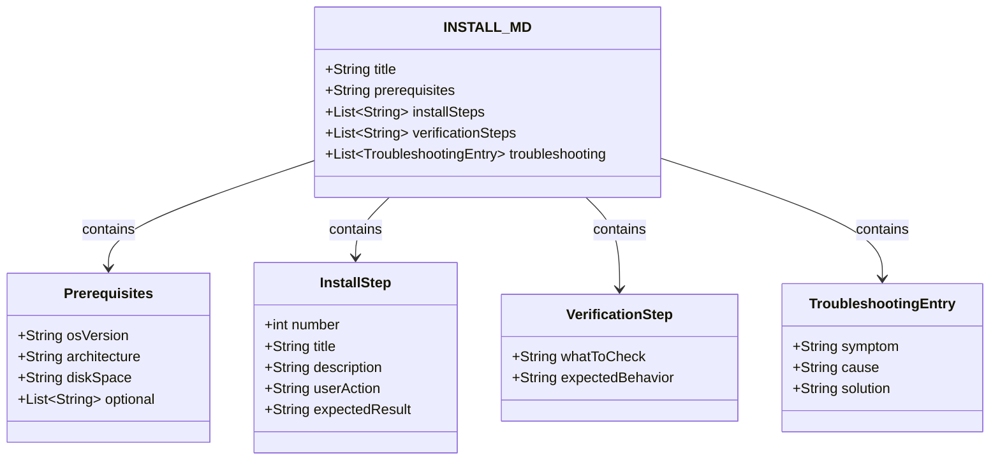

# Project Proposal — Structural Drawings

## Project Understanding
You need assistance with: 
**5.6 Write INSTALL.md**

*Project description:*
---
task: 5.6
phase: 5
type: chore
depends_on: [5.5]
delivers: "INSTALL.md with prerequisites, installation steps, verification, and troubleshooting"
interface_type: "Documentation (Markdown)"
---

## Description

Write a concise INSTALL.md document at the repository root providing clear, step-by-step instructions for installing and launching Platform Console on macOS. The document serves as the primary reference for end users downloading the application from GitHub Releases. It must cover prerequisites, the complete installation workflow from .dmg download to first launch, verification that the application is working correctly, and common troubleshooting scenarios.

The document must be written in plain, accessible language suitable for users who may not be technically familiar with macOS security features like Gatekeeper. It should explicitly address the ad-hoc signing limitation: users must right-click → Open on first launch to bypass Gatekeeper, and this is normal expected behavior (not an error).

The installation steps must be: (1) download the .dmg from GitHub Releases, (2) double-click to mount the .dmg, (3) drag the app to the Applications folder, (4) right-click → Open for first launch (with screenshots or clear description), (5) verify the app opens and the globe renders. Troubleshooting covers Gatekeeper blocking, corrupted download verification, and permission issues.

## UML Class Diagram



## Interface Requirements

### Test Data Shape (JSON)

```json
{
  "document": {
    "path": "INSTALL.md",
    "sections": [
      "Platform Console Installation Guide",
      "Prerequisites",
      "Installation Steps",
      "Verification",
      "Troubleshooting",
      "Uninstalling"
    ]
  },
  "prerequisites": {
    "os": "macOS 14 (Sonoma) or later",
    "architecture": "Apple Silicon (M1/M2/M3/M4) or Intel with Rosetta 2",
    "diskSpace": "~500 MB free",
    "gpu": "Metal-capable GPU (all Macs from 2017+)"
  },
  "installSteps": [
    {
      "step": 1,
      "title": "Download",
      "action": "Download PlatformConsole.dmg from GitHub Releases page"
    },
    {
      "step": 2,
      "title": "Mount Disk Image",
      "action": "Double-click the .dmg file to mount it"
    },
    {
      "step": 3,
      "title": "Install",
      "action": "Drag Platform Console.app to the Applications folder"
    },
    {
      "step": 4,
      "title": "First Launch",
      "action": "Right-click (or Control-click) Platform Console.app in Applications → select Open → click Open in the dialog"
    }
  ]
}
```

### Validation Constraints

- File location: repository root (`INSTALL.md`)
- Must use Markdown format with proper headings (#, ##, ###)
- Must include exactly the following sections (in order):
  1. Platform Console Installation Guide (title + brief intro sentence)
  2. Prerequisites (list with bullet points)
  3. Installation Steps (numbered list, 4 steps)
  4. Verification (bullet list of things to check)
  5. Troubleshooting (table or bullet list with symptom/solution pairs)
  6. Uninstalling (brief section)
- Prerequisites MUST state: macOS 14 (Sonoma) or later, nothing else required
- Installation step 4 MUST describe right-click → Open explicitly, with explanation of why
- Verification MUST include: 3D globe renders, terrain visible, sidebar tree shows nodes, property grid loads
- Troubleshooting MUST cover at least 3 scenarios: Gatekeeper block, corrupted download, app not opening
- Must NOT include any placeholder text or TODO items
- Must NOT reference internal development paths or build instructions
- Must be written at a user comprehension level (8th grade reading level, no jargon)
- Must include a note about Gatekeeper being expected behavior, NOT an error
- File encoding: UTF-8

### API Operations

```
// INSTALL.md structure (pseudocode)
# Platform Console Installation Guide
Brief intro paragraph

## Prerequisites
- macOS 14 (Sonoma) or later
- ~500 MB free disk space

## Installation Steps
1. Download PlatformConsole.dmg from GitHub Releases
2. Double-click the .dmg file to mount it
3. In the Finder window that opens, drag "Platform Console.app" 
   to the "Applications" folder
4. Go to Applications in Finder, right-click (or Control-click) 
   "Platform Console.app", select "Open", then click "Open" in the dialog
   (This is only needed the first time you launch the app)

## Verification
- The app opens without error messages
- The 3D globe renders with Earth terrain
- The sidebar tree on the left shows network topology nodes
- Clicking a node in the tree loads its properties in the right panel

## Troubleshooting
(Table with symptom/cause/solution entries)

## Uninstalling
Drag Platform Console.app from Applications to Trash, then empty Trash
```

### Interactive Flow & States

```
User installation flow (as described in INSTALL.md):
  1. READ Prerequisites → verify macOS version, disk space
  2. Step 1: Download .dmg from GitHub → file appears in ~/Downloads/
  3. Step 2: Double-click .dmg → mounted at /Volumes/Platform Console/
     → Finder window shows app icon + Applications folder
  4. Step 3: Drag app → Applications → macOS copies ~400MB
  5. Step 4: Right-click → Open in Applications → Gatekeeper dialog appears
     → Click "Open" → App launches ✓
  6. Verification: Check globe renders, sidebar works, property grid loads
  7. If issues: consult Troubleshooting section
```

## Acceptance Criteria

### Scenario 1: INSTALL.md exists at repository root
**Given** the repository is checked out
**When** checking the file listing
**Then** `INSTALL.md` exists at the repository root
**And** the file is not empty

### Scenario 2: Prerequisites section lists only macOS 14+
**Given** the INSTALL.md document
**When** reading the Prerequisites section
**Then** it states macOS 14 (Sonoma) or later is required
**And** no other mandatory prerequisites (no npm, no Python, no Homebrew)
**And** disk space requirement is mentioned (~500MB)

### Scenario 3: Installation steps are clear, numbered, and actionable
**Given** the Installation Steps section
**When** reading the steps
**Then** exactly 4 steps are listed (numbered 1-4)
**And** each step has a clear action the user must perform
**And** step 4 explicitly describes right-click → Open for first launch
**And** step 4 explains that this is only needed once (subsequent launches don't need it)

### Scenario 4: Verification section describes working app behavior
**Given** the Verification section
**When** reading the verification items
**Then** it mentions the 3D globe rendering
**And** it mentions the sidebar tree showing nodes
**And** it mentions the property grid loading data
**And** it uses positive, observable behaviors (not "if X works then Y")

### Scenario 5: Troubleshooting covers Gatekeeper blocking
**Given** the Troubleshooting section
**When** searching for Gatekeeper-related troubleshooting
**Then** there is an entry for "App is blocked by Gatekeeper"
**And** the solution references System Settings → Privacy & Security → Open Anyway
**And** it explains this is expected for ad-hoc signed applications

### Scenario 6: Troubleshooting covers corrupted download
**Given** the Troubleshooting section
**When** searching for download-related issues
**Then** there is an entry for "App is damaged and can't be opened"
**And** the solution suggests re-downloading the .dmg
**And** explains that macOS may quarantine incomplete downloads

### Scenario 7: Negative case — no developer jargon or internal references
**Given** the entire INSTALL.md document
**When** searching for developer-focused terms
**Then** terms like "flutter", "dart", "dylib", "cmake", "xcode", "ffi" do not appear
**And** no internal file paths (e.g., `/app_flutter/build/`) are mentioned
**And** no build instructions are included (this is for end users, not developers)

### Scenario 8: Negative case — uninstalling instructions are present
**Given** the uninstalling section
**When** reading it
**Then** it describes dragging the app from Applications to Trash
**And** notes that emptying the Trash permanently removes the app
**And** mentions that user data/settings location should be noted if applicable

## Source References

- DMG packaging (5.5): `app_flutter/build/PlatformConsole.dmg` — the file users download
- Code signing (5.4): ad-hoc signing — explains why right-click → Open is needed
- GitHub Releases (5.7): release page where users download the .dmg
- Apple Gatekeeper docs: [Safely open apps on your Mac](https://support.apple.com/guide/mac-help/mh40616/mac)


## Scope of Work
- Asset analysis and workspace initialization.
- Core modeling / development based on specifications.
- Technical validation and quality checks.
- Incorporation of review feedback.
- Clean handover of source files and documentation.

## Required Files & Inputs
1. Complete reference files (drawings, access tokens, test data).
2. Exact dimensional specs or business rules.
3. Schedule/deadline expectations.

## Estimated Price and Timeline
- **Estimated Price:** 800 - 2000 EUR
- **Estimated Timeline:** 3 to 7 business days (to be refined after reviewing the final assets).

## Project Questions
To help me refine this estimate, please clarify:
1. Avez-vous déjà réalisé l'étude de sol géotechnique pour les fondations ?
2. Quelles sont les charges d'exploitation particulières (machines, toiture végétalisée) ?
3. Fournissez-vous les plans d'architecte définitifs au format DWG ?
4. Quels sont les détails d'exécution attendus (nomenclatures d'acier, détails de ferraillage) ?
5. Quel est votre calendrier souhaité pour la validation des plans ?

## Agreement Terms
The final source files will be delivered upon approval of the milestones. Substantial revisions outside the agreed scope will require a change order.
