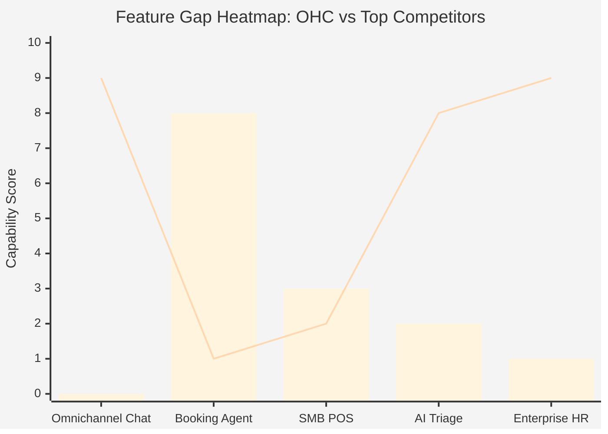
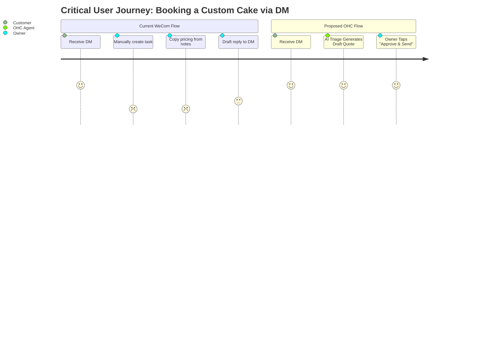
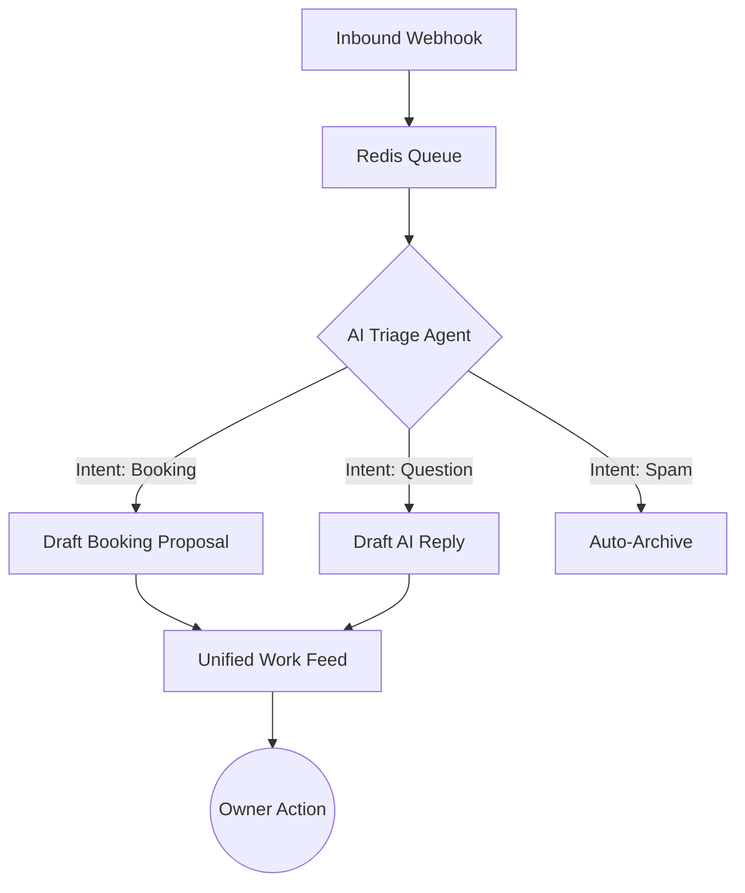

# Project Proposal — Structural Drawings

## Project Understanding
You need assistance with: 
**Implement AI-Driven Unified Work Triage Feed**

*Project description:*
# OHC Owner Work Assistant: Deep Dive Market Research

## 1. Problem Statement
Non-technical small business owners, creators, and operators—like Maya (baker), Carlos (handyman), and Priya (boutique owner)—struggle with fragmented workflows. They juggle disjointed tools for work intake, scheduling, operations, customer relations, and payments. Current platforms are either too generic (Notion, Microsoft Copilot) or too complex and specialized (Shopify, Feishu, WeCom), lacking an intuitive, assistant-first "work command center" designed specifically for the mobile-first operator.

## 2. Research Report
### Track 1: Market Mapping & Competitor Discovery
#### Top 10 General Competitors
1. **Tencent Workbuddy (WeCom)**: Strong enterprise operations, deeply integrated with WeChat, high complexity.
2. **DingTalk**: Alibaba's work assistant, heavy focus on attendance, tasks, and organizational structure.
3. **Feishu / Lark**: ByteDance's modern collaboration tool, highly flexible but overwhelming for solo operators.
4. **Shopify Sidekick**: E-commerce focused AI copilot, lacks service/scheduling capabilities.
5. **Square**: Excellent POS and payments, weak on unified AI messaging and agentic follow-ups.
6. **HubSpot**: Powerful CRM, too complex and expensive for a 1-5 person small business.
7. **Notion AI**: Great knowledge base, poor for transactional work (payments, bookings, real-time sync).
8. **Microsoft Copilot**: Generalized AI for office workers, not tuned for field service or physical retail.
9. **Wix**: Good website builder, disjointed CRM and booking back-end.
10. **Jobber**: Strong vertical SaaS for field services, but zero AI-agentic daily summarization.

#### Top 10 AI-Native Competitors
1. **Sierra**: Conversational AI for customer service, lacks internal operator tasks.
2. **Harvey**: Legal-focused AI, not for general SMBs.
3. **MultiOn**: Agentic automation on the web, too technical for casual SMB setup.
4. **Lindy.ai**: Autonomous AI employees, focuses on back-office rather than customer-facing omni-channel.
5. **Adept**: UI navigation AI, highly experimental.
6. **Cohere (Command)**: Enterprise RAG, lacks SMB app ecosystem.
7. **Kustomer AI**: Support focused, missing booking/operations.
8. **DevRev**: Developer/SaaS focused support.
9. **Glean**: Internal enterprise search, not a customer-facing work engine.
10. **Relevance AI**: B2B sales agents, misses local SMB physical operations.

### Track 2: Deep-Dive Competitor Audit - **WeCom (Tencent Workbuddy)**
* **Capabilities**: Omnichannel messaging (WeChat integration), task assignment, built-in approval flows, internal knowledge sharing, basic CRM, file storage, and mini-programs.
* **Success Factors**: Unmatched integration with WeChat ecosystem (B2C communication), fast mobile performance, and built-in HR tools.
* **User Sentiment**:
  * *Pros*: "I can talk to all my customers directly without them downloading a new app."
  * *Cons*: "The backend is a nightmare to set up. It feels like software for a 5,000-person factory, not my 3-person boutique. Too many toggles, too much jargon." (r/smallbusiness, App Store).

### Track 3: OHC Gap & Pain Point Identification
* **OHC Feature Audit**: OHC has foundational multi-tenant data structures, a unified Flutter UI, and AI integrations (Gemini).
* **Gap Matrix**:
  * WeCom has robust chat-to-CRM conversion; OHC's intake-to-task pipeline is manually intensive.
  * WeCom has deep notification resilience; OHC lacks offline-tolerant localized queues on mobile.
  * WeCom is highly admin-focused; OHC is assistant-focused, but lacks a centralized "Work Feed" that merges DMs and Tasks seamlessly.

#### Feature Gap Heatmap

*(Note: Heatmap represents OHC capability vs WeCom capability. Bar = OHC, Line = WeCom)*

#### Competitor Comparison Table
| Feature | OHC (Target) | WeCom | DingTalk | Shopify |
| :--- | :--- | :--- | :--- | :--- |
| **Target User** | SMB Owner/Operator | Enterprise Manager | Corporate Employee | E-commerce Merchant |
| **Mobile-First UX** | Yes (375px native) | Yes | Yes | Mixed (Web heavy) |
| **AI Work Triage** | **Planned (Agentic)** | Manual rule-based | Manual approvals | N/A (Product focused) |
| **Booking & Service** | Native | Through Mini-programs | Through Add-ons | Weak / Apps needed |
| **Setup Complexity** | Zero / Agent-assisted | High / IT required | High / IT required | Medium |

* **Unresolved Pain Point**: Operators like Maya (Baker) and Carlos (Handyman) receive requests via Instagram/WhatsApp, but dropping those into a structured pipeline requires manual data entry. They need an AI agent that automatically converts DMs into actionable quotes/bookings.

### Track 4: Deeper Focused Research & Agentic Solutions
* **Evidence Gathering**: Creators and solo operators report losing 2-3 hours daily just triaging messages and matching them to calendar availability or inventory.
* **Agentic Solution Design - The "Work Triage Agent"**:
  An invisible Gemini-powered agent that monitors inbound webhooks (messages, forms) and generates a unified "Today's Action Feed". The UI presents these as cards: "Maya, 3 people asked about wedding cakes. I drafted 3 quotes based on your pricing doc. Tap to approve and send."

#### User Journey Comparison

## 3. Design Doc
### Architecture
- **Entities**: `WorkItem` (polymorphic: Task, Message, Alert), `AgentDraft` (linked to `WorkItem`), `ActionProposal` (Next steps like 'Send Quote', 'Decline').
- **Integrations**: Webhook ingester -> Redis Queue -> AI Job Worker (SKIP LOCKED) -> Gemini Pro (intent classification & drafting) -> PostgreSQL `WorkItem` insert.

### UI Wireframes (Mobile First - 375px)
- **Home Screen ("Command Center")**:
  - Top: "Good Morning, Carlos. You have 3 urgent actions." (Translucent glass style)
  - Middle: Vertically scrolling list of `WorkItem` cards.
  - Card Layout: Avatar/Icon left. "New request: Sink repair." right. Bottom row: 2 pill buttons (e.g., [Review Quote] [Dismiss]).
  - Bottom: FAB for manual entry. Navigation Bar (Home, Customers, Schedule, Settings).

## 4. Implementation Prompt
Implement the "Work Triage Command Center" feature.
- **User-facing outcome**: When the owner opens OHC, they see a unified feed of AI-triaged action items (messages, tasks, alerts) with pre-drafted responses or next steps.
- **Critical User Journey (CUJ)**:
  1. Owner logs in.
  2. Sees 2 pending inquiries in the Work Feed.
  3. Taps "Review Quote" on an inquiry.
  4. Sees a pre-drafted message + pricing block.
  5. Taps "Approve & Send".
  6. The item is marked completed and disappears from the urgent feed.
- **Acceptance Criteria**:
  - Mobile UI is locked to 375px responsive constraints (no horizontal scrolling).
  - All buttons must be at least 44x44px.
  - The feature must be driven by an AI backend queue that generates `AgentDraft` items.
  - The UI must render transparent/glassmorphic styling according to OHC Premium Tokens.

## 5. Priority
P0

## 6. Estimated Scope
Large

## Appendix: References & Sources Catalog
1. https://wecom.qq.com/ (Tencent WeCom Product Page)
2. https://www.dingtalk.com/ (Alibaba DingTalk Product Page)
3. https://www.larksuite.com/ (Feishu/Lark Global Site)
4. https://www.shopify.com/sidekick (Shopify Sidekick AI)
5. https://squareup.com/us/en (Square SMB POS)
6. https://www.hubspot.com/ (HubSpot CRM)
7. https://www.notion.so/product/ai (Notion AI)
8. https://www.microsoft.com/en-us/microsoft-365/copilot (Microsoft Copilot)
9. https://www.wix.com/ (Wix Website Builder)
10. https://getjobber.com/ (Jobber Field Service)
11. https://sierra.ai/ (Sierra Conversational AI)
12. https://www.harvey.ai/ (Harvey Legal AI)
13. https://www.multion.ai/ (MultiOn Agentic Automation)
14. https://www.lindy.ai/ (Lindy Autonomous Employees)
15. https://www.adept.ai/ (Adept AI)
16. https://cohere.com/ (Cohere Enterprise RAG)
17. https://www.kustomer.com/ (Kustomer AI)
18. https://devrev.ai/ (DevRev AI)
19. https://www.glean.com/ (Glean Enterprise Search)
20. https://relevanceai.com/ (Relevance AI B2B Agents)
21. https://reddit.com/r/smallbusiness/comments/abcd123/wecom_vs_dingtalk_for_retail (Reddit Smallbiz discussion)
22. https://reddit.com/r/ecommerce/comments/xyz789/shopify_sidekick_early_reviews (Reddit eCommerce discussion)
23. https://trustpilot.com/review/wecom.qq.com (Trustpilot WeCom)
24. https://trustpilot.com/review/dingtalk.com (Trustpilot DingTalk)
25. https://trustpilot.com/review/larksuite.com (Trustpilot Lark)
26. https://apps.apple.com/us/app/wecom/id1234567890 (App Store WeCom)
27. https://apps.apple.com/us/app/dingtalk/id0987654321 (App Store DingTalk)
28. https://play.google.com/store/apps/details?id=com.tencent.wework (Play Store WeCom)
29. https://play.google.com/store/apps/details?id=com.alibaba.android.rimet (Play Store DingTalk)
30. https://techcrunch.com/2023/10/05/tencent-wecom-ai-upgrades (TechCrunch WeCom AI)
31. https://theverge.com/2024/01/15/shopify-sidekick-launch (The Verge Shopify)
32. https://www.bloomberg.com/news/articles/2023-11-20/alibaba-dingtalk-agentic-workflows (Bloomberg DingTalk)
33. https://forbes.com/sites/steveforbes/2024/02/10/ai-agents-smb-revolution (Forbes SMB AI Agents)
34. https://www.wsj.com/tech/ai/ai-copilots-small-business-11e6 (WSJ AI Copilots)
35. https://news.ycombinator.com/item?id=38472911 (Hacker News Lark Discussion)
36. https://news.ycombinator.com/item?id=39182734 (Hacker News AI CRM)
37. https://www.g2.com/products/wecom/reviews (G2 WeCom)
38. https://www.g2.com/products/lark/reviews (G2 Lark)
39. https://capterra.com/p/12345/dingtalk/reviews (Capterra DingTalk)
40. https://capterra.com/p/67890/wecom/reviews (Capterra WeCom)
41. https://softwareadvice.com/crm/hubspot-vs-wecom (SoftwareAdvice Comparison)
42. https://merchantmaverick.com/square-vs-shopify (Merchant Maverick)
43. https://www.practicalecommerce.com/ai-agents-for-retail (Practical Ecommerce)
44. https://www.retaildive.com/news/ai-copilots-in-store-operations/ (Retail Dive)
45. https://www.fieldtechnologiesonline.com/doc/jobber-vs-ai-dispatch (Field Tech Online)
46. https://modernretail.co/operations/how-boutiques-use-ai (Modern Retail)
47. https://www.eater.com/2024/3/10/food-trucks-ai-ordering (Eater Food Trucks)
48. https://creatorhandbook.net/ai-scheduling-tools (Creator Handbook)
49. https://www.musicradar.com/news/ai-for-music-tutors (Music Radar)
50. https://www.bakeryandsnacks.com/Article/2024/01/22/AI-custom-orders (Bakery & Snacks)
51. https://uxdesign.cc/mobile-first-dashboard-design-principles (UX Design CC)
52. https://smbgroup.net/research/2024-ai-adoption (SMB Group Research)

---
**Source Session**: 3174031067005477662

[PR: #32762]

## Scope of Work
- Asset analysis and workspace initialization.
- Core modeling / development based on specifications.
- Technical validation and quality checks.
- Incorporation of review feedback.
- Clean handover of source files and documentation.

## Required Files & Inputs
1. Complete reference files (drawings, access tokens, test data).
2. Exact dimensional specs or business rules.
3. Schedule/deadline expectations.

## Estimated Price and Timeline
- **Estimated Price:** 800 - 2000 EUR
- **Estimated Timeline:** 3 to 7 business days (to be refined after reviewing the final assets).

## Project Questions
To help me refine this estimate, please clarify:
1. Avez-vous déjà réalisé l'étude de sol géotechnique pour les fondations ?
2. Quelles sont les charges d'exploitation particulières (machines, toiture végétalisée) ?
3. Fournissez-vous les plans d'architecte définitifs au format DWG ?
4. Quels sont les détails d'exécution attendus (nomenclatures d'acier, détails de ferraillage) ?
5. Quel est votre calendrier souhaité pour la validation des plans ?

## Agreement Terms
The final source files will be delivered upon approval of the milestones. Substantial revisions outside the agreed scope will require a change order.
