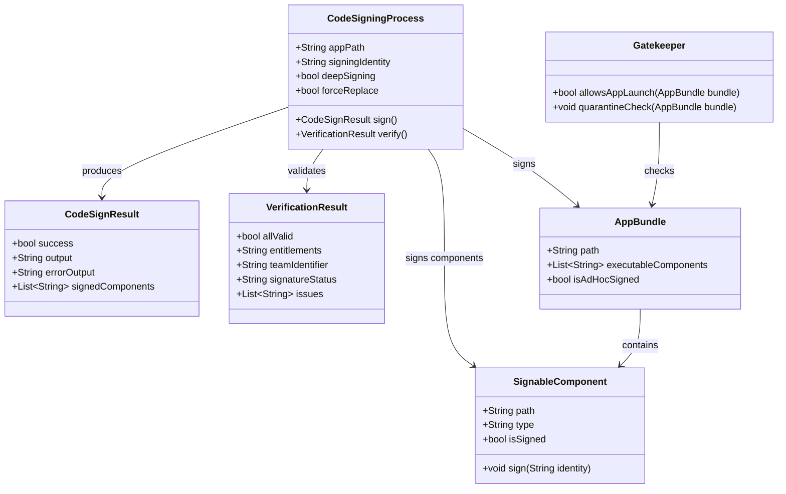

# Project Proposal — Flutter App

## Project Understanding
You need assistance with: 
**5.4 Code-sign the .app bundle**

*Project description:*
---
task: 5.4
phase: 5
type: chore
depends_on: [5.3]
delivers: "Code-sign the .app bundle with ad-hoc signing for macOS distribution"
interface_type: "Build configuration (codesign)"
---

## Description

Code-sign the macOS `.app` release bundle using ad-hoc signing (`codesign --sign '-'`) to satisfy macOS Gatekeeper requirements for local distribution. Ad-hoc signing allows the app to launch without a paid Apple Developer certificate, though users must right-click → Open on first launch to bypass Gatekeeper's initial block. This is the minimum viable signing for distributing a developer tool or internal application via .dmg installer.

The signing process must cover all executable code within the bundle: the main executable binary, the Flutter framework, the App framework, and the embedded cesium-native dylib. The `--deep` flag recursively signs all nested bundles and executables. The `--force` flag replaces any existing signatures. After signing, the bundle is verified using `codesign -vvv` to confirm all signatures are valid and the bundle's seal is intact.

Proper code signing ensures that macOS does not quarantine or block the app, enables the keychain access (if needed), and prevents "app is damaged" errors. The signing is performed as the final step before packaging into a .dmg (5.5).

## UML Class Diagram



## Interface Requirements

### Test Data Shape (JSON)

```json
{
  "signing": {
    "command": "codesign --deep --force --verify --verbose --sign '-' 'Platform Console.app'",
    "identity": "-",
    "flags": ["--deep", "--force", "--verify", "--verbose"]
  },
  "verification": {
    "command": "codesign -vvv 'Platform Console.app'",
    "expectedOutput": [
      "Platform Console.app: valid on disk",
      "Platform Console.app: satisfies its Designated Requirement"
    ],
    "components": [
      "Contents/MacOS/Platform Console",
      "Contents/Frameworks/FlutterMacOS.framework",
      "Contents/Frameworks/App.framework",
      "Contents/Frameworks/libcesium_native_bridge.dylib"
    ]
  },
  "entitlements": {
    "hardenedRuntime": false,
    "network": true,
    "gpuAccess": true
  }
}
```

### Validation Constraints

- Signing identity MUST be `'-'` (ad-hoc signing, no developer certificate)
- `--deep` flag MUST be used to recursively sign all nested code
- `--force` flag MUST be used to replace any existing signatures
- `--verify` flag ensures signature is verified immediately after signing
- `codesign -vvv` verification MUST show "valid on disk" for the .app bundle
- All executable components within the bundle MUST be signed:
  - Main Mach-O executable (Contents/MacOS/Platform Console)
  - FlutterMacOS.framework/Versions/A/FlutterMacOS
  - App.framework/Versions/A/App
  - libcesium_native_bridge.dylib
- After signing, the app MUST launch when right-click → Open is used on first launch
- Ad-hoc signed apps WILL show Gatekeeper warning on first launch ("unidentified developer")
- The signing MUST NOT strip or modify the dylib's rpath (verify with otool -L after signing)
- If signing fails, stderr output MUST be captured and logged
- Signing error exit code MUST cause the build/package pipeline to fail
- No entitlements file needed for ad-hoc signing (basic macOS entitlements implied)

### API Operations

```
// Signing command
$ codesign --deep --force --verify --verbose --sign '-' \
  "app_flutter/build/macos/Build/Products/Release/Platform Console.app"

// Verification command
$ codesign -vvv \
  "app_flutter/build/macos/Build/Products/Release/Platform Console.app"

// Check individual components
$ codesign -dvvv \
  "app_flutter/build/macos/Build/Products/Release/Platform Console.app/Contents/MacOS/Platform Console"

// Verify rpath not corrupted by signing
$ otool -L \
  "app_flutter/build/macos/Build/Products/Release/Platform Console.app/Contents/MacOS/Platform Console"

// Remove quarantine attribute after download (user step)
$ xattr -d com.apple.quarantine "Platform Console.app"
```

### Interactive Flow & States

```
Code signing workflow:
  1. Build complete: unsinged .app bundle exists
  2. Run: codesign --deep --force --verify --verbose --sign '-' App.app
     a. Sign Contents/Frameworks/libcesium_native_bridge.dylib
     b. Sign Contents/Frameworks/App.framework
     c. Sign Contents/Frameworks/FlutterMacOS.framework
     d. Sign Contents/MacOS/Platform Console (main executable)
     e. Sign top-level .app bundle (seal)
  3. Verify: codesign -vvv App.app
     a. Check "valid on disk" for bundle and all components
     b. Check "satisfies its Designated Requirement"
  4. Result: .app is ad-hoc signed, ready for .dmg packaging (5.5)

Gatekeeper launch flow (user perspective):
  1. User downloads .dmg and extracts .app to /Applications
  2. User double-clicks → macOS shows: "Platform Console can't be opened because
     it is from an unidentified developer"
  3. User right-clicks → Open → macOS shows "Are you sure?" dialog
  4. User clicks Open → App launches normally
  5. Subsequent launches: app opens immediately (Gatekeeper remembers choice)

Signing states:
  UNSIGNED → Signing required (won't launch without user intervention)
  ADHOC_SIGNED → Signed with '-' (Gatekeeper warning on first launch, then OK)
  DEV_SIGNED → Signed with Apple Developer ID (no Gatekeeper issues)
  SIGNATURE_BROKEN → Bundle modified after signing (won't launch, "damaged" error)
```

## Acceptance Criteria

### Scenario 1: codesign command completes successfully with ad-hoc signing
**Given** an unsigned `.app` bundle at the expected path
**When** `codesign --deep --force --verify --verbose --sign '-' App.app` is executed
**Then** the command exits with code 0
**And** no error messages are printed to stderr
**And** each signed component is listed in the verbose output

### Scenario 2: codesign verification passes with all checks
**Given** a signed `.app` bundle
**When** `codesign -vvv App.app` is executed
**Then** the output contains "valid on disk"
**And** the output contains "satisfies its Designated Requirement"
**And** no "code object is not signed at all" errors
**And** no "a sealed resource is missing or invalid" errors

### Scenario 3: All components within bundle are signed
**Given** the signed `.app` bundle
**When** checking each nested executable (`codesign -dvvv <component>`)
**Then** the main executable (Platform Console) has a valid ad-hoc signature
**And** FlutterMacOS.framework has a valid signature
**And** App.framework has a valid signature
**And** libcesium_native_bridge.dylib has a valid signature

### Scenario 4: App launches via right-click → Open on first launch
**Given** the ad-hoc signed `.app` is placed in `/Applications/`
**When** the user right-clicks the app and selects "Open"
**And** clicks "Open" in the Gatekeeper confirmation dialog
**Then** the app launches successfully
**And** the 3D globe renders (engine initializes correctly)
**And** no "is damaged and can't be opened" error appears

### Scenario 5: Modification after signing breaks the seal
**Given** a properly signed `.app` bundle
**When** a file inside the bundle is modified (e.g., replacing a resource)
**Then** `codesign -vvv` reports a sealed resource violation
**And** macOS Gatekeeper prevents the app from launching
**And** the user sees "is damaged and can't be opened" error
**And** the proper fix is to re-sign the bundle

### Scenario 6: rpath is preserved after code signing
**Given** the .app bundle after code signing
**When** `otool -L` is run on the main executable
**Then** `@rpath/libcesium_native_bridge.dylib` is still listed as a dependency
**And** the dylib loading path is not modified or corrupted by the signing process

### Scenario 7: Negative case — signing fails on corrupted bundle
**Given** a corrupted `.app` bundle (missing Plist, broken symlink, or directory permissions error)
**When** `codesign --sign '-'` is executed
**Then** the command exits with non-zero status
**And** the error output identifies the specific issue
**And** the build/package pipeline reports failure

### Scenario 8: Negative case — double-signing is idempotent
**Given** an already ad-hoc signed `.app` bundle
**When** `codesign --deep --force --sign '-' App.app` is executed again
**Then** the command succeeds (--force replaces existing sig)
**And** `codesign -vvv` still reports "valid on disk"
**And** no duplicate signature errors occur

## Source References

- macOS release build (5.2): [Release](file:///Users/perkunas/jail/3dgs-002/app_flutter/build/macos/Build/Products/Release/) — .app bundle path
- cesium-native dylib bundling (5.3): dylib in Frameworks, must be included in signing
- Apple Code Signing Guide: `man codesign` — reference for flags and verification
- Gatekeeper documentation: Apple Platform Security — ad-hoc signing behavior


## Scope of Work
- Asset analysis and workspace initialization.
- Core modeling / development based on specifications.
- Technical validation and quality checks.
- Incorporation of review feedback.
- Clean handover of source files and documentation.

## Required Files & Inputs
1. Complete reference files (drawings, access tokens, test data).
2. Exact dimensional specs or business rules.
3. Schedule/deadline expectations.

## Estimated Price and Timeline
- **Estimated Price:** 1500 - 4000 USD
- **Estimated Timeline:** 3 to 7 business days (to be refined after reviewing the final assets).

## Project Questions
To help me refine this estimate, please clarify:
1. Do you have UI designs ready (Figma, Adobe XD) or should we design the screens?
2. Which backend service will the app connect to (REST API, Firebase)?
3. Do you require integration with app stores (App Store, Play Store)?
4. What state management solution do you prefer (Bloc, Riverpod, Provider)?
5. What is your target launch date?

## Agreement Terms
The final source files will be delivered upon approval of the milestones. Substantial revisions outside the agreed scope will require a change order.
