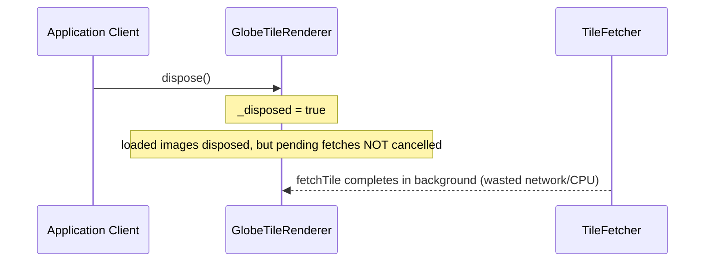

# Project Proposal — Flutter App

## Project Understanding
You need assistance with: 
**[AUDIT] [globe_tile_renderer.dart]: pending fetches not cancelled on dispose**

*Project description:*
## 1. Context and References
- **File**: `app_flutter/lib/domain/cesium_3d/globe_tile_renderer.dart:95-101`
- **Pillar**: Resource Lifecycle
- **Symptom**: Pending asynchronous image fetches and decodes are not cancelled when the renderer is disposed, resulting in network and CPU resource leaks.

## 2. Root Cause Analysis (5 Whys)
1. **Why do network requests and decodes continue after disposal?** Because the pending HTTP requests and image codecs are never cancelled or stopped in the dispose method.
2. **Why are they not cancelled?** Because dispose only releases the memory of already-loaded images and clears the map, neglecting the in-flight tasks.
3. **Why pending fetches are neglected?** Because they are tracked separately in _pendingFetches and the cancellation logic was only written for setProvider.
4. **Why not reuse the cancellation logic?** Because the dispose method was designed to focus only on synchronous cache cleanup of _loadedImages.
5. **Why was asynchronous task lifecycle overlooked?** Because the developer did not account for the lifetime of in-flight Future chains running concurrently after object destruction.

## 3. Correctness Analysis
In dispose() at lines 95-101, the renderer sets _disposed = true, disposes all cached ui.Image objects in _loadedImages, and clears _loadedImages. However, it leaves _pendingFetches populated with keys of currently active tasks. These pending fetches continue executing _fetcher.fetchTile and ui.instantiateImageCodec / codec.getNextFrame in the background. This leaks network requests and CPU cycles (decoding images) that are no longer needed. The invariant violated is: all asynchronous operations started by an object must be terminated/cancelled when that object is disposed.

## 4. UML Diagrams


## 5. Affected Callers / Downstream Impact
- GlobeTileRenderer.dispose — leaves background network fetches and decoding tasks running.
- System performance — unnecessary cellular/Wi-Fi data usage and CPU cycles spent decoding images that will be immediately discarded.

## 6. Proposed Correction
```dart
  void dispose() {
    _disposed = true;
    for (final pendingKey in _pendingFetches.toList()) {
      _fetcher.cancelFetch('$pendingKey/${_activeProvider.name}');
    }
    for (final img in _loadedImages.values.toSet()) {
      img.dispose();
    }
    _loadedImages.clear();
  }
```

## 7. Relationship to Existing Issues
- **Discovered in audit** — new finding.

## Audit Source
Adversarial Resource Lifecycle Audit

SEVERITY: Important
FILE_LOCATION: app_flutter/lib/domain/cesium_3d/globe_tile_renderer.dart:95-101


## Scope of Work
- Asset analysis and workspace initialization.
- Core modeling / development based on specifications.
- Technical validation and quality checks.
- Incorporation of review feedback.
- Clean handover of source files and documentation.

## Required Files & Inputs
1. Complete reference files (drawings, access tokens, test data).
2. Exact dimensional specs or business rules.
3. Schedule/deadline expectations.

## Estimated Price and Timeline
- **Estimated Price:** 1500 - 4000 USD
- **Estimated Timeline:** 3 to 7 business days (to be refined after reviewing the final assets).

## Project Questions
To help me refine this estimate, please clarify:
1. Do you have UI designs ready (Figma, Adobe XD) or should we design the screens?
2. Which backend service will the app connect to (REST API, Firebase)?
3. Do you require integration with app stores (App Store, Play Store)?
4. What state management solution do you prefer (Bloc, Riverpod, Provider)?
5. What is your target launch date?

## Agreement Terms
The final source files will be delivered upon approval of the milestones. Substantial revisions outside the agreed scope will require a change order.
