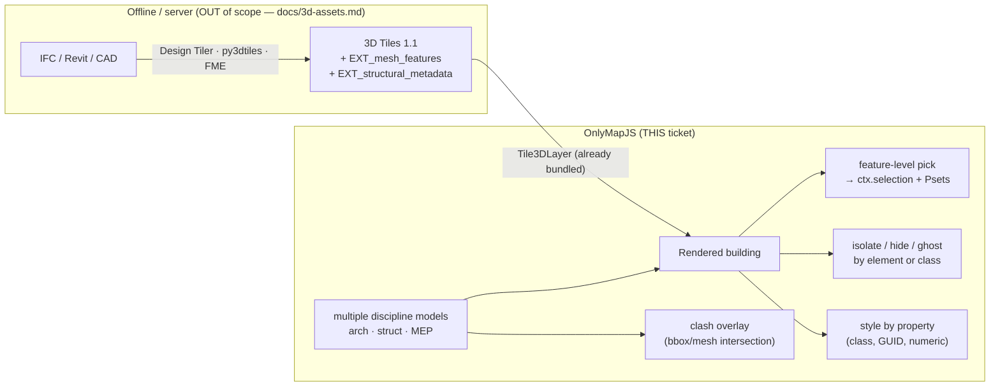

# Project Proposal — Structural Drawings

## Project Understanding
You need assistance with: 
**BIM/IFC building models — metadata-aware 3D Tiles picking, per-element isolation, model federation**

*Project description:*
**Repo:** `NikaGeospatial/onlymap-js`
**Labels:** `enhancement`, `layers`, `3d`, `epic`
**Effort:** Very High *(the industry with the largest 3D market pull, but also the deepest. Re-based after source verification: the critical path is building deck.gl's missing glTF feature-picking sublayer — per-vertex picking-color attribute + shader override + metadata join, templated on deck's internal unexported I3S MeshLayer — which alone is ~3–4 weeks of GPU work; federation/clash on top brings the epic to ~6–8 weeks. Raw IFC conversion stays out of the library by design.)*
**Basis:** OnlyMapJS source at v0.3.x (`layer-registry.ts`, `docs/3d-assets.md`) + a survey of the 2026 web-BIM landscape. **Demand signal (3D deep-dive, table 4, row 1):** AEC digital twins — BIM software market ~$9B (2025) → ~$15B (2030), and the buyer isn't just architects but general contractors (coordination/clash) and owner-operators (handover twins). *All external refs are plain-text, deliberately not hyperlinked — no cross-repo backlinks.*

## TL;DR;

Right now, if you drop a converted building model onto the map, it's just one big dumb shape — click anywhere on it and you get nothing. This ticket makes individual pieces clickable: click a wall, see what it's made of, its ID, its properties. It also lets you hide or ghost out specific parts (say, everything except the plumbing) and show multiple building models at once — architecture, structure, electrical — each toggled on/off, with a way to flag where they physically collide (e.g., a pipe running through a wall). This is the single hardest ticket of the four — turns out doing "click on one exact part of a merged 3D model" requires building a feature deck.gl itself doesn't really have yet, not just flipping a setting.

## Summary — where the boundary already sits

OnlyMapJS has a **deliberate, documented position** on BIM (`docs/3d-assets.md`): *"IFC, CAD, mesh formats → convert on your server to GLB. GLB and 3D Tiles → the manifest renders directly."* That is the right call and this ticket does **not** reverse it — in-browser IFC parsing (web-ifc/WASM) chokes on the 500 MB–2 GB files real buildings ship as, and belongs in a one-time offline step, not a page load. The rendering primitives are already in the curated registry: `ScenegraphLayer` (single GLB per row) and `Tile3DLayer` (streamed 3D Tiles / I3S, LOD-managed).

So what's actually missing is everything that happens **after** the geometry renders. Today a converted building is an opaque mesh: click a wall, get nothing. AEC users need the *semantics* the IFC model carried — and the modern conversion path (Cesium Design Tiler as of Mar 2025, py3dtiles, FME) now preserves them into **3D Tiles 1.1** via the glTF extensions `EXT_mesh_features` (per-element feature IDs) + `EXT_structural_metadata` (typed property tables / Psets keyed to those IDs). loaders.gl's `Tiles3DLoader` already parses these. **This ticket makes OnlyMapJS consume them**: feature-level picking, per-element isolation/hide, styling-by-property, and multi-model federation with clash overlays — the map-library half of a BIM digital twin, built on the pipeline that already exists.



## What already ships (corrected baseline — verified in `layer-registry.ts`)

- **`ScenegraphLayer`** — a glTF/GLB at each data row; `get-orientation="[pitch,yaw,roll]"` (roll 90 stands a Y-up model upright), `lighting="pbr"`, `size-scale`. Georeferencing is carried in the `data` rows (lon/lat from `IfcMapConversion`/`IfcSite`, computed upstream). Documented in `docs/3d-assets.md`.
- **`Tile3DLayer`** — `tileset=` (aliased to deck's `data`), `maximum-screen-space-error`, `maximum-memory-usage`, `view-distance-scale`. Consumes OGC 3D Tiles and Esri I3S through loaders.gl's `Tiles3DLoader`. LOD, frustum culling, tile load/unload are upstream.
- **Picking infra** — `runtime-core.ts` routes deck `onClick`/`onHover` into `ctx.selection`; the stream/adapter layer already fans picks out to per-layer handlers.
- **Scene lighting** (`scene-lighting.ts`) — a `LightingEffect` with solar positioning; extruded/mesh geometry is what it lights.

The gap is that `Tile3DLayer` picks return a coarse tile header, not the **feature** under the cursor, and there is no way to address, isolate, or style an individual element or discipline model.

## Design — five capabilities, one epic

### 1. Feature-level picking (the foundation — and the dominant cost, priced honestly)
When a 3D Tiles tile carries `EXT_mesh_features`, each rendered primitive is partitioned into features by per-vertex feature IDs; `EXT_structural_metadata` holds the property table. loaders.gl **does** decode both extensions by default (the parsed typed arrays land on the glTF primitive's extension objects) — but that is where the good news ends, verified against deck.gl v9.3 source:

- `Tile3DLayer.getPickingInfo()` returns **the tile** (`info.object = sourceTile`), period.
- b3dm/glTF tiles render through a `ScenegraphLayer` with a **single data row** — deck's color-based picking sees one object per tile. There is no per-feature picking on this path, and no deck.gl example ships it.
- The one place deck.gl *does* do Cesium-style batch picking is its internal I3S `MeshLayer`: a per-vertex `uint32` feature-index attribute + `picking_getPickingColorFromIndex()` in the vertex shader. That layer is **not exported** and never used for 3D Tiles content — but it is the exact template for the work.

So this capability is **not** "extend the pick path in `runtime-core.ts`" — it is building deck.gl's missing glTF feature-picking sublayer: a mesh sublayer that (a) uploads the decoded `_FEATURE_ID_0` array as a per-vertex attribute, (b) overrides shaders to emit per-feature picking colors, and (c) overrides `getPickingInfo` to join the picked feature index against the `EXT_structural_metadata` property table, exposing `{featureId, properties, class}` on the standard pick object. Vendor the I3S MeshLayer pattern or upstream a PR — either way this is weeks of GPU/attribute work and the epic's critical path. **Cheap fallback that ships first:** tile-granularity metadata via `onTileLoad` (today's picking, plus tileset-level properties), with per-feature picking layered in behind it.

### 2. Per-element isolation / hide / ghost
`isolate`, `hide`, `ghost` actions keyed by feature ID or by a metadata predicate (`class == "IfcDuct"`, `storey == "L03"`). **Mechanism (corrected):** *not* `DataFilterExtension` — that filters per data object, and a tile mesh is one object (it's also currently broken on `ScenegraphLayer` upstream, a known open deck.gl bug). The working model is Cesium's batch-table `show`/`color`: a small per-feature flag texture/UBO indexed by the same per-vertex feature ID that capability 1 uploads, with discard (hide) or alpha blend (ghost) in the fragment shader. Updates are a cheap texture upload — GPU-side, no refetch — but this capability **depends structurally on capability 1's custom sublayer**; it cannot ship independently.

### 3. Style by property
`get-fill-color` / color-ramp driven by a metadata field — reuse the classified-symbology work (categorized by `IfcClass`, graduated by a numeric quantity like volume). One vocabulary across vector and BIM.

### 4. Model federation
Load N discipline models (`<om-layer type="Tile3DLayer">` per model) co-registered in the shared map CRS, each with an independent visibility toggle and a `model-id`. A `model-tree` widget renders the spatial hierarchy (IfcSite → IfcBuilding → IfcStorey → element) from the metadata for navigation/isolation. No new rendering — federation is composition plus a metadata-driven tree.

### 5. Clash overlay (v1 = coarse, honest)
Given two model layers, a `clash` pass flags intersecting elements and highlights the offending pair (color + zoom-to). v1 is a bounding-box / mesh-AABB intersection — useful as a first cut, explicitly not Navisworks-grade. Persisting/sharing clashes points at **BCF (BIM Collaboration Format)** as the interchange standard (out of scope here; noted for a follow-up).

## Attribute grammar (additions)

```html
<!-- a metadata-bearing 3D Tiles building; picks now return per-element Psets -->
<om-layer id="tower" type="Tile3DLayer" tileset="https://cdn.example.com/tower/tileset.json"
  pick-features feature-id-property="element" pickable></om-layer>

<!-- isolate one storey; style walls by fire rating -->
<om-layer id="tower" type="Tile3DLayer" tileset="…/tileset.json"
  isolate="storey == 'L03'"
  get-fill-color="classify($fireRating, ['R30','R60','R90'], ramp('YlOrRd'))"></om-layer>

<!-- federation: three discipline models, one model-tree widget -->
<om-layer type="Tile3DLayer" model-id="arch"   tileset="…/arch/tileset.json"></om-layer>
<om-layer type="Tile3DLayer" model-id="struct" tileset="…/struct/tileset.json"></om-layer>
<om-layer type="Tile3DLayer" model-id="mep"    tileset="…/mep/tileset.json"></om-layer>
<om-widget type="model-tree" position="top-start"></om-widget>
```

## Implementation plan (phased — each phase independently shippable)

1. **Tile-granularity metadata (cheap first ship)** — read tileset/tile-level properties via `onTileLoad`; expose on the existing tile-level pick. No shader work; establishes the metadata plumbing and the attribute grammar.
2. **Feature-picking sublayer (the critical path)** — the custom mesh sublayer per Design §1: per-vertex `_FEATURE_ID_0` attribute upload, per-feature picking-color shader override (I3S MeshLayer template), `getPickingInfo` join against the `EXT_structural_metadata` property table; wired into `Tile3DLayer` via its sublayer-class override. `pick-features`/`feature-id-property` attributes. Non-metadata tilesets stay at tile granularity with a dev notice.
3. **Isolate/hide/ghost** — per-feature flag texture/UBO + fragment discard/alpha in the same sublayer (depends on 2); `isolate`/`hide`/`ghost` actions accepting a feature ID or metadata predicate.
4. **Style-by-property** — wire metadata fields into the accessor/`classify()` path (depends on classified-symbology).
5. **Federation** — `model-id` grouping, per-model visibility, `model-tree` widget rendering the spatial hierarchy.
6. **Clash v1** — AABB intersection pass, highlight + zoom-to; structured result list.
7. **Doc-sync** (repo rule): `docs/3d-assets.md` gains a "semantics after conversion" section (which converters preserve `EXT_structural_metadata`); README 3D row; skill refs + `llms.txt`; `html-data.ts` + gen; architecture traceability + changelog; example page + `dev/build-public.ts` + `npm run test:public`.

## Non-goals

- **In-browser IFC parsing / conversion.** Stays a documented upstream step (`docs/3d-assets.md`); web-ifc-scale parsing is not a map-library concern.
- **Authoring / editing BIM.** Read + inspect + coordinate, not model.
- **Navisworks-grade clash rules** (soft/clearance/4D scheduling). v1 is coarse geometric intersection.
- **BCF issue round-tripping** — noted as the interop standard, spun out if demand appears.
- **A free-orbit model inspector** — `docs/3d-assets.md` already draws this line: OnlyMapJS is for models *in geographic context*, not a non-georeferenced CAD viewer.

## Acceptance criteria

- [ ] Clicking an element of a metadata-bearing 3D Tiles building returns its feature ID, IFC class, and property set on the pick object; `<om-overlay>` renders them; a non-metadata tileset degrades to tile-granularity picking with a dev notice.
- [ ] `isolate`/`hide`/`ghost` work by feature ID and by metadata predicate, GPU-side, without refetching tiles.
- [ ] A building styles by an IFC class (categorical) and by a numeric quantity (graduated) through the existing `classify()`/ramp path.
- [ ] Three co-registered discipline models toggle independently; the `model-tree` widget reflects the spatial hierarchy and drives isolation.
- [ ] A clash pass flags an intersecting duct/beam pair and zooms to it; results enumerated in a structured list.
- [ ] 3D Tiles chunk stays lazy; core-only pages unaffected (CI size check).
- [ ] All doc-sync surfaces updated.

## Open design questions (max 3)

1. **Metadata access API:** expose the raw loaders.gl feature-table object on the pick (max flexibility, leaks upstream shape) or a normalized `{properties, class, guid}` (stable, but a mapping to maintain as extensions evolve)? Proposed: normalized, with the raw object under an escape-hatch key.
2. **Clash compute location:** main thread (simple, janks on large models) vs a worker (the streaming precedent) vs GPU? Proposed: worker for v1, GPU only if demand proves it.
3. **Federation CRS trust:** assume all models arrive pre-registered in the map CRS (push the burden upstream, consistent with the convert-upstream philosophy) or offer a per-model offset/rotation override in the manifest for the common "model is 2 m off" case? Proposed: offer the override — it's cheap and the misalignment is universal.


## Scope of Work
- Asset analysis and workspace initialization.
- Core modeling / development based on specifications.
- Technical validation and quality checks.
- Incorporation of review feedback.
- Clean handover of source files and documentation.

## Required Files & Inputs
1. Complete reference files (drawings, access tokens, test data).
2. Exact dimensional specs or business rules.
3. Schedule/deadline expectations.

## Estimated Price and Timeline
- **Estimated Price:** 800 - 2000 EUR
- **Estimated Timeline:** 3 to 7 business days (to be refined after reviewing the final assets).

## Project Questions
To help me refine this estimate, please clarify:
1. Avez-vous déjà réalisé l'étude de sol géotechnique pour les fondations ?
2. Quelles sont les charges d'exploitation particulières (machines, toiture végétalisée) ?
3. Fournissez-vous les plans d'architecte définitifs au format DWG ?
4. Quels sont les détails d'exécution attendus (nomenclatures d'acier, détails de ferraillage) ?
5. Quel est votre calendrier souhaité pour la validation des plans ?

## Agreement Terms
The final source files will be delivered upon approval of the milestones. Substantial revisions outside the agreed scope will require a change order.
