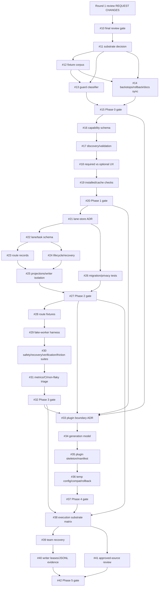

# Project Proposal — Unknown

## Project Understanding
You need assistance with: 
**[Roadmap] Build agent-toolkit into a verified Claude orchestrator**

*Project description:*
## Current authoritative decision
`REQUEST CHANGES — Round 9 / MR-011 approval-vs-implementation freeze wording blocker`.

Current request-changes review: https://github.com/zo-el/agent-toolkit/issues/43#issuecomment-5066781436

MR-010's canonical Review State semantics remain accepted as repaired for review. MR-011 has been accepted/repaired for fresh review, not terminal approval: #11-#42 now contain the lifecycle-safe implementation-freeze contract and no longer make #10/#43 roadmap approval equal implementation authorization. The current source start SHA remains `8705e0561cfb2671b439dfa87b22acdf85e701eb`; implementation remains paused until a later coherent approval transaction, separate El-Le/user authorization, and a fresh no-drift source read-back.

## Review finding disposition ledger
| Finding | Severity | Zachariah disposition | Evidence / roadmap repair |
| --- | --- | --- | --- |
| MR-001 | Critical | Accept | #43/#10 name the current authoritative review chain, supersede the stale approval signal, and #10 is an open final-review gate with agreement checks. |
| MR-002 | High | Accept | #11-#42 bodies use explicit issue-number `Blocked by` and `Blocks` graphs; #15/#20/#27/#32/#37/#42 include graph-readback acceptance checks. |
| MR-003 | High | Accept | #11-#42 bodies replace generic dependency/implementation/test text with planned/candidate paths, interfaces, inputs/outputs, fixture names, exact existing and planned commands, rollback/security/evidence criteria. |
| MR-004 | Medium | Accept | Epics #3-#8 state phase purpose, entry invariants, fan-in graph, exit evidence, non-goals, rollback posture, and their authoritative gate issue. |
| MR-005 | Critical | Accept as reconciled source input; not terminal approval | #9 records the actual current source SHA `8705e0561cfb2671b439dfa87b22acdf85e701eb`, the five post-baseline commits, authorization posture, roadmap impact check, and test/read-back evidence. Round 6 preserves the reconciled SHA as the current Phase 0 source start for review, while still requiring future drift to be explicitly authorized, reconciled, and freshly reviewed. |
| MR-006 | Critical | Accept as repaired, but not terminal approval | #3 now treats reconciled source start SHA `8705e0561cfb2671b439dfa87b22acdf85e701eb` as the active Phase 0 source invariant, names #1/#2/#9/#10/#43 plus MR-005 and the current/latest Micaiah review chain as required inputs, and requires later source deviation to be explicitly authorized, reconciled in #9/#43, and freshly reviewed before Phase 0 begins. #10 stays open because the later Round 7 transaction failed post-final read-back and was superseded by a request-changes rollback. |
| MR-007 | Critical | Accept as repaired for fresh review; gate still open | This issue and #10 now encode the transactional final-approval protocol below, latest-comment authority, superseded approval-looking comments, and preserved coherent non-approved state: #9/#10/#43 open, labels include `implementation-paused`/`review-needed`/`changes-requested`, Project `Status: Todo`, Review State `Changes requested`, and no `roadmap-approved` label while blockers remain. |
| MR-008 | High | Accept as planning repair for fresh review; gate still open | #9 records the guard-config/README caveat at `8705e056...`; #11 owns the instruction-surface policy matrix; #12 owns fixture classes for target × cwd × operation; #14 owns hook/test/README/installer-doctor/rollback synchronization; #15 blocks Phase 0 exit on doc/code/test disagreement. |
| MR-009 | Critical | Accept as repaired for a future approval transaction; gate still open | #3-#8 now encode lifecycle-safe before/after/in-both-states roadmap approval semantics rather than unqualified pre-approval-only claims; #10 and this issue extend final-approval read-back across #3-#43 approval/freeze/entry-invariant bodies and candidate-state verification before any terminal approval phrase. The Round 7 transaction failed post-final read-back and was superseded by a request-changes rollback, so #10 remains open until a later clean transaction. |
| Round 7 transaction failure | Critical | Current blocker | Approval transaction reached final edit but failed post-final read-back on a stale candidate-count assertion in #43; public state was restored to coherent non-approved and the failed approval comment is superseded by the newer Round 7 rollback comment. |
| MR-010 | Critical | Accept as repaired for fresh review; not terminal approval | This issue and #10 now define one canonical roadmap Review State semantics and terminal-state contract: #3-#43 are roadmap cards and must all become `Review State: Roadmap approved` before terminal approval; #1/#2 remain `Not required`; implementation completion is not inferred from roadmap approval; any active candidate using `Roadmap approved=3` / `Needs review=38` is invalid and superseded. |
| MR-011 | Critical | Accept as repaired for fresh review; not terminal approval | #11-#42 now contain the lifecycle-safe freeze contract: terminal roadmap approval clears only the roadmap-review gate and does not authorize implementation; `implementation-paused` remains authoritative until separate El-Le/user authorization, fresh no-drift source read-back, and prerequisite phase gates/dependencies are satisfied. Fresh review must verify all 32 #11-#42 bodies contain the lifecycle-safe sentence and none contain the old unsafe sentence before any terminal phrase. Round 9 request-changes review: https://github.com/zo-el/agent-toolkit/issues/43#issuecomment-5066781436 |

## Roadmap Review State semantics and terminal-state contract
`Review State` is review of roadmap-card readiness and quality; it is not implementation completion, phase-gate completion, source-work authorization, or proof that dependency evidence is done.

Terminal roadmap approval requires exactly this Project/issue state:
- #3-#43: `Review State: Roadmap approved` (41 items).
- #1/#2: `Review State: Not required` (2 items).
- No #3-#43 Project item remains `Needs review` or `Changes requested`.
- Project Status counts: `Done=2`, `Todo=41`; specifically #9/#10 are `Done`, and the other 41 Project items remain `Todo` unless separately justified by their own gate.
- Review State counts: `Roadmap approved=41`, `Not required=2`.
- #3-#43 carry `roadmap-approved` and `implementation-paused`.
- #3-#43 do not carry `review-needed` or `changes-requested`.
- #9/#10 are closed; #43 and implementation epics/tasks/gates remain open as appropriate.
- `Todo` + `implementation-paused` + issue/phase evidence remain the implementation gate after roadmap approval.

The failed active candidate model `Roadmap approved=3` / `Needs review=38` / `Not required=2` is invalid for terminal roadmap approval because all #3-#43 are roadmap cards under review. It may appear only as historical failed-attempt evidence when explicitly marked superseded or non-authoritative.

## Transactional final-approval protocol
Any future final approval transition must be atomic with respect to public authority signals and must follow the one-attempt transaction rule:
1. One fresh review task may create exactly one prepared comment/anchor for its named round.
2. Snapshot current issue body, issue state, label set, Project item field values, and gate state for #9/#10/#43 and affected roadmap items.
3. Precompute every item/field ID and intended issue/label/Project/gate mutation.
4. Apply exactly one candidate issue body, label, Project, and gate mutation path using the canonical terminal target above, without posting the exact final approval phrase.
5. Candidate read-back must enumerate all 41 #3-#43 issue→Project-item mappings and verify every one is `Review State: Roadmap approved` before the terminal phrase.
6. Candidate body counts must be computed from live read-back, not copied from a second generator or duplicated static prose.
7. Read back every candidate approval surface: #9/#10/#43 bodies; all approval/freeze/entry-invariant bodies in #3-#43; #11-#42 freeze-contract bodies with the lifecycle-safe sentence exactly once per issue and the old unsafe sentence absent; newest authoritative comments; labels; open/closed states; Project Status/Review State counts; explicit scans for unqualified `#10 is open`, `no roadmap-approved signal`, hard-coded state-count assertions, and any active `Roadmap approved=3` / `Needs review=38` target; and the lifecycle-safe separation between roadmap approval and implementation authorization.
8. Verify the candidate approved-roadmap state keeps #3-#8 true after #9/#10 close and `roadmap-approved` labels/Project fields are applied, while `implementation-paused` remains authoritative until separate El-Le/user authorization and a fresh no-drift source read-back.
9. Post `APPROVED — ROADMAP READY FOR IMPLEMENTATION` only as the final mutation after all candidate-state verification succeeds.
10. If candidate or post-final verification fails, roll back/supersede and stop the task. Do not create another round/anchor or switch approval semantics inside the same worker run.
11. A retry requires a new El-Le-routed fresh whole-roadmap review task and a newly named round.

Implementation authorization remains separate and is currently `no`.

## Implementation pause and roadmap-level criteria
- Roadmap review is not approved; implementation remains paused: no source edits, branches, PRs, pushes, plugin installs, Claude configuration changes, production deployment, or public outreach beyond separately authorized planning/state updates until a later approval and El-Le/user authorization are explicit.
- While the current decision is request-changes, #10 remains open and all 43 Project items stay Project `Status: Todo`; after terminal roadmap approval, #9/#10 may be closed and `roadmap-approved` must be present on #3-#43, but implementation issues still do not enter work until separately authorized.
- In the current non-approved rollback state, #9/#10/#43 use Project `Review State: Changes requested` and #3-#8/#11-#42 use `Needs review`. In the terminal roadmap-approved state, every #3-#43 item must use `Review State: Roadmap approved`; no #3-#43 item may remain `Needs review` or `Changes requested`.
- While blockers remain, #9/#10/#43 retain `implementation-paused`, `review-needed`, and `changes-requested`; `roadmap-approved` is absent in the current non-approved state. After terminal roadmap approval, #3-#43 must carry `roadmap-approved` and `implementation-paused`, and must not carry `review-needed` or `changes-requested`.
- No roadmap issue may enter implementation while its dependency, implementation, or test sections remain generic boilerplate.
- Before Phase 0 starts, read back that repository state still matches `8705e0561cfb2671b439dfa87b22acdf85e701eb` or that any later deviation was explicitly authorized, reconciled in #9/#43, and freshly reviewed.
- Before Phase 0 exits, #15 must verify that #11's instruction-surface policy matrix, hook behavior, fixture tests, README/user-facing docs, installer/doctor behavior, and rollback docs agree for every target class × cwd state × operation.

## Critical path and safe next-task graph

## Phase gates and graph-readback rule
- #15 Phase 0 gate: #11-#14 complete, linked, verified; zero public-action false negatives; existing `./tests/run.sh` green; #11 policy, code, fixture tests, README/user-facing docs, installer/doctor behavior, and rollback docs agree for every instruction-surface write class/cwd state/operation.
- #20 Phase 1 gate: #16-#19 complete, linked, verified; every advertised workflow launches or emits exact remediation.
- #27 Phase 2 gate: #21-#26 complete, linked, verified; lane recovery, projections, migrations and privacy evidence green.
- #32 Phase 3 gate: #28-#31 complete, linked, verified; deterministic eval metrics calibrated and non-flaky.
- #37 Phase 4 gate: #33-#36 plus #15/#20/#27/#32 contracts complete, linked, verified; plugin package local validation/rollback green.
- #42 Phase 5 gate: #38-#41 plus #27/#32/#37 complete, linked, verified; optional integrations remain deferred unless trust evidence reopens them.

## Dependency-graph changes in this revision
- Phase 0: #11 feeds #12/#13/#14; #12 feeds #13/#14; #13 and #14 feed #15.
- Phase 1: #16 defines schema, #17 discovers records, #18 classifies required/optional semantics, #19 verifies installed/cache state, all converge on #20.
- Phase 2: #21 decides store/privacy, #22 defines schema, #23 route records and #24 lifecycle feed #25 projections, #26 validates migration/privacy, all converge on #27.
- Phase 3: #28 consumes #22-#27 artifacts; #29 fake-worker harness, #30 suites, #31 metrics converge on #32.
- Phase 4: #33 consumes stabilized safety/capability/lane/eval interfaces; #34/#35/#36 converge on #37.
- Phase 5: #38 consumes #27/#32/#37; #39/#40/#41 converge on #42.

## Implementation-detail changes in this revision
- #11-#15 specify public-action classifier substrate, instruction-surface write policy matrix, fixture taxonomy, allow/ask/deny controls, fail-open/fail-closed behavior, sandbox/backstops, docs synchronization, and zero-false-negative/no-disagreement gate evidence.
- #16-#20 specify capability manifest fields, discovery inputs, required/optional semantics, doctor output contract, exit codes and fresh-machine proof.
- #21-#27 specify lane-store ADR outputs, lane/task/route schemas, lifecycle transitions, leases, stale-owner recovery, projections, migration/privacy fixtures and gate evidence.
- #28-#32 specify deterministic routing/recovery/hallucinated-artifact/same-tree/user-friction eval cases, fake-worker artifacts, metrics and non-flaky evidence.
- #33-#37 specify plugin/device boundary, source-pinned generation, manifests, validation, temporary Claude config compatibility and rollback.
- #38-#42 specify execution substrate decision table, team interruption/recovery, writer fan-out/fan-in, JSONL evidence shape, approved-source trust checklist and reconsideration triggers.

## Project-state target
- #43: Status `Todo`, Review State `Changes requested` while the approval transaction remains failed/superseded.
- #10: Status `Todo`, Review State `Changes requested`; open final-review gate after the failed/superseded approval transaction.
- #9: Status `Todo`, Review State `Changes requested` for the source-reconciliation gate while no terminal approval is landed.
- #3-#8 and #11-#42: Status `Todo`, Review State `Needs review` unless a later phase-specific public review changes it.
- #1/#2 may remain evidence/research records with their own appropriate review state.

## Current request-changes read-back
- Round 9 request-changes review: https://github.com/zo-el/agent-toolkit/issues/43#issuecomment-5066781436
- Superseded Round 7 transaction-failure request-changes review: https://github.com/zo-el/agent-toolkit/issues/43#issuecomment-5066547826
- Superseded approval-looking/current-state comments include prior Round 5 request-changes state plus approval-looking comments: https://github.com/zo-el/agent-toolkit/issues/43#issuecomment-5062923817 and https://github.com/zo-el/agent-toolkit/issues/43#issuecomment-5066057473
- #10 stale approval-looking comment superseded: https://github.com/zo-el/agent-toolkit/issues/10#issuecomment-5066058895
- Project non-approved target: all 43 items `Todo`; Review State counts `Changes requested=3`, `Needs review=38`, `Not required=2`.
- Implementation authorized: no; separate El-Le/user authorization is still required before source work begins.

## Scope of Work
- Asset analysis and workspace initialization.
- Core modeling / development based on specifications.
- Technical validation and quality checks.
- Incorporation of review feedback.
- Clean handover of source files and documentation.

## Required Files & Inputs
1. Complete reference files (drawings, access tokens, test data).
2. Exact dimensional specs or business rules.
3. Schedule/deadline expectations.

## Estimated Price and Timeline
- **Estimated Price:** 300 - 800 USD
- **Estimated Timeline:** 3 to 7 business days (to be refined after reviewing the final assets).

## Project Questions
To help me refine this estimate, please clarify:
1. Could you describe the project scope and deliverables in detail?
2. Do you have any existing drawings or reference documents?
3. What is your target budget range?
4. What is your expected timeline?
5. Which tools/software do you prefer for this project?

## Agreement Terms
The final source files will be delivered upon approval of the milestones. Substantial revisions outside the agreed scope will require a change order.
