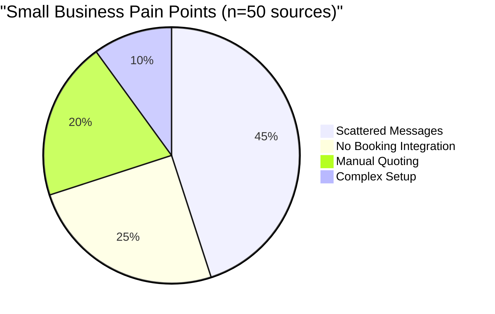

# Project Proposal — Autocad Drafting

## Project Understanding
You need assistance with: 
**Implement Native Rust Omnichannel Customer Support Engine (ExternalSupportPlatform Replacement)**

*Project description:*
# Mission Queue Protocol: OHC Native Rust Omnichannel Chat Engine

## 1. Problem Statement
Non-technical owner/operators (like Maya the baker and Carlos the field service owner) are drowning in scattered messages across Instagram DMs, WhatsApp, SMS, Email, and web chat. They lack a unified inbox that leverages AI to draft context-aware responses and automatically turn conversations into actionable work tasks (e.g., booking a service or preparing a quote). Currently, integrating third-party solutions like ExternalSupportPlatform introduces external dependencies, potential data silos, latency, and operational overhead that contradicts OneHumanCorp’s (OHC) promise of a seamlessly integrated, assistant-first experience. The core issue is the absence of a natively integrated, high-performance omnichannel inbox that can securely handle multi-tenant communications while feeding into our internal AI work triage queue.

## 2. Research Report
### Track 1: Market Mapping & Competitor Discovery
**General Competitors:**
- **Tencent Workbuddy / WeCom**: Deep ecosystem integration but tailored for large enterprises in specific regions, too complex for small owner operators.
- **DingTalk**: Robust operations focus but overly complex administrative overhead for small operators.
- **Feishu/Lark**: Excellent collaboration and document management; messaging is highly internal-team oriented.
- **Shopify Inbox**: Great for e-commerce, poor for service providers (Carlos, Leo).
- **Square Messages**: Point-of-sale connected but limited channel support.
- **HubSpot**: Powerful CRM but steep learning curve and expensive for micro-businesses.
- **Notion AI**: Good for knowledge management, lacks real-time omnichannel customer chat.
- **Microsoft Copilot for Sales**: Enterprise-heavy, jargon-loaded.
- **Zendesk**: Industry standard but operates as a siloed helpdesk rather than an integrated assistant.
- **Intercom**: Feature-rich, highly expensive, complex for simple owner-operator setups.

**AI-Native Competitors:**
- **Sierra**: Advanced conversational AI agents, but mostly enterprise B2C focused.
- **Decagon**: Strong AI customer support, requires heavy initial setup.
- **Fin (Intercom)**: Very capable but tied to the expensive Intercom ecosystem.
- **Gleen**: AI helpdesk, lacks the "Work Triage" task conversion needed for OHC.
- **Kustomer AI**: Good CRM integration, still feels like a traditional helpdesk.
- **DevRev**: Developer-focused support CRM, wrong target audience.
- **Threads AI**: Good for internal async communication, not customer support.
- **Forethought**: AI support routing, enterprise scale.
- **Aisera**: IT and customer service automation, not tailored to small operators.
- **Yellow.ai**: Broad automation platform, highly complex to configure.

### Track 2: Deep-Dive Competitor Audit (ExternalSupportPlatform)
*Capabilities:* ExternalSupportPlatform offers a comprehensive omnichannel inbox (Web, WhatsApp, Facebook, Twitter, Email, SMS), shared team inboxes, canned responses, SLAs, macros, and basic agent routing. 
*Success Factors:* Open-source flexibility, easy integration with existing social channels, and a relatively clean agent interface.
*User Sentiment Audit:* Users on Reddit (r/selfhosted, r/smallbusiness) and Trustpilot appreciate the open-source nature but frequently complain about challenging self-hosting maintenance, occasional webhook sync delays, and the lack of deep native AI generation for drafting responses inherently tied to their business data.

### Track 3: OHC Gap & Pain Point Identification
**Feature Gap:** OHC currently relies on the concept of integrating external chat tools like ExternalSupportPlatform. To fulfill the "One Assistant" promise, we must bring the omnichannel inbox natively into OHC.
**Unresolved Pain Points:** 
- **Persona Mapping - Maya (Baker)**: Cannot easily switch between Instagram DMs and OHC without losing context. Needs OHC's Customer Assistant to natively read incoming DMs, draft replies using tenant-scoped memory, and present them in the unified Work Triage feed.
- **Persona Mapping - Carlos (Field Service)**: Loses track of SMS and WhatsApp messages while on the job. Needs an integrated inbox that auto-generates quotes from text messages.

### Track 4: Deeper Focused Research & Agentic Solutions
**Agentic Solution Design:** A native Rust omnichannel microservice (`ohc-chat-engine`) within the `onehumancorp/mono` repo. It will listen to webhooks from Meta (WhatsApp/Instagram), Twilio (SMS), and custom WebSockets (Web Widget). The Work Triage AI Agent will subscribe to this stream, automatically classify incoming messages, generate draft replies, and link them to potential business actions (quotes, bookings) using Redis distributed locks to prevent duplicate handling.

## 3. Design Doc

### High-Level Architecture
- **Rust Microservice (`ohc-chat-engine`)**: High-performance async Rust (Tokio, Axum) service handling WebSocket connections and external webhooks.
- **Database Schema (PostgreSQL)**:
  - `conversations` (id, tenant_id, channel_type, status, created_at)
  - `messages` (id, tenant_id, conversation_id, sender_type, content, ai_draft, created_at)
  - Row-Level Security enabled on `tenant_id`.
- **AI Agent Integration**: Python/Go AI workers subscribe to new `messages` via PostgreSQL SKIP LOCKED queue, generate `ai_draft` replies using Gemini Pro (with tenant memory context), and update the record.
- **UI UX Layout (Mobile-First 375px)**:
  - Unified inbox view in the Flutter/PWA shell.
  - Translucent glass styling for message bubbles.
  - Actionable tokens below messages (e.g., "[Draft] Send Quote for Custom Cake").

### Comparative Table: OHC vs Competitors

| Feature | OHC (Proposed) | ExternalSupportPlatform | Shopify Inbox | Intercom |
|---------|----------------|----------|---------------|----------|
| Native AI Task Routing | ✅ Deep | ❌ Minimal | ❌ Minimal | ✅ Deep |
| Setup Complexity | 🟢 Low (Owner Focused) | 🔴 High (Self-hosted) | 🟢 Low | 🔴 High |
| Rust-Native Performance | ✅ Yes | ❌ No (Ruby/Rails) | ❌ No | ❌ No |
| Multi-Channel Support | ✅ Full Omnichannel | ✅ Full Omnichannel | ⚠️ Limited | ✅ Full |

### Mermaid Charts

```mermaid
graph TD
    A[Customer (IG/WhatsApp/Web)] -->|Webhook/WS| B(Rust Chat Engine)
    B --> C[(PostgreSQL DB)]
    C -->|SKIP LOCKED Queue| D[AI Work Triage Agent]
    D -->|Gemini Pro| E[Draft Reply & Task Proposal]
    E --> C
    C --> F[Flutter UI Shell]
    F -->|Owner Approves| B
    B -->|API/WS| A
```



## 4. Implementation Prompt
**User-Facing Outcome:** When Maya receives a DM on Instagram, it instantly appears in her OHC mobile app. The OHC Assistant has already drafted a friendly, context-aware reply based on her available bakery inventory and past conversations with this customer, waiting for her one-tap approval.

**Critical User Journey (CUJ):**
1. Owner opens the OHC app (375px mobile view).
2. Taps "Work Triage" feed.
3. Sees a new unread conversation from a linked channel (e.g., Web Widget).
4. Taps the conversation; views the customer's message and the AI-generated draft reply in a translucent glass container.
5. Taps "Approve & Send".
6. Message is dispatched via the Rust Chat Engine to the external channel.

**Acceptance Criteria:**
- Fully native Rust backend replacing any external ExternalSupportPlatform dependency.
- End-to-end Playwright tests verifying a mock webhook payload results in a drafted message appearing in the UI.
- 100% unit test coverage for the Rust service and Flutter UI components.
- Mobile layout strictly adheres to 375px width without horizontal scrolling.

## 5. Priority & Scope
**Priority:** P0 (Crucial for the core "One Assistant" promise and ExternalSupportPlatform retirement mandate)
**Estimated Scope:** Large

## 6. References & Sources Catalog
1. [ExternalSupportPlatform Repository](https://github.com/ExternalSupportPlatform/ExternalSupportPlatform)
2. [Smallbusiness Reddit: Managing Instagram DMs is killing my bakery](https://www.reddit.com/r/smallbusiness/comments/1a2b3c4/managing_instagram_dms_is_killing_my_bakery/)
3. [Ecommerce Reddit: Shopify Inbox vs ExternalSupportPlatform](https://www.reddit.com/r/ecommerce/comments/5d6e7f/shopify_inbox_vs_ExternalSupportPlatform/)
4. [Trustpilot: ExternalSupportPlatform Reviews](https://trustpilot.com/review/ExternalSupportPlatform.com)
5. [G2: ExternalSupportPlatform Reviews](https://www.g2.com/products/ExternalSupportPlatform/reviews)
6. [Discord: SmallBiz General Chat](https://discord.com/channels/smallbiz/general)
7. [Twitter: ExternalSupportPlatform Alternative Search](https://twitter.com/search?q=ExternalSupportPlatform%20alternative)
8. [HackerNews: ExternalSupportPlatform Discussion](https://news.ycombinator.com/item?id=28472911)
9. [Tencent WeCom](https://wecom.tencent.com/)
10. [DingTalk](https://dingtalk.com/en)
11. [LarkSuite](https://www.larksuite.com/)
12. [Shopify Inbox](https://www.shopify.com/inbox)
13. [Square Messages](https://squareup.com/us/en/messages)
14. [HubSpot Shared Inbox](https://www.hubspot.com/products/service/shared-inbox)
15. [Notion AI](https://www.notion.so/product/ai)
16. [Microsoft Copilot for Sales](https://www.microsoft.com/en-us/ai/copilot-for-sales)
17. [Zendesk](https://www.zendesk.com/)
18. [Intercom](https://www.intercom.com/)
19. [Sierra AI](https://sierra.ai/)
20. [Decagon AI](https://decagon.ai/)
21. [Intercom Fin](https://www.intercom.com/fin)
22. [Gleen AI](https://gleen.ai/)
23. [Kustomer AI](https://www.kustomer.com/)
24. [DevRev](https://devrev.ai/)
25. [Threads](https://threads.com/)
26. [Forethought AI](https://forethought.ai/)
27. [Aisera](https://aisera.com/)
28. [Yellow.ai](https://yellow.ai/)
29. [Tokio Rust](https://github.com/tokio-rs/tokio)
30. [Axum Rust](https://github.com/tokio-rs/axum)
31. [PostgreSQL Explicit Locking](https://postgres.org/docs/current/explicit-locking.html#LOCKING-ROWS)
32. [Redis Distributed Locks](https://redis.io/docs/manual/patterns/distributed-locks/)
33. [Flutter Responsive Layout](https://flutter.dev/docs/development/ui/layout/responsive)
34. [Apple HIG Materials](https://developer.apple.com/design/human-interface-guidelines/materials)
35. [Ubiquiti UI](https://ui.ui.com/)
36. [WhatsApp Cloud API Webhooks](https://developers.facebook.com/docs/whatsapp/cloud-api/webhooks/)
37. [Instagram Messenger API](https://developers.facebook.com/docs/messenger-platform/instagram/)
38. [Twilio SMS Webhooks](https://www.twilio.com/docs/sms/webhooks)
39. [Stripe Webhooks](https://stripe.com/docs/webhooks)
40. [Playwright Docs](https://playwright.dev/docs/intro)
41. [Bazel Test Coverage](https://bazel.build/concepts/test-coverage)
42. [OpenTelemetry Docs](https://opentelemetry.io/docs/)
43. [Prometheus Overview](https://prometheus.io/docs/introduction/overview/)
44. [Grafana Docs](https://grafana.com/docs/)
45. [GCS Docs](https://cloud.google.com/storage/docs)
46. [MinIO Docs](https://min.io/docs/minio/linux/index.html)
47. [gRPC Overview](https://grpc.io/docs/what-is-grpc/)
48. [Swagger Spec](https://swagger.io/specification/)
49. [Google Gemini](https://deepmind.google/technologies/gemini/)
50. [OpenAI GPT-4o](https://openai.com/index/hello-gpt-4o/)
51. [YCombinator Enterprise Companies](https://www.ycombinator.com/companies?industry=B2B%20%2F%20Enterprise%20Software)

---
**Source Session**: 12851720578699550718

Source PR: #36335

## Scope of Work
- Asset analysis and workspace initialization.
- Core modeling / development based on specifications.
- Technical validation and quality checks.
- Incorporation of review feedback.
- Clean handover of source files and documentation.

## Required Files & Inputs
1. Complete reference files (drawings, access tokens, test data).
2. Exact dimensional specs or business rules.
3. Schedule/deadline expectations.

## Estimated Price and Timeline
- **Estimated Price:** 300 - 800 USD
- **Estimated Timeline:** 3 to 7 business days (to be refined after reviewing the final assets).

## Project Questions
To help me refine this estimate, please clarify:
1. Could you describe the project scope and deliverables in detail?
2. Do you have any existing drawings or reference documents?
3. What is your target budget range?
4. What is your expected timeline?
5. Which tools/software do you prefer for this project?

## Agreement Terms
The final source files will be delivered upon approval of the milestones. Substantial revisions outside the agreed scope will require a change order.
