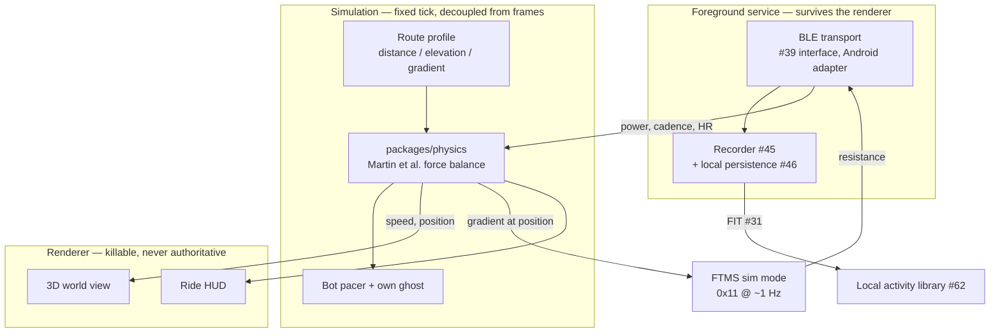
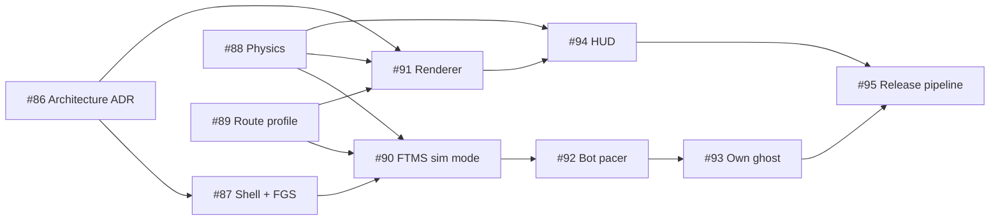

# Project Proposal — Structural Drawings

## Project Understanding
You need assistance with: 
**[EPIC] Android Trainer Game — Solo Virtual Riding**

*Project description:*
## Overview

A native **Android** app that turns a smart trainer into a video game: ride a real route, the trainer
fights you up every hill, and a bot pacer that will not wait for you is always just up the road.
Solo. No server, no account, no network at all.

**Parent**: #1 · **Phase**: 3 (immediately after the v0.1 local milestone) · **Depends on**: #39, #43, #45, #46, #31
**Component**: `apps/mobile` + a new `packages/physics` leaf package

> ### Why this epic exists, and what it is not
>
> Owner decision, 2026-09-03: the trainer experience should be a **mobile game**, Android first.
> That work was previously spread across three epics that each held part of it and none of which
> could ship it:
>
> - **#15** owned mobile clients, but framed around *outdoor background recording in a jersey
>   pocket* — a different product. #15 is now narrowed to that, plus iOS reach.
> - **#16** owned the virtual world, but gated the whole thing behind **server-authoritative
>   multiplayer** — the expensive, hard part. #16 is now "add other riders" on top of this epic.
> - **#14** owns ERG and structured workouts, which sequence *after* this.
>
> **The insight that makes this epic possible: none of the hard parts are needed to make it fun.**
> Zwift's beta launched 2014-09-30 with **one road, a ~5 km loop, some bots, and no multiplayer** —
> and got 13,000 applications for 1,000 places. It did not become a paid product for another 13
> months. Drafting, power-ups, Drops, levels and race categories are retention machinery bolted onto
> a loop that already worked.

## The market evidence this epic is built on

Two facts from research (2026-09-03) that shape every decision below.

**1. The competitor field collapsed in 2026.** Zwift acquired **Rouvy and FulGaz** (2026-04-29);
Garmin acquired **TrainingPeaks**, and with it TrainingPeaks Virtual (2026-07-22). Of the three
serious Zwift competitors named in 2024, one is owned by Zwift and one by Garmin.

**2. Every free platform *with a world and a population* has died.** Wahoo RGT closed 2023-10-31;
BKOOL closed 2025-11-30 four months after acquisition; indieVelo's free tier ended April 2025;
VirtuGo and CVRcade before them. Wahoo's stated reason was a strategy refocus; Rouvy said of BKOOL,
verbatim, that operating it *"at a level which meets the expectations of the community and remains
financially sustainable isn't possible."*

The free things that **survived** are precisely the ones with no server and no population
dependency: Auuki (899★, AGPL, browser, no backend), qdomyos-zwift (845★, GPL, local bridge),
zwift-offline (1,366★), OpenTrainer (Android, no accounts). **That is the shape of this epic**, and
it is independent corroboration of #1's "no server, no account, no hosting bill" v0.1 constraint.

## Scope

### In scope
- **Android only.** iOS is #15.
- **Solo only.** No other real riders, no accounts, no network. Bots and your own ghost.
- FTMS **simulation mode** driven from route gradient at ~1 Hz — the feature this epic exists for.
- A cycling physics model good enough that the speed feels earned.
- One 3D route view built for a phone at arm's length on handlebars.
- Reuse of #39's sensor interface, #45's recorder, #46's persistence and #31's FIT encoder,
  **unchanged**. If the mobile client needs a different interface, that is a bug in #39, fixed there.

### Out of scope
- **Multiplayer, drafting, pack dynamics** — #16. Drafting is worth exactly nothing solo.
- **ERG and structured workouts** — #14, sequences after this.
- **iOS** — #15.
- **Ranked leaderboards from ghost participants** — permanently, see the patent constraint below.
- Equipment, bike selection, per-frame CdA, Drops, unlockables. Zwift's Drop Shop arrived years
  after launch and rests on a bike-manufacturer sponsorship business this project does not have.

## Architecture

**The seam that matters.** BLE and recording live in an Android **foreground service**; the renderer
is a separate, killable component that is never the source of truth. Zwift arrived at the same
separation from the other direction — its Companion app exists because Apple TV allows only two BLE
connections, so radio lives on the phone and rendering on the TV. We do not have that constraint, so
we do not need two apps; but keeping the seam means casting to a TV later is additive rather than a
rewrite. It is also what makes #15's background recording achievable without redesigning this.

## The engine decision, and why it is nearly made already

Research 2026-09-03. **The AGPL-3.0 choice in ADR 0001 eliminates two of the three major engines,
and this was not previously recorded anywhere.**

| Engine | Verdict |
|---|---|
| **Unreal Engine 5** | **Hard no.** The EULA's *Non-Compatible Licenses* clause names GPL/LGPL explicitly and forbids combining the Licensed Technology with code under a licence requiring other terms. Epic staff have stated the same. No action this project can take cures it; royalties are irrelevant. |
| **Unity** | **No, unless ADR 0001 is reopened.** Editor Software Terms §2.2 requires distributing the Runtime under an agreement "no less protective of Unity", which cannot coexist with AGPL §10. The cure is a linking exception — which needs unanimous consent from all copyright holders, and ADR 0001 deliberately declined a CLA to make exactly that impossible. Separately, **every Unity BLE plugin found is proprietary with binary-only redistribution terms**, an independent conflict. |
| **Godot 4.7** | **No, on BLE.** Licence is perfect (MIT) and the 4.6/4.7 Mobile renderer is genuinely improved. But Godot core has no Bluetooth API; GDBLE explicitly lists *"Not supported: Android ARMv7, iOS and automatic reconnection"*, and GodotAndroidBle is Android-only. You would write a CoreBluetooth extension from scratch and express FTMS/CPS/HRS in GDScript — the anti-goal, reached by a different road. |
| **Flutter** | **No, on architecture.** Dart forks `packages/sensors` into a second language — the exact outcome #39 exists to prevent, and forbidden by this epic's "reuse #39's interface unchanged". *(A licence argument was considered and **withdrawn**: `flutter_blue_plus` 2.3.12 did relicense to a proprietary "FlutterBluePlus License v1.5", but `flutter_reactive_ble` 5.5.0 is BSD-3-Clause and OSI-approved, so a licence-clean Flutter option does exist. Recorded so nobody reopens Flutter on discovering it — the architectural objection is the one that stands.)* |
| **Kotlin Multiplatform** | **No, on architecture**, for the same reason — a Kotlin rewrite of `packages/sensors`. `JuulLabs/kable` (Apache-2.0) is genuinely excellent; it is excellent for a project whose domain layer is already Kotlin. |
| **React Native + three.js** | **Recommended.** `expo` 57.x, `react-native-ble-plx` 3.5.1, `three` 0.185.x, `@react-three/fiber` 9.7.x — all MIT, all installable in an AGPL app with no exception and no royalty. `packages/domain`, `packages/fit` and `packages/sensors` ship unchanged. |
| **Capacitor + three.js** | **Viable and cheaper**, up to the point background BLE bites. Same leaf packages. |

**The performance ceiling is not the constraint people assume.** Zwift's published Android floor is
**OpenGL ES 3.0, 3 GB RAM, arm64-v8a**, and Zwift's own engine is reported by its co-founder as
"all C and OpenGL 2 + extensions". Every phone, tablet and Apple TV gets Zwift's **Basic** graphics
profile, capped at **30 fps**. A WebGL2-class renderer is comfortably inside that envelope.

**This epic does not settle it — #86 does, as an input to #20.** Both live options keep TypeScript,
so both keep every rendering option open.

## Constraints that are already binding

**Patents — read #59 before writing the pacer.** Peloton's leaderboard family (US 10,486,026,
which survived IPR2020-01541; US 11,170,886) was asserted against Echelon and iFIT, and **both
settled by removing the on-demand leaderboard technology**. The complaint language targets *"live
performance parameters … used in subsequent sessions … to enable ghost participants."*

The line this epic must hold:

- ✅ **A bot pacer is not a ghost at all** — it is synthetic, computed from a target w/kg and a
  pacing rule, replaying no prior session's data. This is why a bot is the right answer for solo.
- ✅ **Your own previous ride on the same route**, as a private, unranked pacing aid.
- ❌ **A ranked leaderboard populated by ghost participants replaying prior sessions.** Never.

**Clean room — #19.** No world asset, course geometry, texture or model may derive from another
product. **Do not read `zwift-offline`**: it is a reimplementation of Zwift's server protocol and
reading it is exactly the contact #19's posture exists to prevent. Cite its existence as evidence
that offline single-player works; do not open the source.

**Licence boundary — `CONTRIBUTING.md`.** GoldenCheetah is GPL, qdomyos-zwift is GPL-3.0, Auuki is
AGPL-3.0, OpenTrainer is **CC BY-NC-4.0** (not an open-source licence at all). Protocol *facts* — a
UUID, an opcode, a byte layout — are not copyrightable and may be used freely. **Their code may not
be copied into an Apache-2.0 leaf package.** Auuki's file *layout* is safe to be inspired by.

## Sub-Issues

| # | Issue | Points |
|---|---|---|
| 1 | #86 Write ADR: mobile client architecture and rendering stack | 3 |
| 2 | #87 Build the Android app shell, foreground service and BLE permissions | 8 |
| 3 | #88 Build the cycling physics model as an Apache-2.0 leaf package | 8 |
| 4 | #89 Define the route profile model and import a route from GPX | 5 |
| 5 | #90 Drive FTMS simulation mode from route gradient | 5 |
| 6 | #91 Build the 3D route renderer | 8 |
| 7 | #92 Implement the bot pacer | 5 |
| 8 | #93 Implement own-ride ghost replay | 3 |
| 9 | #94 Build the ride HUD for a handlebar-mounted phone | 5 |
| 10 | #95 Establish the Android release and distribution pipeline | 5 |

**Total: 55 points.**

## Acceptance criteria (epic level)

- [ ] A rider pairs a trainer over BLE, selects a route, and rides it end to end **with no network
      connection at all** — airplane mode is a valid test configuration and a test asserts it.
- [ ] Trainer resistance visibly changes on gradient: a test asserts that at a +6% section the FTMS
      `0x11` simulation write carries a grade within tolerance of the route profile at that position.
- [ ] A 60-minute ride with the screen off and the app backgrounded produces a sample count within a
      stated tolerance of a simultaneous foreground recording, verified with
      `adb shell dumpsys activity services` showing the `connectedDevice` service alive throughout.
- [ ] The completed ride writes a FIT file that #30's decoder reads back with identical stream
      values — the round trip crosses the storage boundary, not just the in-memory object.
- [ ] The physics model is validated against published values from Martin et al. 1998, not against
      Zwift: a test asserts computed power for a known speed/gradient/mass within a stated tolerance
      of the paper's worked figures.
- [ ] A frame-rate drop does not corrupt the simulation — a test drives the physics tick at a fixed
      rate while stalling the renderer and asserts position is unchanged from an unstalled run.
- [ ] **No ranked leaderboard and no ghost of another rider exists anywhere in the codebase**,
      asserted by review against #59.
- [ ] `grep -ri "ant+\|antplus\|ant_plus"` over the mobile app returns nothing (decision D2).
- [ ] Every dependency added is OSI-permissive and compatible with the package it lands in, per
      `CONTRIBUTING.md`.

## Risks

| Risk | Impact | Likelihood | Mitigation |
|---|---|---|---|
| Android BLE reliability — GATT 133, dropped callbacks, OEM battery killers | High | **High** | Never write raw `BluetoothGatt`; use a library with an operation queue. Test across OEMs, not one Pixel. #94 |
| Thermal throttling over a 90-minute ride, screen on, phone charging | High | Medium | Instrument `getThermalHeadroom()` from day one; scale internal resolution and visible detail. #91 |
| Physics feels wrong, so the game feels wrong | High | Medium | Validate against Martin et al., not against Zwift — whose figures are known to flatter by 1–4 km/h. Ship *plausible* defaults, expose the six coefficients as tunables. #95 |
| Play Store: 12 testers × 14 continuous days for new personal accounts | Medium | **High** | **Register `openzigs` as an organization account** — D-U-N-S verified orgs are exempt. #95 |
| Android developer verification (Sept 2026 regional, 2027 global) threatens F-Droid/APK distribution | Medium | Medium | Track it in #95; F-Droid's own position is that this is existential for FOSS distribution |
| Art budget — #19 forbids deriving any asset from another product | Medium | Medium | One real route from GPX terrain, stylised corridor, not a designed fictional world |

## Open questions

1. **React Native or Capacitor?** #86 decides. RN buys background BLE and a WebGPU escape hatch off
   the deprecated-OpenGL path; Capacitor is cheaper until background BLE bites. Both keep the leaf
   packages identical, which is the point.
2. **Neither Capacitor nor React Native ships an Android foreground service** (Capacitor issue #643
   is open; `react-native-ble-plx`'s `isBackgroundEnabled` only adds a `uses-feature` line). That is
   hand-written native work in #87 and it was not in #15's original ~34-point estimate. Note that
   "hybrid" here does **not** mean "no native code" — it means native code confined to the transport
   and background boundary.
3. **The real hybrid go/no-go sits one layer above the foreground service, and it is easy to
   mis-frame.** An FGS keeps the *process* alive, and `BluetoothGatt` connections are held by the
   process, so the connections survive. The open question is whether **the WebView keeps delivering
   notification callbacks into JavaScript while the Activity is backgrounded**. If the WebView is
   suspended or destroyed under memory pressure, the connections stay open and the samples go
   nowhere — a silent failure that looks like working software. **That, not "does background BLE
   work", is the hypothesis #87's spike must state and test.**
4. **What is the first route?** A real climb or loop from GPX. Naming it is a product call.
5. **Is 2.5D or a fixed camera acceptable?** If so the rendering problem largely dissolves. Worth
   deciding in #86 rather than discovering in #91.

## Research sources

- Zwift device requirements and graphics profiles — `support.zwift.com`, fetched 2026-09-03
- Zwift beta scope and RoboPacer mechanics — `zwiftinsider.com`, community-sourced but well-regarded
- Wahoo RGT closure statement — Wahoo spokesperson via dcrainmaker/cyclingnews/velo, 2023-10-02
- BKOOL closure statement — Rouvy press release, 2025-10-01
- Zwift/Rouvy acquisition — dcrainmaker, 2026-04-29 · Garmin/TrainingPeaks — garmin.com, 2026-07-22
- Martin et al. 1998, *J Appl Biomech* 14(3):276–291, PubMed 28121252 — >97% of power variance
- Dahmen & Saupe 2011, *Calibration of a Power-Speed-Model for Road Cycling*, uni-konstanz.de
- Peloton US 10,486,026 (IPR2020-01541) and US 11,170,886; Echelon and iFIT settlements
- Unreal EULA *Non-Compatible Licenses*; Unity Editor Software Terms §2.2 (effective 2026-06-30)
- `@glandais/virtual-cyclist` v1.3.1 (MIT, 2026-08-17); npm registry, read 2026-09-03
- Google Play closed-testing requirement — `support.google.com/.../answer/14151465`
- Android developer verification — `developer.android.com/developer-verification`, 2026-02-24

## Scope of Work
- Asset analysis and workspace initialization.
- Core modeling / development based on specifications.
- Technical validation and quality checks.
- Incorporation of review feedback.
- Clean handover of source files and documentation.

## Required Files & Inputs
1. Complete reference files (drawings, access tokens, test data).
2. Exact dimensional specs or business rules.
3. Schedule/deadline expectations.

## Estimated Price and Timeline
- **Estimated Price:** 800 - 2000 EUR
- **Estimated Timeline:** 3 to 7 business days (to be refined after reviewing the final assets).

## Project Questions
To help me refine this estimate, please clarify:
1. Avez-vous déjà réalisé l'étude de sol géotechnique pour les fondations ?
2. Quelles sont les charges d'exploitation particulières (machines, toiture végétalisée) ?
3. Fournissez-vous les plans d'architecte définitifs au format DWG ?
4. Quels sont les détails d'exécution attendus (nomenclatures d'acier, détails de ferraillage) ?
5. Quel est votre calendrier souhaité pour la validation des plans ?

## Agreement Terms
The final source files will be delivered upon approval of the milestones. Substantial revisions outside the agreed scope will require a change order.
