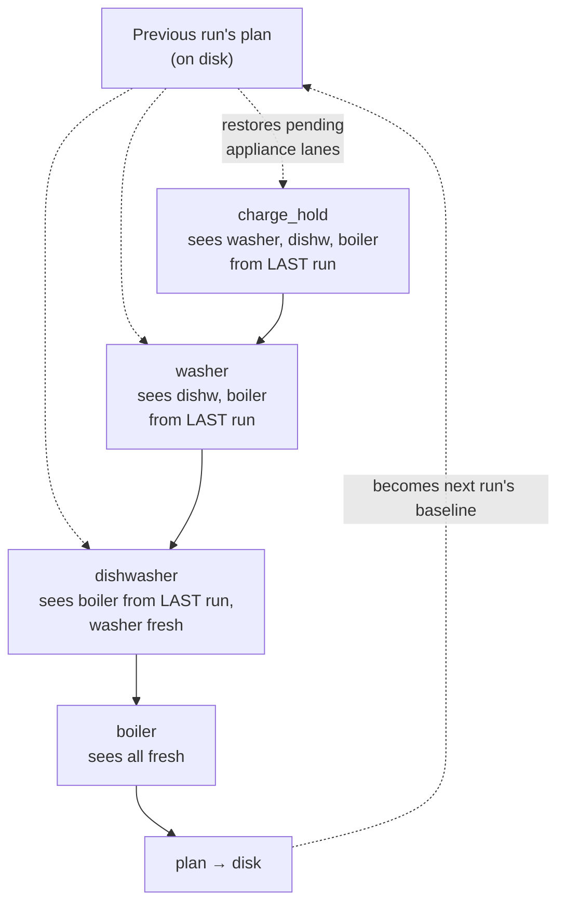
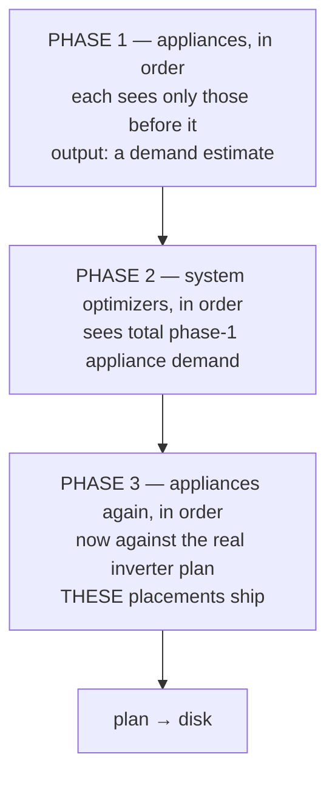

# Project Proposal — Structural Drawings

## Project Understanding
You need assistance with: 
**Split optimizers into appliance and inverter buckets with a deterministic phased run**

*Project description:*
The optimizer pipeline is one flat, user-ordered list. Because every run strips its own previous decisions and re-plans from scratch, an optimizer cannot see the lanes of optimizers that have not run yet — so `_build_pending_aware_snapshot` restores those lanes from the **previous run's** plan (`custom_components/helman/automation/pipeline.py:704-762`, added for #116). That single mechanism is applied to two structurally different relationships, and the conflation is what this issue removes.

The code already contains the distinction it does not admit. `_APPLIANCE_OPTIMIZER_KIND = "appliance_runtime"` (`pipeline.py:686`) and the identical test at `coordinator.py:4779` mean inverter lanes are never restored and appliance lanes always are — an emergent seam, duplicated, not a designed one. Making it explicit gives each family a rule that can be stated in one sentence, and lets the previous-run dependency be deleted rather than managed.

Three concrete defects follow. **The plan depends on what was on disk** — identical forecasts produce different schedules depending on the previous plan, so tests must seed history to assert anything. **Cold start is unfixed** — on the first run after a restart or after an appliance is added there is no baseline to restore, so `charge_hold` sees the full inflated surplus that #116 was filed about. **Priority is a lie** — a higher-priority appliance partly defers to a lower-priority one's stale placement, because the restore makes no distinction between demand that must be respected physically and demand that may be displaced.

## What changes

Today — one list, every optimizer reading the previous run:

After — three phases, no previous-run input:

## The reserve-floor hazard, and why it is not fixed here

Phase 3 moves appliance demand relative to phase 1, and phase 2's decisions were computed against phase 1. That is usually an economic approximation, but in one case it touches a safety invariant.

`charge_from_grid` sizes a grid purchase from three reads of the phase-2 SoC trajectory: `_min_soc_over` across the expensive window (`optimizers/charge_from_grid.py:236-238`), `_soc_at(expensive_band.start)` (`:271`) and `_soc_at(cheap_band.start)` (`:282`), with `dip = floor - window_min_soc` (`:258`). Appliance demand added inside that window lowers all three, so `dip` grows and the bridge is undersized — the shipped plan can cross `reserve_floor_soc`. Nothing on the appliance side reliably backstops it: `_SelfSustainabilityGate.for_run` returns a `_NullGate` when `ensure_self_sustainability` is unset on every group, forced runs bypass the floor deliberately (`optimizers/appliance_runtime.py:359-369`), and the appliance floor is a different policy anyway.

**This hazard exists in production today**, for the same reason — `charge_from_grid` already sizes against last run's appliance placements with no re-check. This issue does not introduce it and does not fix it.

A repair phase was designed and rejected. Re-running `charge_from_grid` against final demand cannot guarantee reaching the floor — `target_soc` is capped by `max_target_soc` (`charge_from_grid.py:281`) and the cheap window may hold fewer slots than needed, which the optimizer treats as partial capacity and continues past (`:319-325`). It would also write the **shared inverter lane**, where only user-owned actions are protected (`automation/base.py:172-176`) and `_rank_cheapest_slots` skips only user-owned slots (`:395-398`) — so a repair write could overwrite `export_price`'s `stop_export` or `charge_hold`'s `stop_charging`, contradicting the precedence those optimizers rely on. And a second step for one optimizer id collides in `ExplanationBook`, which indexes `date → controllable id → optimizer id → record` (`automation/explain.py:664-667`); the phase-4 record would overwrite the phase-2 one.

So the hazard is **classified and pinned down before it is fixed**. #274 lands first on `main`: it classifies breaches — separating the `downstream_introduced` case this restructure could affect from pre-existing physical breaches and from breaches `charge_from_grid` already knew it could not close — and commits a deterministic scenario suite with its results as a golden file.

**The gate is that suite, not a live measurement.** A rate observed from the running system before and after would involve different forecasts, prices, SoC and weather, and would establish nothing about the algorithm. #272 re-runs #274's scenarios on identical fixed inputs and the PR reports the per-scenario diff: **no benign class may move to `downstream_introduced`, no affected-window count may rise, and no shortfall may grow by more than 0.5 percentage points** — a scenario must not be allowed to get worse merely because its class name stayed the same. How often this occurs on a real system is a separate question and belongs entirely to #275; it informs when the repair is worth building, never whether this may merge.

## Goals

**G1 — The plan does not read the previous plan.** No phase consumes previous automation-owned schedule actions. Holding forecasts, prices, live state, day-classification hysteresis bands and appliance runtime history fixed, the schedule is identical whether the previous plan is present, different or absent. This retires the #116 cold-start behaviour. It is deliberately *not* a claim of full determinism: day-classification hysteresis carries `previous_bands` from the prior run by design (`automation/day_context.py:10-14`), and runtime history intentionally affects appliance placement. Both remain.

**G2 — Appliance order means what the list says.** Within the appliance bucket an optimizer sees the placements of those before it and nothing of those after it. Order carries three meanings, all honoured by a single forward walk and none served by reading last run: *capacity claim* — an earlier optimizer commits demand the later ones must plan around, which is not exclusive ownership of a slot, since two appliances may share one; *dependency* — `requires_appliance` reads the plan, so a provider must precede its dependent (`conditions/types.py:419-440`); and *lane composition* — two optimizers may target the same appliance, in which case the later one sees and may extend the earlier one's writes.

**G3 — Less machinery, not more.** The appliance path becomes a plain ordered walk. `_pending_appliance_ids_by_index`, `_build_pending_aware_snapshot`, `_appliance_lane_ids`, `_APPLIANCE_OPTIMIZER_KIND`, `restore_automation_owned_appliance_actions` and the `demand_schedule_document` fork through `coordinator._build_automation_snapshot_from_schedule_pure` all go, along with the baseline document threaded into the runner.

**G4 — The two buckets are visible, and derived once.** Config and UI show system and appliance optimizers as separate ordered lists. Membership is computed from `affects_consumption` via the existing controllable registry (`controllables/spec.py:197-226`) and exposed as one property on `OptimizerSpec` — never a hand-written kind list, in either backend or frontend.

## Scenarios

Shared setup: `charge_hold` + `charge_from_grid` + washer (1.0 kWh), dishwasher (0.8 kWh), boiler (2.0 kWh). Figures are kWh/hour, aggregated from 15-minute slots.

### A — Cold start after a restart

| | Before | After |
|---|---|---|
| `charge_hold` sees | bare house — no baseline exists, surplus inflated by 3.8 kWh | total phase-1 appliance demand |
| Result | charge set sized against surplus the appliances will eat; wrong until the next slot | correct on the first run |

### B — Appliance priority, sunny day

Surplus 1.8 / 2.5 / 2.4 / 2.0 / 0.9 across 11:00–15:00. Washer first in the list, boiler last.

*Before:* the washer sees the boiler at 14:00 and the dishwasher at 13:00 from last run, so it ranks 12:00 best partly because two lower-priority appliances occupy the alternatives. Priority is inverted in effect.

*After:* the washer sees an empty appliance bucket and takes the best slot outright; the dishwasher places against the washer, the boiler against both. The boiler — last in priority — takes the worst remaining slot, which is what the list said.

### C — Boiler requirement changes mid-day

The user raises the boiler's target, so it needs 3 hours instead of 2 and its window shifts.

*Before:* `charge_hold` sizes against the boiler at **last run's** 14:00; the boiler then re-places to 11:00–13:00. Inconsistent for one slot, self-corrects next run.

*After:* phase 1 places it at 11:00–13:00, phase 2 sizes against that, phase 3 confirms. Consistent within the run.

### D — Deficit day, and the hazard the detector measures

Overcast. An expensive import window runs 17:00–20:00 with `reserve_floor_soc` at 20 %.

*Phase 1* places the boiler at 13:00. *Phase 2* projects a minimum of 24 % across the window, so `dip <= 0` and it buys nothing. *Phase 3*, now seeing `charge_hold`'s holds, moves the boiler to 18:00 — inside the expensive window. The projected minimum is now 16 %.

The plan ships breaching the floor by 4 points, and #274's detector logs it. **This is the same outcome as today**, where the equivalent trigger is the boiler having sat at 13:00 in last run's plan and moving this run. What changes is that it is now visible, and comparable between the two pipelines.

### E — Negative export prices

Prices go negative 12:00–14:00; all three appliances want those hours. Before and after, the appliance bucket resolves it by order — but after, by *stated* order rather than order plus last run's occupancy. `export_price` reads only prices and eligibility (`optimizers/export_price.py:54-126`), so no phase can invalidate it.

## Scope

- New `automation.appliance_optimizers` / `automation.system_optimizers` config shape replacing the flat `automation.optimizers` list, with a v14→v15 migration that partitions by derived bucket and preserves relative order within each.
- Bucket membership derived once from `affects_consumption` and exposed on `OptimizerSpec`.
- Three-phase run in `run_optimizer_loop_pure`, replacing the per-step pending-aware rebuild.
- Deletion of the baseline-restore machinery and the `demand_schedule_document` snapshot fork.
- Defined canonical day-context, static-rail and trace semantics under phases.
- A decided policy for `ConditionRailsUnavailable` now that there is no lane to restore.
- Config editor split into two ordered sections with per-bucket add and reorder.

## Out of scope

- **Fixing the reserve-floor hazard.** Measured here via #274, fixed in a follow-up. See above.
- Changing any optimizer's internal decision logic. Every kind keeps its algorithm; only what it is shown, and how often it is run, changes.
- Cross-bucket ordering as a user control. Bucket order is fixed by the phase structure.
- Rejecting two optimizers on one appliance lane. It is supported today (`config_validation.py:1414` exists to handle it) and stays supported; P2 defines the composition and P3 words the UI accordingly.
- `charge_hold`'s `has_room` staleness — see *Deliberately not doing*.

## Prerequisite

**P0 (#274) must land on `main` before this integration branch is cut.** It classifies reserve-floor breaches and commits the deterministic scenario suite whose golden results P2's PR is diffed against.

## Follow-up

**#275 — investigate whether the reserve-floor repair is worth building.** A research task, not a feature: it retains P0's classifications over weeks of real running and produces a recommendation to build the repair or to drop it.

Its decision metric is deliberately narrow. A breach *predicted* in a future window is not damage — the plan is rebuilt every 15 minutes, so most are planned away long before the slot executes. What counts is a breach that **survives into the executing slot**, and the gap between those two numbers is the most likely reason the answer comes back "not worth it".

Not scheduled with this work. The trigger is specific: **start it when the repair is being considered, and not before** — the repair is its only consumer. P0's suite proves which classes are *possible*; only this says which are *worth fixing*. It depends on P0's classifier so cannot begin until P0 has merged, and it needs weeks of varied weather before it can say anything.

## Phases

| Phase | Goals | Scope | Sequencing | Merges into |
|---|---|---|---|---|
| **P0** — #274 | gate | Breach classifier as an ordered decision table; observation collector on `OptimizerTrace`; deterministic scenario suite committed as a golden file | First | **`main`** |
| **P1** — #271 | **G4**, G3 | Bucket derived on `OptimizerSpec`; two-bucket config model with parse-time rejection of a misplaced kind; v14→v15 migration; `execution_optimizers` replaced by explicitly named properties; bucket-aware validation | After P0 | integration branch |
| **P2** — #272 | **G1**, G2, G3 | Three-phase run; drop appliance→appliance lookahead; delete the restore machinery and baseline thread; canonical day-context, static-rail and trace semantics; rails-unavailable policy; re-run P0's suite and report the diff | After P1 | integration branch |
| **P3** — #273 | **G4** | Config editor: two ordered sections driven by `schema.bucket`, per-bucket add/reorder, dependency-aware helper text | After P1 | integration branch |

**P0 merges to `main` on its own**, before the integration branch is cut. Its golden file would be a valid baseline either way — the pipeline is unrestructured at that commit in both cases — but it has standalone value: it classifies a hazard that exists in production today, so it should not be stranded if this parent stalls.

**#275 is tracked here but is not a phase.** It measures how often the hazard occurs at runtime. It does not gate anything in this issue and must not be built alongside it; see *Follow-up* below.

**Why this order.** P0 is first because the gate must exist before the thing it gates, and because its baseline must be generated from an unrestructured pipeline. P1 then comes before the rest because both remaining phases need bucket identity to exist — P2 to know what a phase contains, P3 to know what a section contains. P2 is the behaviour core and where the deletions land. P3 depends only on P1, not on P2, and is numbered last so the backend shape is settled before the editor is drawn against it. **P1 is not independently releasable** and must not reach `main` alone; see its Accepted risk.

**Deliberately not doing: a constraint bus between optimizers.** The tidy-looking option — phase 2 publishes slot masks phase 3 must respect — does not fit. `MaskInputs` (`conditions/types.py:69-82`) carries snapshot, value, target, master params and slot ids; there is no inter-optimizer channel, and the one mask that reads the plan does so through `snapshot.schedule` (`types.py:419-441`). A constraint channel means new plumbing through the loop, a condition type with no config key, and new explanation nodes. Worse, the constraint couples slots rather than gating them individually — which is exactly why `reserve_floor_soc` and `ensure_self_sustainability` are self-gating today — so any honest mask would have to blanket the whole expensive band.

**Deliberately not doing: an additive phase-4 repair.** Re-run `charge_from_grid` against final demand, merging additively so projected SoC only rises. It was the plan until three things killed it: it cannot guarantee reaching the floor (`max_target_soc` cap at `charge_from_grid.py:281`; partial cheap-window capacity treated as a gate state and continued past at `:319-325`), it writes the shared inverter lane where only user-owned actions are protected and so can overwrite `export_price` and `charge_hold` decisions (`automation/base.py:172-176`, `charge_from_grid.py:395-398`), and a second step under one optimizer id collides in `ExplanationBook`'s `date → controllable → optimizer id` index (`automation/explain.py:664-667`). Monotone improvement is not guaranteed repair, and a repair that clobbers its peers is not a repair.

**Deliberately not doing: failing the run on a floor breach.** Consistent with the rails-unavailable policy and safe, but the breach rate is unmeasured — shipping it could stall planning for hours on a config that trips it often. #275 answers the frequency question first; this becomes the leading candidate for the follow-up if prevalence is low.

**Deliberately not doing: validate-and-fall-back to phase-1 placements.** Re-check the floor after phase 3 and, on breach, ship phase 1's appliance lanes, which phase 2 is self-consistent with. Lossy and cliff-edged: one breached band discards every appliance's phase-3 improvement, including appliances nowhere near the window.

**Deliberately not doing: repairing `charge_hold`'s `has_room`.** `charge_hold` asserts the day's ranked surplus covers its threshold (`optimizers/charge_hold.py:477`), and phase-3 demand eats surplus, so a day that resolved `has_room=True` in phase 2 can ship a hold it cannot refill behind. This is a kWh-cost error, not a safety breach, and it is one-directional — it holds too much, never too little. It is also present today for the same reason. Unlike the floor, it is not even a candidate for measurement here — record it and open a separate issue if it proves material.

**Deliberately not doing: iterating to a fixpoint with a max-iteration cap.** Appliance placement is a discrete choice ranked on a continuous surplus signal, which has no convergence guarantee — limit cycles are the expected failure. The cap would then be the common exit path, and "iteration 10 of an oscillating system" is a plan chosen by the parity of a loop counter. Three fixed phases terminate trivially and are explicable to a user.

**Deliberately not doing: keeping a previous-run seed to warm phase 1.** It would give the system bucket a better first estimate but reintroduces exactly the history dependence G1 removes, and with it the cold-start gap.

## Working agreement

Python: `./scripts/run_tests.sh` on the host, one process per test file — never `pytest tests/`. Frontend: `cd frontend && npm run build`, then `npx playwright test` for the editor specs.

- **Branch from a freshly pulled `main`.** CI pushes release commits between sessions, so a stale `main` produces a diverged branch that cannot fast-forward.
- **One issue, one branch, one PR.** This parent gets one integration branch; each phase gets its own branch and PR merged into it, in phase order, one at a time. A phase's sub-issue closes when its PR merges. A single final PR goes from the integration branch into `main`.
- **The user merges the final PR into `main`.** Nothing merges to `main` unattended; the parent closes with it.
- **Each phase gets its own `/code-review` when complete**, scoped to that phase's changes, with findings resolved before the next phase starts — never batched at the end.

## Notes
- `custom_components/helman/automation/pipeline.py:686,704-762` — the seam and the restore machinery
- `custom_components/helman/automation/pipeline.py:376` — `_schedule_lock` held across the executor hop
- `custom_components/helman/automation/pipeline.py:432-450,474-479` — initial snapshot, canonical day contexts
- `custom_components/helman/automation/pipeline.py:495-510` — the existing "failed run persists nothing" path
- `custom_components/helman/automation/config.py:126-162` — `AutomationConfig`
- `custom_components/helman/controllables/spec.py:197-226` — `affects_consumption`, the bucket source
- `custom_components/helman/automation/spec.py:60-95,172-178` — `OptimizerSpec`, target shapes
- `custom_components/helman/automation/migration.py:841-855` — `_MIGRATIONS`; `const.py:32` — version 14
- `custom_components/helman/config_validation.py:1334-1480` — validation keyed on `execution_optimizers`
- `custom_components/helman/coordinator.py:4037-4073` — `demand_schedule_document` fork
- `custom_components/helman/automation/optimizers/charge_from_grid.py:236-290,281,319-325,395-398` — the SoC reads, the target cap, partial capacity, and slot ownership
- `custom_components/helman/automation/base.py:172-176` — only user-owned inverter actions are protected
- `custom_components/helman/automation/explain.py:664-667` — the one-record-per-optimizer-id index
- `frontend/config-editor/helman-config-editor.ts:2520-2570`, `frontend/cards/shared/optimizer/helman-optimizer-editor.ts:260`
- `docs/automation.md` — current behaviour, rewritten by P2

## Scope of Work
- Asset analysis and workspace initialization.
- Core modeling / development based on specifications.
- Technical validation and quality checks.
- Incorporation of review feedback.
- Clean handover of source files and documentation.

## Required Files & Inputs
1. Complete reference files (drawings, access tokens, test data).
2. Exact dimensional specs or business rules.
3. Schedule/deadline expectations.

## Estimated Price and Timeline
- **Estimated Price:** 800 - 2000 EUR
- **Estimated Timeline:** 3 to 7 business days (to be refined after reviewing the final assets).

## Project Questions
To help me refine this estimate, please clarify:
1. Avez-vous déjà réalisé l'étude de sol géotechnique pour les fondations ?
2. Quelles sont les charges d'exploitation particulières (machines, toiture végétalisée) ?
3. Fournissez-vous les plans d'architecte définitifs au format DWG ?
4. Quels sont les détails d'exécution attendus (nomenclatures d'acier, détails de ferraillage) ?
5. Quel est votre calendrier souhaité pour la validation des plans ?

## Agreement Terms
The final source files will be delivered upon approval of the milestones. Substantial revisions outside the agreed scope will require a change order.
