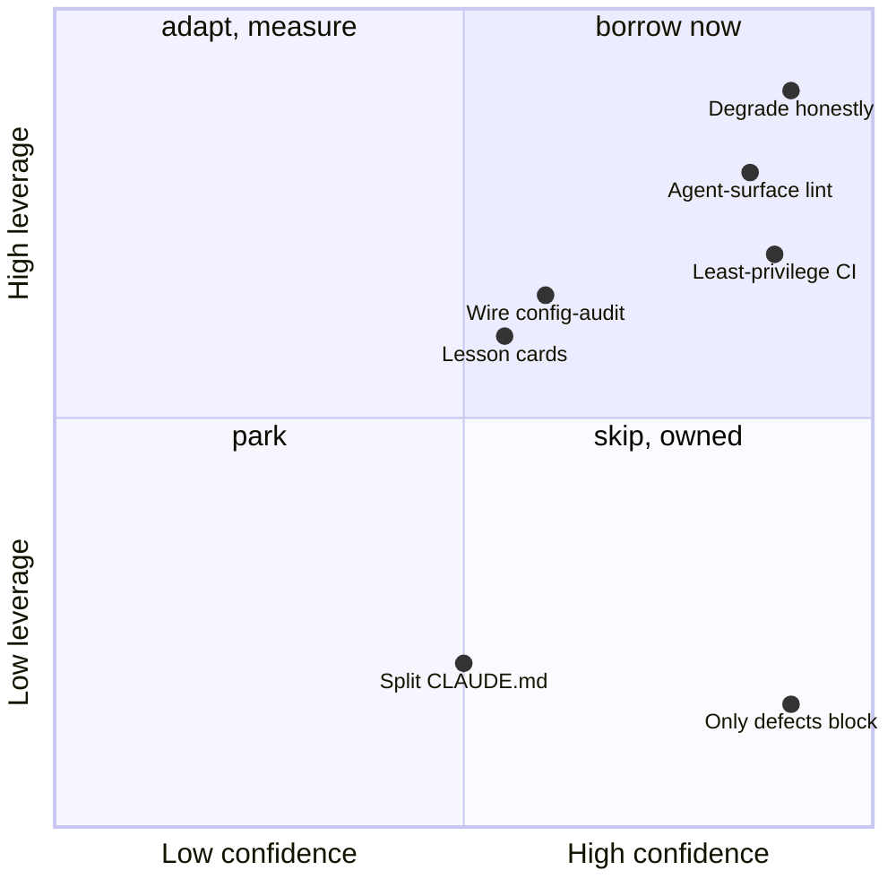

# Project Proposal — Unknown

## Project Understanding
You need assistance with: 
**plan: adopt four harness practices from lousy-agents — honest degradation, agent-surface lint, least-privilege ci**

*Project description:*
**Adopt four harness practices from zpratt/lousy-agents: honest degradation, an agent-surface lint, least-privilege CI, lesson cards.**

| | |
|---|---|
| **Status** | proposed · awaiting the ready flip (plan) |
| **Surface** | doc-rot · config-audit · a new eye · `pipeline.yml` (platter) · `/retro` |
| **Size** | ~6 PRs, two on the platter |

- 39 of their mechanisms censused against our code; 18 calls with falsifiers; 5 gaps sized (comments below).
- Ahead on process (ratchets, retros, envelope, leased lanes); behind on linting our own agent surface.
- "Degrade honestly" names a bug we have today: doc-rot's graph check passes on an unknown commit.

_Caption — the calls by confidence and leverage; above the midline are the slices. Source: comment D._

<strong>The brief</strong> — current state, criteria, constraints, forks

### Raw idea (verbatim)

> One of the most talented engineers/principle architects/Product managers/critical thought partners I know developed this repository: https://github.com/zpratt/lousy-agents … I'd like you to interrogate this repository to learn everything you have. They are consistently at the forefront of the bleeding edge of technologies, so afford more trust in their teachings and that you will learn the deeper lessons with time by listening.

(Eric, 2026-09-26.)

### Where it stands today

- **The study.** Four reports are the comments below this capsule, in order: A the thesis and the wisdom knowledge base; B the packages and mechanics; C the agent operating system; D the census of 39 mechanisms against our code, the call sheet, the gap table, the vocabulary, and the eight gaps of theirs we already solved. Every claim in them cites a path in one of the two repos. Read D first.
- **Their founding claim.** Agents are lousy because they are under-constrained, not because the model is weak: "the model is not the product, the harness is". Their product moved from scaffolding to a `doctor` that grades a repo's agent configuration for silent drift.
- **Verified in our code before filing:** `scripts/doc-rot-scan.mjs` returns an empty finding list when the graph's built-from commit is unknown (a shallow clone passes the check); `scripts/config-audit.mjs` has no caller in `package.json`, any workflow or any spec; `.github/workflows/pipeline.yml` grants `contents: write` at the top level and pins `superfly/flyctl-actions/setup-flyctl@master` in the two jobs that hold the deploy token; nothing lints the frontmatter of `.claude/skills/*/SKILL.md`, `.claude/agents/*.md` or the hook event names in `.claude/settings.json`; the always-loaded context is 58 KB against their 19 KB.
- **Their gaps we already solved** (D part 5): wired and tested hooks; ratcheted budgets; detection lag as a metric; doc rot checked against the tree; a mechanical envelope; no self-attested checks; idempotent dispatch; retro discipline. Not flattering: our platter's merge-commit promise lived only as a sentence until #3754 measured it, which is their "prose guardrails" failure in our house.

### The call sheet (18 rows, ranked by leverage on Eric's attention)

| # | Pattern | Call | Conf. | Why | What proves it wrong |
|---|---|---|---|---|---|
| 1 | Degrade honestly | borrow | high | our one blocking doc check passes silently on an unknown sha and measures staleness in days, not commits | by 2026-10-10 doc-rot fails explicitly on an unreachable sha and a commit overrun, with no false red on main |
| 2 | Instruction files linted like code | adapt | high | a malformed skill, agent or hook event vanishes silently, the `/grind` registry bug's class | 30 days of the eye find zero defects across 18 skills, 13 agents and the hooks |
| 3 | A doctor grades drift against declared intent | adapt | med | `config-audit.mjs` is the eye and no one runs it; `envelope.json`'s wording is restated in 7 files | the first 3 digests after wiring show zero actionable findings |
| 4 | "Harness" as the word for the process lane's product | adapt (vocabulary) | high | one word for what COACHES, skills and hooks jointly are | Eric never uses it in a request within a month |
| 5 | Lessons as trigger-scoped cards with caps | adapt | med | a ledger-only lesson protects nothing unless a session reads a 228 KB file | a ledger-only lesson recurs after its card existed, or >5% of edits get unused injections |
| 6 | Loop state in one marker, cap, human escape | adapt (small) | med | we have the cap and marker; a duplicate marker would re-dispatch on the wrong count | no PR carries two conflict markers in 60 days |
| 7 | Only high-confidence defects block | skip | high | CLAUDE.md and COACHES already go further | a red gate fires on a non-defect |
| 8 | Review comments are hypotheses | adapt | med | the lanes read PR comments unattended | a lane applies an untraced suggestion that breaks green |
| 9 | `permissions: {}` default, per-job grants | borrow | high | `pipeline.yml` hands write to every job | a job fails for a missing scope the platter's verify missed |
| 10 | SHA-pinned actions | borrow | high | `flyctl-actions@master` runs where the deploy token is | Dependabot's actions PRs stop landing after pinning |
| 11 | Tool provenance with checksums | adapt | med | the session hook curls an unverified mise tarball | the proxy blocks the provenance fetch |
| 12 | Security rules tested against fixtures | adapt (rule-testing) | med | apply the known-limitation header habit to every eye; SAST itself is a skip | an eye regresses silently despite a spec |
| 13 | "Partial beats false Shipped" | borrow | med | COACHES ✅ has no evidence rule | a roster audit finds every ✅ already wired |
| 14 | Telemetry independent of self-reports | skip for sessions, park for lanes | med | Actions logs already record what lanes ran | a lane's self-report contradicts its run log |
| 15 | Offline MCP that hands the AI lookup URLs | skip | high | no pinning product, no external audience | we ship a scaffolder to outsiders |
| 16 | One canonical file imported per assistant | skip for now | med | one assistant; the cost is size, not cross-harness drift | always-loaded bytes pass 60 KB or a second assistant is adopted |
| 17 | Release provenance and Scorecard | skip | high | nothing published to outsiders | we publish a package |
| 18 | Task sizing stated per slice | adapt | low | fits the slicing sketch | slices already average under it |

### Gap table (top five)

| Element | Ours today | Gap | Size | Lands on |
|---|---|---|---|---|
| Honest degrade on a stale graph | `doc-rot-scan.mjs` days-only threshold, unknown sha → `[]` | replace the silent skip with an explicit finding; add a commit-count threshold; fixture spec | S | `doc-rot-scan.mjs`, `tests/arch/doc-rot.spec.ts` |
| Agent-surface lint | `workflow-meta-scan.mjs` covers workflows only | add `agent-surface-scan.mjs`: name = directory, description present, known hook event, matcher present | M | new eye in the COACHES roster; the settings.json reader is unprotected, the file is not |
| Wire config-audit | no caller | npm script, advisory spec, digest row; a restatement counter for `envelope.json` wording | S | `/secretary`, `docs/COACHES.md` |
| Lesson cards | one 228 KB ledger, no Edit/Write hook | cards for ledger-only lessons via `/retro`; the hook change boards the platter | M | `/retro`; platter |
| Least-privilege tokens, SHA pins | top-level write, two `@master` pins | `permissions: {}` plus per-job grants; SHA pins with a version comment | S | platter, one commit per item |

### Vocabulary worth adopting

harness (the operating model) · degrade honestly · defect vs advisory (our correctness vs debt class) · effective document (what a session actually loads) · loop completeness (does the instruction say how to know it is done) · invariant vs pattern lesson (our doctrine line vs ledger-only) · evil path (our repro) · accidental sprawl · evidence hierarchy (Shipped, Partial, Specified, Planned).

### Acceptance criteria (EARS)

- WHEN doc-rot's graph check cannot resolve the graph's built-from commit, the scan SHALL emit an explicit "unknown" finding with a non-zero exit, and WHEN the graph is more than N commits behind HEAD it SHALL fail on the count, not the days.
- WHEN a skill, agent or hook file under `.claude/` has a name that does not match its directory, a missing description, or an unknown hook event, the agent-surface eye SHALL report it; errors block, everything else notes.
- WHEN `npm test` runs, `config-audit.mjs` SHALL run as an advisory eye and its findings SHALL appear in the next digest.
- WHILE any job in `pipeline.yml` needs write access, that job SHALL declare it; the workflow's default SHALL be `permissions: {}`; every third-party action SHALL be pinned to a SHA with its version in a comment.
- WHEN `/retro` files a ledger-only lesson, it SHALL also write a trigger-scoped card, and WHEN a session edits a path the card's trigger names, the card SHALL be injected, capped in count and size.
- The pickup test for the study itself: a build session handed only comment D and the state block starts slice 1 without opening the reference repo.

### Constraints & non-goals

- No new dependency and no SAST adoption; the borrow is the habit (fixtures, known-limitation headers), not semgrep.
- `pipeline.yml`, `.claude/settings.json` and the lane prompts are envelope-protected: those items board the platter, one commit per item, never a direct merge.
- The reference's packages are not adopted: paper-only app, one assistant, no external audience. Skips 14 to 17 stay skips until their falsifiers fire.
- Trust the teachings, verify the claims: every "theirs" in the census cites a path; every call carries a falsifier and the tape adjudicates.

### Settled forks (decision log)

- 2026-09-26 · Study shape: three parallel reads (thesis, mechanics, operating system) then one census against our code, all read-only, reports attached as comments so the issue is the context store (#3765's pattern). This run is the first test of the "adopting a capability" anatomy parked in `docs/IDEAS.md`.
- 2026-09-26 · The wisdom knowledge base is not adopted: it is a 24 MB Graphify graph over vendor docs that even their own reader caps at 10 MB. The five deepest entries are summarised in comment A.
- 2026-09-26 · "Harness" enters our vocabulary as a word, not a rename: `docs/OPERATING-MODEL.md` keeps its title.

### Open questions

- Commit-count threshold for the graph: the 170-commit drift that ADR-0008 records is the only data point. Slice 1 picks 50 and states it as a call with that falsifier.

### Slicing sketch

1. **Degrade honestly in doc-rot** (S): explicit unknown state, commit-count threshold, fixture spec. One PR.
2. **Wire config-audit + the COACHES evidence rule** (S): npm script, advisory spec, digest row, ✅ needs a caller and a spec. One PR.
3. **Agent-surface eye** (M): `scripts/agent-surface-scan.mjs` + spec + roster row. One PR.
4. **Platter: least-privilege tokens, SHA pins, mise checksum** (S, protected): three items, one commit each.
5. **Lesson cards** (M): `/retro` writes cards for ledger-only lessons; the injection hook boards the platter.
6. **Lane hygiene** (S, protected): review comments as hypotheses in the lane prompts; fail closed on a duplicate conflict marker. Boards the platter; **slice 6 closes this**.

State block: the first comment after the four reports, edited in place.

### Eric's steps

None until the platter opens; then one merge click per cadence, with a merge commit.

---
_Generated by [Claude Code](https://claude.ai/code)_

## Scope of Work
- Asset analysis and workspace initialization.
- Core modeling / development based on specifications.
- Technical validation and quality checks.
- Incorporation of review feedback.
- Clean handover of source files and documentation.

## Required Files & Inputs
1. Complete reference files (drawings, access tokens, test data).
2. Exact dimensional specs or business rules.
3. Schedule/deadline expectations.

## Estimated Price and Timeline
- **Estimated Price:** 300 - 800 USD
- **Estimated Timeline:** 3 to 7 business days (to be refined after reviewing the final assets).

## Project Questions
To help me refine this estimate, please clarify:
1. Could you describe the project scope and deliverables in detail?
2. Do you have any existing drawings or reference documents?
3. What is your target budget range?
4. What is your expected timeline?
5. Which tools/software do you prefer for this project?

## Agreement Terms
The final source files will be delivered upon approval of the milestones. Substantial revisions outside the agreed scope will require a change order.
