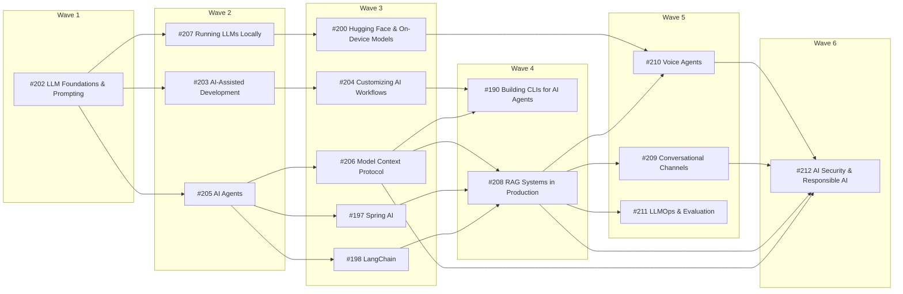

# Project Proposal — Structural Drawings

## Project Understanding
You need assistance with: 
**Add "Hugging Face & On-Device Models" sub-section under Guides & References / AI: the Hub (model cards, licences, gating, hf CLI, cache), model formats (safetensors, GGUF, ONNX, MLX, Core ML / Core AI, LiteRT, ExecuTorch), transformers v5 pipelines, curated STT / TTS / vision / small-LLM / embedding models, conversion and quantization, fine-tuning with PEFT / TRL, and integrating Hugging Face models into Python (FastAPI) and Spring Boot backends and into macOS / iOS, Android, Windows / .NET, web and cross-platform apps, with bibliography and a one-page cheat sheet PDF**

*Project description:*
## Summary

Add **Hugging Face & On-Device Models** (`modules/ROOT/pages/ai/hugging-face/`). It covers:

* how to **find, evaluate and download models from Hugging Face** to run locally
* **speech-to-text** and **text-to-speech** models
* **image processing and vision** models
* **LLMs** that run on premise, and **small models for phones and apps**
* how to **integrate those models into existing apps**:
  * **backends**: Python/FastAPI, Spring Boot
  * **native apps**: macOS/iOS, Android, Windows/.NET
  * **web and cross-platform**

It also covers fine-tuning with PEFT/TRL, because adapting a Hub model is part of the same workflow.

This issue **fills in the placeholder #200 "HuggingFace"**.

Original request covered: *"explore how to use HuggingFace to obtain models to work locally (e.g. for speech to text and text
to speech, for image processing, LLM's that can be run on premises or text models that can run locally in
smaller devices such as phones or apps). Explore how to integrate models obtained from HuggingFace into
existing apps (either backend apps using python or SpringBoot, or native desktop or phone apps in macOS,
Windows, iOS, Android, etc)"*.

## Context

### Requester-provided books used by this sub-section

These are copyrighted PDFs in `~/Desktop/ai`. They are not attached or uploaded.

| Book | Bibliographic data | Publisher page | Official code |
|---|---|---|---|
| *Hugging Face in Action* | Wei-Meng Lee. Manning, 2026. ISBN 978-1-63343-671-8 | https://www.manning.com/books/hugging-face-in-action | https://github.com/weimenglee/HuggingFaceInAction |
| *Hands-On Large Language Models* (Ch. 2, 4, 5, 9–12) | Jay Alammar, Maarten Grootendorst. O'Reilly, Sep 2024. ISBN 978-1-098-15096-9 | https://www.oreilly.com/library/view/hands-on-large-language/9781098150952/ | https://github.com/HandsOnLLM/Hands-On-Large-Language-Models |
| *AI Engineering* (Ch. 7, fine-tuning; Ch. 8, dataset engineering) | Chip Huyen. O'Reilly, Dec 2024. ISBN 978-1-098-16630-4 | https://www.oreilly.com/library/view/ai-engineering/9781098166298/ | https://github.com/chiphuyen/aie-book |
| *The Developer's Playbook for LLM Security* (Ch. 9, supply chain: pickle malware, model cards, ML-BOM) | Steve Wilson. O'Reilly, Sep 2024. ISBN 978-1-098-16220-7 | https://www.oreilly.com/library/view/the-developers-playbook/9781098162191/ | none |

#### Concepts extracted

**Lee, *Hugging Face in Action***

| Ch. | Concepts |
|---|---|
| 1 | The Hub; model cards; the old hosted inference widget; Gradio; Spaces; the "need → Hub discovery → model card → hosted or local" workflow |
| 2 | Environments; GPU use (`device` `cuda:0` / `mps:0` / CPU); `huggingface_hub` (`hf_hub_download`, `login`); the old `huggingface-cli` |
| 3 | `pipeline()` vs. `AutoTokenizer` / `AutoModelFor*`; tasks: classification, generation, summarization, translation, zero-shot, QA |
| 4 | Vision: DETR detection (plus webcam), ViT classification, SegFormer segmentation, VideoMAE, CLIP |
| 5 | `datasets`: load, stream, Parquet, `map` tokenization |
| 6 | Fine-tuning with `Trainer` / `TrainingArguments`; multimodal models |
| 7–8 | LangChain `HuggingFaceEndpoint`; LlamaIndex RAG; Langflow |
| 9 | smolagents `CodeAgent`, tools, `LiteLLMModel` with Ollama |
| 10 | Gradio UIs and deploying to Spaces |
| 11 | GPT4All local GGUF |
| 12 | Local RAG (FAISS + MiniLM + GPT4All) |
| 13 | MCP with FastMCP |

**Alammar & Grootendorst**

| Ch. | Concepts |
|---|---|
| 2 | Tokenizers |
| 4 | Classification with task models vs. embeddings |
| 5 | Clustering / BERTopic |
| 9 | CLIP / BLIP-2 |
| 10 | Training embedding models (sentence-transformers, MNR loss, TSDAE) |
| 11 | Fine-tuning BERT, SetFit, MLM, NER |
| 12 | **QLoRA** (NF4 via bitsandbytes, LoRA r/alpha/targets, TRL `SFTTrainer`, merging), DPO |

**Huyen**

| Ch. | Concepts |
|---|---|
| 7 | When to fine-tune; memory math; PEFT / LoRA / QLoRA; merging |
| 8 | Dataset curation, synthesis, dedup |

#### Where the books are outdated

**Hugging Face libraries and tools**

* **The serverless Inference API is gone.** It was decommissioned and replaced by **Inference Providers**
  (`router.huggingface.co/v1`, `InferenceClient(provider=…)`).
* **`huggingface-cli` is replaced by the `hf` CLI.** The old CLI was removed in `huggingface_hub` 1.0.
  **`huggingface_hub` 2.0.0** (2026-09-24) moved to `httpx2` and removed the APIs deprecated in 1.x.
* **transformers v5** (5.17.x) is PyTorch-only, with a single tokenizer backend, `transformers serve`, and
  first-class quantization. v4-era code (TF/Flax, Fast/Slow tokenizers) may need edits.
* **Gradio 6** is current. smolagents is at 1.2x; `HfApiModel` is now `InferenceClientModel`.
* **Optimum's ONNX export moved to `optimum-onnx`.**

**Model generations.** The books' models are old; current families are listed in the Page outline.

**Renames and deprecations (2025–2026)**

| Old | Now |
|---|---|
| ai-edge-torch | **litert-torch** |
| TFLite | **LiteRT** |
| MediaPipe LLM Inference | **maintenance-only**; use **LiteRT-LM** |
| WhisperKit repository | **argmax-oss-swift** |
| mlx-swift-examples LLM libraries | **mlx-swift-lm** |
| `rhasspy/piper` | **OHF-Voice/piper1-gpl** (GPL-3.0) |
| Moonshine under `UsefulSensors` | **moonshine-ai** |
| DirectML | "sustained engineering"; use **Windows ML** |
| Phi Silica | being replaced by **Aion Instruct** (Oct–Nov 2026) |
| AutoAWQ | archived; use **llm-compressor** |
| docs at ai.google.dev/edge | **developers.google.com/edge** |

* **Apple Core AI (`.aimodel`) is new in OS 27.** It sits alongside Core ML. Foundation Models gains
  `LanguageModelExecutor` and can run Core AI models.

### What already exists in this repository

| Existing page | Relationship |
|---|---|
| `apps/apple/apple-intelligence-and-machine-learning.adoc` (Foundation Models, `@Generable`, tool calling, Core ML approach choice) | **Linked, not repeated.** The Apple page here covers only *bringing Hub models* to Apple platforms (Core ML / Core AI conversion, MLX, swift-transformers, WhisperKit, `LanguageModelExecutor`) and links back for Foundation Models basics. |
| `apps/android/*` (e.g. `device-features-camera-location-sensors-media.adoc`, `project-structure-and-gradle.adoc`) | Linked from the Android page for Gradle setup and camera / audio capture. |
| `apps/react-native/*` | Linked from the cross-platform page. |
| `database/vector-rag/generating-embeddings-in-practice.adoc` (sentence-transformers, MTEB) | Embedding **models** are linked here; only the on-device runtime aspects are added. |
| `backend/springboot/*`, `programming-languages/python/*` | Linked for framework basics. The planned Python FastAPI section is #199: if it exists, the FastAPI page links it; otherwise plain prose. |
| Open issue #191 "Windows Apps" | If it exists at implementation time, the Windows page links it. |

## Page outline

All pages live under `modules/ROOT/pages/ai/hugging-face/`.

**Running scenario: *DocsAssistant goes offline*.** One example app per platform performs the **same four tasks**
with Hub models:

1. **transcribe** a spoken question (Whisper / Moonshine / Parakeet)
2. **answer it** with a small local LLM (Gemma 4 E2B / Qwen3.5 / Phi-4-mini)
3. **speak** the answer (Kokoro / Piper)
4. **classify / describe** a screenshot (SigLIP 2 / SmolVLM)

It is implemented in Python/FastAPI, Spring Boot, Swift (iOS/macOS), Kotlin (Android), C# (Windows) and JavaScript
(Transformers.js). Each snippet is followed by its official doc link.

### The Hub

* `index.adoc` covers:
  * the obtain → convert → integrate workflow
  * the platform × task × runtime × format decision matrix
  * the recent renames and deprecations table
  * the version baseline
  * `== Bibliography`

  📊 SVG of the decision matrix; 📊 Mermaid of the workflow.
* `hub-essentials.adoc` covers:
  * models / datasets / Spaces repos
  * searching and filtering (task, library, app, size)
  * trending models
  * model cards
  * **tokens and gated models** (manual vs. auto gating)
  * the **`hf` CLI** (`auth`, `download --include`, `cache ls/prune`, `models ls --json`)
  * the `huggingface_hub` 2.0 API (`hf_hub_download`, `snapshot_download`)
  * the cache and `HF_HOME`
  * offline mode
  * Xet storage
* `choosing-models-and-licences.adoc` covers:
  * reading a model card: intended use, eval, limitations
  * size vs. hardware (link the local-llms sizing page)
  * **licence classes**:
    * Apache / MIT
    * CC-BY (NVIDIA)
    * OpenRAIL
    * community licences (Llama, older Gemma)
    * **AGPL-3.0 (Ultralytics YOLO)**, with its implications for apps
    * non-commercial (XTTS CPML)
  * gated access
  * leaderboards (Open ASR, MTEB, Arena)
  * a licence checklist for shipping in an app
* `model-formats.adoc` covers:
  * safetensors vs. pickle (security)
  * GGUF
  * ONNX (the `onnx-community` org)
  * MLX (`mlx-community`)
  * Core ML `.mlpackage` / Core AI `.aimodel`
  * LiteRT `.tflite` / `.litertlm` (`litert-community`)
  * ExecuTorch `.pte`
  * CTranslate2
  * which runtime reads which format
  * where the official pre-converted variants live

  📊 SVG format → runtime map.

### Python and models

* `transformers-pipelines.adoc` covers:
  * transformers v5 `pipeline()` per task: `automatic-speech-recognition`, `text-to-audio`,
    `image-classification`, `zero-shot-image-classification`, `object-detection`, `image-segmentation`,
    `mask-generation`, `image-text-to-text`, `text-generation`
  * `Auto*` classes and processors
  * device / dtype
  * `transformers serve`
  * v4 → v5 migration notes
* `speech-models.adoc` is a curated STT + TTS catalogue: licence, size, languages, streaming, runtimes and official
  card link. It covers:
  * STT:
    * Whisper large-v3 / turbo
    * distil-whisper
    * Parakeet / Canary
    * Moonshine
  * TTS:
    * Kokoro-82M
    * Piper voices
    * Parler-TTS
    * Dia, Orpheus, Chatterbox
    * Kyutai, VibeVoice, CSM
  * code with transformers, faster-whisper and Kokoro

  Links: the Voice Agents sub-section for real-time use.
* `vision-models.adoc` is a curated catalogue with code for classification, detection, segmentation and VLM
  captioning. It covers:
  * SigLIP 2
  * DINOv2 / v3
  * YOLO (AGPL) vs. Apache-licensed RT-DETRv2 / D-FINE
  * SAM 2.1 / SAM 3
  * Florence-2
  * SmolVLM
  * Qwen-VL
  * FastVLM
* `small-llms-and-embeddings.adoc` covers:
  * the LLMs: Gemma 4 E2B / E4B, Gemma 3n / 3, Phi-4-mini, Qwen3 / 3.5 small, SmolLM3, Llama 3.2 1B / 3B
  * embedding models: MiniLM, Qwen3-Embedding, EmbeddingGemma
  * which official quantized formats exist for each
  * quality expectations on device
* `conversion-and-quantization.adoc` covers:
  * GGUF (`convert_hf_to_gguf.py`, `llama-quantize`, imatrix, the GGUF-my-repo Space)
  * ONNX (`optimum-cli export onnx`, the ORT GenAI model builder, Olive int4)
  * Core ML (`coremltools.convert` + `optimize`)
  * Core AI (`coreai-torch`, `coreai-models`)
  * LiteRT (`litert-torch`) and the LiteRT-LM bundles
  * MLX (`mlx_lm.convert -q`)
  * ExecuTorch (`torch.export` → `.pte`, `optimum-executorch`)
  * GPU-server quantization (bitsandbytes, GPTQModel, llm-compressor)

  📊 Mermaid of the conversion pipelines.
* `fine-tuning-with-peft-and-trl.adoc` covers:
  * when to fine-tune (vs. prompting / RAG)
  * the LoRA update \( W' = W + \tfrac{\alpha}{r}BA \) and parameter savings
  * QLoRA / NF4
  * TRL `SFTTrainer` / `SFTConfig`
  * DPO
  * datasets preparation
  * merging and exporting adapters to GGUF / ONNX for on-device use
  * fine-tuning embedding models (sentence-transformers) and classifiers (SetFit)
  * compute estimates

### Integrating into apps

* `python-backends.adoc` covers:
  * FastAPI with the model loaded once in `lifespan`, inference in a threadpool or worker process
  * batching
  * streaming results
  * the ASR endpoint (faster-whisper), the TTS endpoint (Kokoro), the vision endpoint (pipeline) and the LLM
    endpoint (llama-cpp-python or `transformers serve`)
  * ONNX Runtime sessions and execution providers
  * text-embeddings-inference as a sidecar
  * GPU and concurrency pitfalls

  Links: the Python / FastAPI reference if it exists.
* `java-and-spring-boot.adoc` covers:
  * DJL (HF tokenizers, the model zoo, the ONNX engine)
  * ONNX Runtime Java (`OrtSession`) and ORT GenAI Java
  * Spring AI `TransformersEmbeddingModel` (ONNX, `spring.ai.embedding.transformer.onnx.*`)
  * LangChain4j in-process ONNX embeddings
  * Jlama (slow-moving)
  * `java-llama.cpp` (lags upstream)
  * the recommended path for LLMs: a local server (Ollama / vLLM / llama.cpp) behind Spring AI's Ollama or
    OpenAI starter with `base-url` (link Running LLMs Locally)
  * whisper / TTS via a sidecar or ONNX
* `apple-platforms.adoc` covers:
  * Core ML vs. **Core AI** (OS 27+; `AIModelAsset` → `AIModel` → `InferenceFunction`)
  * `swift-transformers` (Tokenizers, Hub)
  * MLX / **mlx-swift-lm** (`ChatSession`)
  * **WhisperKit** / TTSKit (argmax-oss-swift)
  * Foundation Models `LanguageModelExecutor` to run your own model inside a Foundation Models session
  * the llama.cpp XCFramework
  * app-size, memory and on-demand model download (Background Assets)

  Links: `apps/apple/apple-intelligence-and-machine-learning.adoc`.
* `android.adoc` covers:
  * **LiteRT** 2.x (the CompiledModel API; GPU and NPU delegates)
  * **LiteRT-LM** (`.litertlm`, Gemma 4 E2B)
  * the MediaPipe LLM Inference migration note
  * **Gemini Nano via ML Kit GenAI / AICore** (Prompt API beta, device list)
  * ONNX Runtime Mobile (NNAPI / QNN)
  * ExecuTorch
  * llama.cpp and whisper.cpp Android examples
  * model delivery (Play Asset Delivery / on-demand download)

  Links: `apps/android/*`.
* `windows-and-dotnet.adoc` covers:
  * **Windows ML** (the system ONNX Runtime, dynamic EPs, NPU requirements; the `winml` CLI)
  * the Windows AI APIs (Phi Silica → Aion Instruct, OCR, image APIs; Limited Access Feature)
  * **Foundry Local** (SDK, the OpenAI-compatible server)
  * ONNX Runtime GenAI (the C# API; the model builder)
  * the DirectML status
  * `Microsoft.ML.OnnxRuntime`
  * `Microsoft.Extensions.AI` `IChatClient` / `IEmbeddingGenerator` abstractions
* `web-and-cross-platform.adoc` covers:
  * **Transformers.js** 4.x (`pipeline(task, model, {device:'webgpu', dtype:'q4'})`, WebGPU vs. WASM)
  * ONNX Runtime Web
  * ExecuTorch cross-platform
  * React Native (llama.rn, react-native-executorch)
  * Flutter (flutter_gemma, onnxruntime, llama_cpp_dart)

  Links: `apps/react-native/*`.
* `hf-inference-providers-and-spaces.adoc` covers the cloud counterparts, for prototyping and as a fallback:
  * Inference Providers (the router, `:fastest` / `:cheapest` suffixes, `InferenceClient`)
  * Inference Endpoints
  * Gradio 6 + Spaces / ZeroGPU for demos
  * smolagents briefly (link AI Agents)
  * when to prefer local

### Cheat sheet

* `cheat-sheet.adoc` and `ai-hugging-face-cheat-sheet.pdf` cover:
  * the `hf` CLI commands
  * the download API
  * the licence checklist
  * the format → runtime table
  * the pipeline task names
  * the curated model table (STT / TTS / vision / small LLM / embeddings, with licences)
  * the conversion one-liners per format
  * the LoRA formula and TRL skeleton
  * the per-platform integration snippets (FastAPI, Spring, Swift, Kotlin, C#, JS)
  * the deprecations and renames

## Cross-links to add in existing pages

* **`apps/apple/apple-intelligence-and-machine-learning.adoc`:** a sentence linking `ai/hugging-face/apple-platforms.adoc`
  (bringing your own models, Core AI, MLX).
* **`apps/android/index.adoc` and `apps/react-native/index.adoc`:** a bullet linking the Android and cross-platform pages.
* **`database/vector-rag/generating-embeddings-in-practice.adoc`:** link `small-llms-and-embeddings.adoc` and
  `java-and-spring-boot.adoc` (in-process ONNX embeddings).

## Bibliography (on `ai/hugging-face/index.adoc`)

* **Requester-provided books:** the four above.
* **Hugging Face Hub:**
  * Hub docs: https://huggingface.co/docs/hub/index
  * model cards: https://huggingface.co/docs/hub/model-cards
  * licences: https://huggingface.co/docs/hub/repositories-licenses
  * gated models: https://huggingface.co/docs/hub/models-gated
  * security: https://huggingface.co/docs/hub/security
  * pickle security: https://huggingface.co/docs/hub/security-pickle
  * GGUF: https://huggingface.co/docs/hub/gguf
  * MLX: https://huggingface.co/docs/hub/mlx
  * Transformers.js: https://huggingface.co/docs/hub/transformers-js
  * local apps: https://huggingface.co/docs/hub/local-apps
* **`huggingface_hub`:**
  * CLI guide: https://huggingface.co/docs/huggingface_hub/guides/cli
  * download guide: https://huggingface.co/docs/huggingface_hub/guides/download
  * migration: https://huggingface.co/docs/huggingface_hub/main/en/concepts/migration_v2
* **Libraries:**
  * transformers: https://huggingface.co/docs/transformers/index
  * pipelines: https://huggingface.co/docs/transformers/main_classes/pipelines
  * transformers v5 blog: https://huggingface.co/blog/transformers-v5
  * safetensors: https://huggingface.co/docs/safetensors/index
  * Optimum ONNX: https://huggingface.co/docs/optimum-onnx/index
  * optimum-executorch: https://huggingface.co/docs/optimum-executorch/index
  * PEFT: https://huggingface.co/docs/peft/index
  * TRL: https://huggingface.co/docs/trl/index
  * datasets: https://huggingface.co/docs/datasets/index
  * Transformers.js: https://huggingface.co/docs/transformers.js/index
  * text-embeddings-inference: https://huggingface.co/docs/text-embeddings-inference/index
  * Inference Providers: https://huggingface.co/docs/inference-providers/index
  * Gradio: https://www.gradio.app/docs
  * smolagents: https://huggingface.co/docs/smolagents/index
* **Model cards** (links only): each model named on the catalogue pages, e.g.
  * https://huggingface.co/openai/whisper-large-v3-turbo
  * https://huggingface.co/hexgrad/Kokoro-82M
  * https://huggingface.co/google/gemma-4-E2B-it
  * https://huggingface.co/google/siglip2-base-patch16-224
* **Runtimes:**
  * ONNX Runtime: https://onnxruntime.ai/docs/
  * ORT GenAI: https://onnxruntime.ai/docs/genai/
  * ExecuTorch: https://docs.pytorch.org/executorch/stable/index.html
  * llama.cpp: https://github.com/ggml-org/llama.cpp
  * whisper.cpp: https://github.com/ggml-org/whisper.cpp
  * faster-whisper: https://github.com/SYSTRAN/faster-whisper
  * `llama-cpp-python`: https://llama-cpp-python.readthedocs.io/en/latest/
* **Java:**
  * DJL: https://docs.djl.ai/
  * ONNX Runtime Java: https://onnxruntime.ai/docs/get-started/with-java.html
  * Spring AI ONNX embeddings: https://docs.spring.io/spring-ai/reference/api/embeddings/onnx.html
  * LangChain4j in-process embeddings: https://docs.langchain4j.dev/integrations/embedding-models/in-process/
  * Jlama: https://github.com/tjake/Jlama
  * `java-llama.cpp`: https://github.com/kherud/java-llama.cpp
* **Apple:**
  * Core ML: https://developer.apple.com/documentation/coreml
  * Core AI: https://developer.apple.com/documentation/coreai
  * coremltools: https://apple.github.io/coremltools/docs-guides/
  * coreai-models: https://github.com/apple/coreai-models
  * Foundation Models: https://developer.apple.com/documentation/foundationmodels
  * swift-transformers: https://github.com/huggingface/swift-transformers
  * MLX: https://github.com/ml-explore/mlx
  * mlx-swift-lm: https://github.com/ml-explore/mlx-swift-lm
  * argmax-oss-swift: https://github.com/argmaxinc/argmax-oss-swift
* **Android / Google:**
  * LiteRT: https://developers.google.com/edge/litert
  * LiteRT-LM: https://developers.google.com/edge/litert-lm/overview
  * MediaPipe LLM Inference: https://developers.google.com/edge/mediapipe/solutions/genai/llm_inference
  * Gemini Nano: https://developer.android.com/ai/gemini-nano
  * ML Kit GenAI: https://developers.google.com/ml-kit/genai
  * ONNX Runtime mobile: https://onnxruntime.ai/docs/get-started/with-mobile.html
  * ExecuTorch Android: https://docs.pytorch.org/executorch/stable/using-executorch-android.html
* **Windows:**
  * Windows ML: https://learn.microsoft.com/en-us/windows/ai/new-windows-ml/overview
  * Windows AI APIs: https://learn.microsoft.com/en-us/windows/ai/apis/
  * Phi Silica: https://learn.microsoft.com/en-us/windows/ai/apis/phi-silica
  * Foundry Local: https://learn.microsoft.com/en-us/azure/foundry-local/what-is-foundry-local
  * DirectML: https://learn.microsoft.com/en-us/windows/ai/directml/dml
  * ONNX Runtime C#: https://onnxruntime.ai/docs/get-started/with-csharp.html
  * Microsoft.Extensions.AI: https://learn.microsoft.com/en-us/dotnet/ai/microsoft-extensions-ai
* **Cross-platform:**
  * llama.rn: https://github.com/mybigday/llama.rn
  * react-native-executorch: https://github.com/software-mansion/react-native-executorch
  * flutter_gemma: https://pub.dev/packages/flutter_gemma
* **Papers:**
  * Radford et al., Whisper: https://arxiv.org/abs/2212.04356
  * Hu et al., LoRA: https://arxiv.org/abs/2106.09685
  * Dettmers et al., QLoRA: https://arxiv.org/abs/2305.14314
  * Rafailov et al., DPO: https://arxiv.org/abs/2305.18290
  * Zhai et al., SigLIP: https://arxiv.org/abs/2303.15343
  * Oquab et al., DINOv2: https://arxiv.org/abs/2304.07193
  * Ravi et al., SAM 2: https://arxiv.org/abs/2408.00714

## Out of scope

* **Serving LLMs for many users:** belongs to Running LLMs Locally and LLMOps.
* **Voice-agent pipelines:** belong to Voice Agents. This sub-section only provides the models and runtimes.
* **Training from scratch.**
* **Hosting Spaces in production.**

## Estimated difficulty

**Very hard.** The job includes:

* six target platforms, each with its own runtime and conversion toolchain
* many renames and deprecations in 2025–26
* new OS-27 APIs (Core AI, `LanguageModelExecutor`)
* licence and gating facts that must be re-verified per model
* app examples that need real devices or simulators to validate

Consider implementing it in two PRs:

1. Hub, models, conversion, fine-tuning and backends
2. native, web and cross-platform integration

## Section-wide conventions

These conventions are shared by the 15 issues that together build **Guides & References / AI**. Each issue
repeats them so it can be implemented on its own.

### Placement

* **Folder.** All pages of this sub-section live under `modules/ROOT/pages/ai/hugging-face/`.
* **Nav block.** `modules/ROOT/nav.adoc` gets an `** xref:ai/index.adoc[AI]` block under *Guides & References*,
  inserted **after the Cloud block and before Git & GitHub**. This sub-section is added inside it as
  `*** xref:ai/hugging-face/index.adoc[Hugging Face & On-Device Models]` plus its `****` children.
* **Sub-section order.** Sub-sections appear in the AI block in this fixed order, so their relative position is
  stable whichever issue lands first:
  1. LLM Foundations & Prompting (`ai/llm-foundations/`)
  2. AI-Assisted Development (`ai/ai-assisted-development/`)
  3. Customizing AI Workflows (`ai/customizing-ai-workflows/`)
  4. AI Agents (`ai/agents/`)
  5. Model Context Protocol (MCP) (`ai/mcp/`)
  6. Building CLIs for AI Agents (`ai/cli-for-agents/`)
  7. Running LLMs Locally (`ai/local-llms/`)
  8. Hugging Face & On-Device Models (`ai/hugging-face/`)
  9. LangChain (`ai/langchain/`)
  10. Spring AI (`ai/spring-ai/`)
  11. RAG Systems in Production (`ai/rag-systems/`)
  12. Conversational Channels (`ai/conversational-channels/`)
  13. Voice Agents (`ai/voice-agents/`)
  14. LLMOps & Evaluation (`ai/llmops/`)
  15. AI Security & Responsible AI (`ai/security/`)
* **Bootstrapping the landing page.** `modules/ROOT/pages/ai/index.adoc` (the AI landing page) is fully specified
  in the *LLM Foundations & Prompting* issue.
  * If the *LLM Foundations & Prompting* issue has not landed yet, the first AI issue implemented creates `ai/index.adoc`
    as a minimal landing page. That page has a title, a description, the AI-assistance disclaimer, a
    `== Sub-sections` list, and the `ai.svg` picker image on the root `pages/index.adoc`, as described in that
    issue.
  * Every later issue adds its bullet to `ai/index.adoc` → `== Sub-sections`.
  * Every later issue appends its terms to the `:keywords:` of `ai/index.adoc` and of the root `pages/index.adoc`.

### Disclaimer and admonitions

* **The partial.** Add `modules/ROOT/partials/ai-hugging-face-disclaimer.adoc`. It is a single `[IMPORTANT]` block
  containing only:
  * the house AI-assistance disclosure: "This content was generated with the assistance of AI and should be
    verified against the official documentation of each tool and framework before being relied on in
    production."
  * the pointer `xref:ai/hugging-face/index.adoc#_bibliography[bibliography]`
* **Admonitions only indicate AI-assisted generation.** No other `NOTE`/`TIP`/`WARNING`/`CAUTION`/`IMPORTANT`
  block may appear anywhere in the sub-section. Version notes, deprecations, security caveats, pricing caveats
  and "planned section" pointers go in ordinary prose or table rows.

### Page format

* **Header.** Every page starts with `= <Title>`, `:description:`, `:keywords:` and
  `include::partial$ai-hugging-face-disclaimer.adoc[]`.
* **Intro.** An intro paragraph states the versions the page was written against. Versions are verified as
  current at implementation time and dated.
* **References.** Every page ends with `== References`, linking only the official documentation, specifications
  and papers the page derives from.
* **Code examples.** Every concept has at least one code example, and every example is followed by a link to
  the official page it derives from.
  * Examples are written against the **current official documentation**, never copied from a book.
  * Where a book's code is outdated, the page says so in prose and shows the current API.
* **Figures.** Add a `[mermaid]` block or an SVG wherever a picture genuinely clarifies a concept. The 📊
  suggestions in this issue are a floor, not a ceiling.
  * SVGs go in `modules/ROOT/images/` and are named `ai-hugging-face-*.svg`. They must render legibly in both light
    and dark themes.
  * Every Mermaid block must pass `npm run validate:mermaid` (`scripts/validate-mermaid.mjs`).
* **Math.** Use MathJax (`\( \)` / `\[ \]`) wherever a formula makes a concept precise, for example sampling,
  cost and latency estimates, memory sizing, or metrics.

### Cross-links

* **Link, don't duplicate.** Pages that already exist on this site are linked rather than re-documented; see
  "What already exists in this repository" above.
* **Sibling sub-sections.** Links to other AI sub-sections use `xref:` **only if the target page exists at
  implementation time**, because Antora fails on unresolved xrefs. Otherwise, name the planned sub-section in
  plain prose.
  * When a sibling lands later, it adds the missing xrefs back into this sub-section, as listed in its own
    "Cross-links" section.
* **The `ai-catalog` component.** Links into the `ai-catalog` component (`xref:ai-catalog::<page>.adoc[]`) may
  only target pages that exist on that repository's `main` branch, which is the branch the playbook builds.

### Bibliography

`ai/hugging-face/index.adoc` ends with a `== Bibliography` that lists **and links** every source consulted, grouped as:

* **Requester-provided books**, each with:
  * full bibliographic data
  * the official publisher page
  * the official companion code repository, where one exists
* **Official documentation**
* **Specifications and standards**
* **Papers and engineering articles**

The requester-provided PDFs are copyrighted:

* They are **never** committed, attached or uploaded anywhere.
* Concepts are paraphrased and credited, and no book text or code is reproduced verbatim.
* The bibliography closes with the house-style note: the books are consulted references, not the primary source
  of any example. On any discrepancy the official documentation is authoritative.

### Cheat sheet

* **The page.** `ai/hugging-face/cheat-sheet.adoc` is a short page that:
  * lists what the sheet covers
  * cross-references every page of the sub-section, grouped like the nav
  * links the PDF via `xref:attachment$ai-hugging-face-cheat-sheet.pdf[Download the Hugging Face & On-Device Models Cheat Sheet (PDF)]`
* **The PDF.** `modules/ROOT/attachments/ai-hugging-face-cheat-sheet.pdf` must be **exactly one A4 page**.
  * **Layout:** dense, multi-column, colour-coded boxes with a header line stating the version baseline and date,
    and a breadcrumb footer. It must be visually consistent with `vector-rag-cheat-sheet.pdf` and
    `azure-cheat-sheet.pdf`.
  * **Content:** a summary of every concept the sub-section documents.
  * **Production:** rendered from a print-ready HTML/CSS layout via headless Chrome. Only the PDF is checked in.

### Common acceptance criteria

- [ ] The `modules/ROOT/partials/ai-hugging-face-disclaimer.adoc` partial contains **only** the AI-assistance
      disclosure and the bibliography pointer.
- [ ] No other admonition appears under `modules/ROOT/pages/ai/hugging-face/`.
- [ ] The nav block sits inside *Guides & References → AI* in the order given above.
- [ ] `ai/index.adoc` and the root `pages/index.adoc` are updated with the bullet and keywords.
- [ ] Every page listed in "Page outline" exists and has a `:description:`, `:keywords:`, the disclaimer
      include, versions in its intro and a `== References` section.
- [ ] Every concept has at least one code example, and each example is followed by a link to its official page.
- [ ] Every source is linked in `== Bibliography`, including the publisher page (and the code repository, if
      any) of each requester-provided book. No book PDF is committed or attached.
- [ ] `ai-hugging-face-cheat-sheet.pdf` is exactly one A4 page, summarises every concept, and is linked from
      `cheat-sheet.adoc`.
- [ ] The 📊 figure floors are met, SVGs follow the `ai-hugging-face-*.svg` naming, and `npm run validate:mermaid`
      passes.
- [ ] Every cross-link in "Cross-links to add" is added, and there is no `xref:` to a page that doesn't exist.
- [ ] `npx antora antora-playbook.yml` builds with no xref or AsciiDoc errors or warnings introduced by this
      sub-section.

## Branching, PR target and merge strategy (read before running `/iru-issue`)

**Why this section exists.** The site is published nightly from `main` by `.github/workflows/publish.yml`, and no
CI build runs on PRs. Anything merged into `main` goes live the next night. If a partial AI section lands in `main`,
the site could publish half a section, or the build could break on an unresolved `xref`, a broken nav entry or an
invalid Mermaid block. To prevent that, **all 15 AI issues are integrated on one long-lived branch, `feature/213-ai-section`**. That
branch reaches `main` exactly once, through a single final PR, after every issue is done.

The branch belongs to the **collector issue #213**. Following this repository's rule that every branch has an
issue, #213 tracks all 15 sub-sections, owns the branch lifecycle, validates the whole section end to end, and
opens the single final PR into `main`.

**Settings for this issue (#200):**

| Setting | Value |
|---|---|
| Base branch (fork point **and** PR target) | **`feature/213-ai-section`**, never `main` |
| Working branch | `feature/200`, the `iru-issue` default |
| May this PR merge into `main`? | **No.** Only the final integration PR `feature/213-ai-section` → `main` merges into `main`. |
| Prerequisites before this PR may merge into `feature/213-ai-section` | the PRs of #207 (Running LLMs Locally) must already be **merged into `feature/213-ai-section`**. Until then this PR stays a **draft** and must not be merged, even into the integration branch. |

**Instructions for the `iru-issue` → `iru-explore` → `iru-plan` → `iru-code` → `iru-pr-description` chain:**

1. **Base branch (iru-issue Step 4.2).** When confirming the base branch, propose **`feature/213-ai-section`** as the default,
   explaining that this issue says so. Do **not** propose the current branch or `main`, and make sure the user
   picks `feature/213-ai-section` (free-text "use another branch" if needed).
   * If `feature/213-ai-section` doesn't exist on `origin` yet, stop and tell the user. It is created as described in #213 →
     *Branch lifecycle*, before #202 starts.
   * Before branching, bring `feature/213-ai-section` up to date with `main`. In a desktop-app worktree, use the app's
     sync-with-base-branch action; otherwise run `git merge origin/main` on `feature/213-ai-section`. This keeps unrelated work on
     `main` (e.g. other Guides & References sections) from turning into conflicts later.
2. **Implementation plan (iru-plan).** The plan's *Task summary* must contain the line `Base branch: feature/213-ai-section`, plus a
   short *Merge constraints* paragraph that restates the prerequisites row above. Its last task group must be
   **"Integration-branch verification"**, with these tasks:
   1. Merge the latest `origin/feature/213-ai-section` into `feature/200` and resolve conflicts.
      * **Expected conflict points:** the `** xref:ai/index.adoc[AI]` block in `modules/ROOT/nav.adoc`,
        `modules/ROOT/pages/ai/index.adoc` → `== Sub-sections`, and the `:keywords:` of the root and AI index
        pages.
      * **How to resolve:** keep every sibling's entries, in the fixed sub-section order.
   2. Run `npm run validate:mermaid` and `npx antora antora-playbook.yml` (or `/iru-build-docs`) **on the merged
      result**. It must finish with no xref, AsciiDoc or Mermaid errors.
   3. Compute this PR's merge readiness. For each prerequisite issue `#D`, check whether its branch has been merged
      into the integration branch: `git fetch origin && git branch -r --merged origin/feature/213-ai-section | grep -x "  origin/feature/D"`.
      Alternatively, list merged PRs into `feature/213-ai-section` with
      `gh pr list --base feature/213-ai-section --state merged --json number,headRefName,title`.
3. **PR creation (iru-issue Step 8).**
   * Open the PR as a draft against **`feature/213-ai-section`**.
   * In the PR body, reference the ticket as `Refs #200`. GitHub's closing keywords (`Closes #200`) only
     take effect on PRs into the default branch, so they would not close anything here. The final integration PR
     closes all 15 issues.
   * After `iru-pr-description` rewrites the body, re-append the ticket reference as Step 8.5 already does. Also
     append the **merge readiness** block below.
4. **Merge-readiness block.** Add it to the PR body, and repeat it verbatim in the final report to the user (iru-issue
   Step 9) as an explicit notification, not a passing mention. When this PR merges, also tick #200 in #213's
   *Progress* checklist:

   ```
   ### Merge readiness
   - Target branch: feature/213-ai-section (NOT main; this PR must never be merged into main)
   - Prerequisites: <each #D with ✅ merged into feature/213-ai-section / ⏳ not merged yet>
   - Antora build + Mermaid validation on the merged result: <✅ passed / ❌ failed>
   - Status: <✅ READY: can be merged into feature/213-ai-section after human review
             | ⏳ WAIT: keep as draft until <#D, …> are merged into feature/213-ai-section, then re-merge feature/213-ai-section and rebuild>
   - Reaches main only via the final integration PR feature/213-ai-section → main, owned by collector issue #213, after all 15 AI issues are merged
   ```

   If a prerequisite merges later, re-run step 2.1–2.3 of the "Integration-branch verification" group before
   marking the PR ready. Re-running `/iru-pr-description` with `base-branch: feature/213-ai-section` refreshes the description.

**Merging rules for the maintainer:**

* **Within a wave.** PRs can be merged into `feature/213-ai-section` in any order.
* **Updating before merge.** Before each merge, update the PR with the latest `feature/213-ai-section` and rebuild, because a sibling
  may have just touched `nav.adoc`.
* **After the merge.** Delete `feature/200`, and tick #200 in #213's *Progress* list.
* **Keep `feature/213-ai-section` buildable.** After every merge into it, `npx antora antora-playbook.yml` must stay green on the
  branch. That way the final PR is a pure aggregation with nothing left to fix.

**Final integration PR into `main`.** The final integration PR is owned by the **collector issue #213**. When all
15 AI issues are merged into `feature/213-ai-section`, #213 does the following:

1. runs the section-wide validation checklist
2. syncs the branch with `main` one last time
3. opens **one** PR `feature/213-ai-section` → `main`, which carries `Closes #213` plus all 15 sub-section issues

Merging it publishes the whole AI section at once, on the next nightly run, or immediately through
`manual_publish.yml`.

**Rejected alternative.** One option was to keep #202's PR open as the integration vehicle. That was rejected: it
would make #202 an unreviewable 15-sub-section PR, it would couple every sibling to an issue working branch, and
`iru-issue` creates and owns `feature/<id>` branches per ticket. A dedicated integration branch gives the same
"nothing reaches `main` until everything is done" guarantee, while keeping one small PR per issue.

**Extra acceptance criteria for this issue:**

- [ ] The PR for #200 targets `feature/213-ai-section`, and its body contains the *Merge readiness* block.
- [ ] The Antora build and `npm run validate:mermaid` pass on `feature/200` merged with the latest `feature/213-ai-section`.
- [ ] The PR is merged into `feature/213-ai-section` only after every prerequisite listed above has been merged there.
- [ ] After the merge, #200 is ticked in #213's *Progress* checklist.

## Implementation order, dependencies and parallelism (Guides & References / AI)

The 15 AI issues are grouped into **waves**:

* Issues **in the same wave are independent of each other** and can be implemented **in parallel**, for example
  on separate branches or worktrees, or by separate agents.
* A wave should start only when **all the hard dependencies** of its issues have been merged into `feature/213-ai-section` (see "Branching, PR target and merge strategy").

**Hard vs. soft dependencies**

* **Hard dependency.** The dependent issue reuses the other issue's concepts, running-example code (the
  DocsAssistant core, MCP server, models) or pages as its foundation. These dependencies are what the waves
  encode.
* **Soft dependency.** A cross-link only. Soft dependencies never block. Because `xref:` may only target
  existing pages, an issue that lands first names its siblings in plain prose, and each later issue adds the
  missing xrefs back, as described in "Cross-links" above.

**The critical path** is #202 → #205 → #198 / #197 → #208 → #209 / #210 → #212. It takes 6 waves. The other
issues fit alongside it without extending the total.



| Wave | Issues (can be implemented in parallel within the wave) | Requires (hard dependencies) |
|---|---|---|
| 1 | #202 LLM Foundations & Prompting (+ AI landing page) | none (start here) |
| 2 | #203 AI-Assisted Development<br>#205 AI Agents<br>#207 Running LLMs Locally | #202 |
| 3 | #204 Customizing AI Workflows<br>#206 Model Context Protocol (MCP)<br>#198 LangChain<br>#197 Spring AI<br>#200 Hugging Face & On-Device Models | #203, #205, #207 |
| 4 | #190 Building CLIs for AI Agents<br>#208 RAG Systems in Production | #204, #206, #198, #197 |
| 5 | #209 Conversational Channels<br>#210 Voice Agents<br>#211 LLMOps & Evaluation | #200, #208 |
| 6 | #212 AI Security & Responsible AI | #206, #208, #209, #210 |

All 15 issues, and the section-wide validation, are collected in **#213**, which owns `feature/213-ai-section`.

### Where this issue sits

* **Wave:** 3 of 6.
* **Depends on (implement first):** 
  * #207 Running LLMs Locally: the backend-integration pages recommend the local serving engines, sizing and quantization documented there.
* **Can be implemented in parallel with:** #204 Customizing AI Workflows, #206 Model Context Protocol (MCP), #198 LangChain, #197 Spring AI
* **Unblocks:** #210 Voice Agents

## Traceability to the original request

This issue is one of the set generated from a single request. The request asked for a new *Guides & References
/ AI* section built from the AI books in the requester's library, with:

* one detailed page per concept
* code examples linked to official documentation
* Mermaid, SVG and MathJax figures where helpful
* a linked bibliography
* admonitions used only for AI-assistance disclosure
* one-page cheat-sheet PDFs

The part of that request this issue covers is listed in its **Summary**.

## Task details

* **Importance:** important.


## Scope of Work
- Asset analysis and workspace initialization.
- Core modeling / development based on specifications.
- Technical validation and quality checks.
- Incorporation of review feedback.
- Clean handover of source files and documentation.

## Required Files & Inputs
1. Complete reference files (drawings, access tokens, test data).
2. Exact dimensional specs or business rules.
3. Schedule/deadline expectations.

## Estimated Price and Timeline
- **Estimated Price:** 800 - 2000 EUR
- **Estimated Timeline:** 3 to 7 business days (to be refined after reviewing the final assets).

## Project Questions
To help me refine this estimate, please clarify:
1. Avez-vous déjà réalisé l'étude de sol géotechnique pour les fondations ?
2. Quelles sont les charges d'exploitation particulières (machines, toiture végétalisée) ?
3. Fournissez-vous les plans d'architecte définitifs au format DWG ?
4. Quels sont les détails d'exécution attendus (nomenclatures d'acier, détails de ferraillage) ?
5. Quel est votre calendrier souhaité pour la validation des plans ?

## Agreement Terms
The final source files will be delivered upon approval of the milestones. Substantial revisions outside the agreed scope will require a change order.
