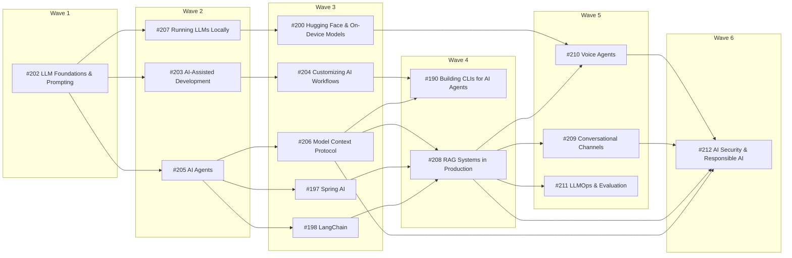

# Project Proposal — Quantity Takeoff

## Project Understanding
You need assistance with: 
**Add "AI-Assisted Development" sub-section under Guides & References / AI: working with GitHub Copilot and Claude Code from basic to advanced (completions, chat, agent mode, cloud/background agents, plan-first workflows, context management, testing, reviewing and securing AI-written code, team practices, model selection in each tool), with bibliography and a one-page cheat sheet PDF**

*Project description:*
## Summary

Add **AI-Assisted Development** (`modules/ROOT/pages/ai/ai-assisted-development/`). This sub-section is a practical guide to
**developing software with AI coding assistants**, mainly **GitHub Copilot** (VS Code, JetBrains, github.com
and the Copilot CLI) and **Claude Code** (CLI, IDE extensions, desktop and web).

It runs from basic to advanced:

* **Basic:** first completions and chat.
* **Intermediate:** agent mode and a plan → implement → verify loop.
* **Advanced:**
  * background and cloud agents working from issues
  * parallel sessions in worktrees
  * headless runs in CI
  * multi-model cross-checking
  * team-wide practices

It also covers **how to choose models inside each tool**.

It deliberately does **not** cover *creating* customisations (instruction files, skills, subagents, hooks,
plugins); that is the **Customizing AI Workflows** issue. This sub-section *uses* them and links there.

Original request covered: *"how to work with AI and LLMs (e.g. using Github Copilot or Claude) from basic to
advanced levels … select best models"*.

## Context

### Requester-provided books used by this sub-section

These are copyrighted PDFs in `~/Desktop/ai`. They are not attached or uploaded.

| Book | Bibliographic data | Publisher page | Official code |
|---|---|---|---|
| *AI-Assisted Programming: Better Planning, Coding, Testing, and Deployment* | Tom Taulli. O'Reilly Media, 1st ed., Apr 2024. ISBN 978-1-098-16456-0 | https://www.oreilly.com/library/view/ai-assisted-programming/9781098164553/ | https://github.com/ttaulli/AI-Assisted-Programming-Book |
| *Beyond Vibe Coding: From Coder to AI-Era Developer* | Addy Osmani. O'Reilly Media, 1st ed., Aug 2025. ISBN 979-8-341-63475-6 | https://www.oreilly.com/library/view/beyond-vibe-coding/9798341634749/ | none; continuously updated companion at https://beyond.addy.ie/ |
| *AI Engineering* (Ch. 5, defensive prompting; Ch. 10, feedback) | Chip Huyen. O'Reilly, Dec 2024. ISBN 978-1-098-16630-4 | https://www.oreilly.com/library/view/ai-engineering/9781098166298/ | https://github.com/chiphuyen/aie-book |

#### Concepts extracted

**Taulli, *AI-Assisted Programming***

| Ch. | Concepts |
|---|---|
| 1 | Benefits (less searching, IDE integration, docs, legacy modernisation) and drawbacks (hallucination, IP/copyleft, privacy, security, training cutoff, bias). Several tools beat one. |
| 2 | IntelliSense vs. generative completion. The "levels of code AI" (L0–L5). Tokens. Temperature guidance per task: low for code and review, higher for brainstorming. Code benchmarks (HumanEval, HumanEval+). |
| 3 | Prompt anatomy, delimiters, leading words (`def`, `SELECT`), few-shot, closed options against hallucination, no PII or secrets in prompts. |
| 4 | Copilot ghost text, cycling suggestions, comment-driven prompting, chat participants and slash commands, inline chat with diff view, open tabs as context, GitHub Advanced Security. |
| 7 | Brainstorming, PRDs and SRSs, Given-When-Then TDD prompts. |
| 8 | Modular prompting for small single-purpose units. Refactoring recipes: extract method, decompose conditionals, rename, dead code. Learning and translating languages. |
| 9 | Explaining errors, generating docs, code-review prompts, unit tests (typical, edge and invalid cases), PR descriptions, deployment planning. |

**Osmani, *Beyond Vibe Coding***

| Ch. | Concepts |
|---|---|
| 1 | Vibe coding vs. AI-assisted engineering. Tools: Copilot agent mode + MCP, Cline, Cursor, Windsurf. Model categories and mixing models per task. |
| 2 | Specificity checklist, iterative refinement, metaprompting, self-consistency, anti-patterns. |
| 3 | **The 70 % problem.** The knowledge paradox. Three workflows: AI as first drafter, pair programmer, or validator. Separate `[AI-assisted]` commits. Golden rules, e.g. "never merge code you don't understand". |
| 5 | Review, refine and own the code. The "majority problem". Debugging cycle, test-driven debugging, refactoring AI-looking code. |
| 6 | Prototyping (v0, Lovable, Bolt, screenshot-to-code) and moving to production. |
| 8 | Vulnerabilities in AI code (secrets, injection, IDOR, insecure defaults, hallucinated packages). Audits, property-based and fuzz tests, maintainability, staged rollouts. |
| 9 | IP and licensing, attribution, bias, responsible-AI checklist. |
| 10 | **Background coding agents.** The loop is plan → sandbox → execute → verify → PR. In-IDE vs. background agents. Multi-model specialist chains and cross-checking. "Coherent incorrectness". Bounded tasks with measurable goals, reviewing the plan as a gate, splitting work by module. |

#### Where the books are outdated

Neither book covers the features the official docs now centre on.

**Taulli (2024)**
* The chat-and-completion era only: no agent mode, cloud agent, MCP, instruction files, prompt files, custom
  agents, skills, hooks, AGENTS.md or Claude Code.
* Stale product names: CodeWhisperer is now Amazon Q Developer, Duet AI is now Gemini Code Assist, and
  ChatGPT plugins are gone.
* `gh copilot` has been replaced by the **Copilot CLI**.
* Copilot pricing and models have changed.

**Osmani (2025)**
* Claude Code gets only a passing mention.
* Copilot's "coding agent" is now documented as **Copilot cloud agent**.
* Missing: plan mode, subagents, worktrees, `claude -p`, permission modes, sandboxing and checkpoints.

Pages treat the books' tool and pricing details as history and document today's features from the official docs.

### What already exists in this repository

| Existing page | Relationship |
|---|---|
| `ai-catalog::index.adoc`, `ai-catalog::guides/common-workflows.adoc`, `ai-catalog::guides/provider-comparison.adoc` (Claude Code vs. Copilot vs. Codex), `ai-catalog::skills/iru-issue.adoc`, `ai-catalog::skills/iru-plan.adoc`, `ai-catalog::skills/iru-code.adoc` | The issue → explore → plan → code → PR flow in this account's catalog is the **worked example** of an advanced agentic workflow. Link it; don't re-document it. |
| `git-and-github/pull-requests.adoc` | Linked from the cloud-agent and review pages. |
| `backend/springboot/maven-quality-plugins.adoc`, `backend/docker/security.adoc` | Linked from the review / security page as deterministic gates that complement AI review. |

## Page outline

All pages live under `modules/ROOT/pages/ai/ai-assisted-development/`.

**Running scenario.** Examples use a small **Spring Boot + Python** sample repo ("DocsAssistant API"),
consistent with the rest of the AI section. Each task is shown in **both** Copilot (VS Code) and Claude Code (CLI),
side by side, as two AsciiDoc tabs or two consecutive blocks. The tasks are: add an endpoint, write tests, fix a
failing test, refactor, review a PR. "Code examples" here are:

* prompts
* instruction snippets
* CLI commands (`claude …`, `copilot …`, `gh …`)
* resulting diffs

Every example is linked to the official doc page.

### Basics

* `index.adoc` covers:
  * the spectrum from vibe coding to AI-assisted engineering
  * the levels of autonomy (completion → chat → agent → background agent)
  * the 70 % problem and the knowledge paradox
  * a basic → advanced reading path
  * the version baseline (VS Code / Copilot, Copilot CLI, Claude Code versions verified at implementation time)
  * `== Bibliography`

  📊 Mermaid of the autonomy ladder.
* `tool-landscape.adoc` covers:
  * the tool categories: completion, IDE chat, IDE agents, terminal agents, cloud/background agents, app
    builders
  * Copilot, Claude Code, Cursor, Cline, OpenAI Codex, Google Jules, Gemini Code Assist, Amazon Q Developer,
    as a dated comparison table with links to official pages only
  * when to use which
* `copilot-getting-started.adoc` covers:
  * installing in VS Code and JetBrains, and signing in
  * plans and their limits (link only)
  * ghost-text completions and next-edit suggestions
  * accepting and cycling suggestions
  * chat, inline chat, `#` context variables, attaching files and images
  * the Copilot CLI
  * Copilot on github.com
* `claude-code-getting-started.adoc` covers:
  * install and login
  * the agentic loop
  * `@` file references
  * permission modes and plan mode
  * checkpoints / rewind
  * sessions and `--continue` / `--resume`
  * IDE extensions (VS Code, JetBrains)
  * desktop and web
  * the `/` command basics
* `prompting-coding-assistants.adoc` covers:
  * applying the Foundations prompt anatomy to code: specificity checklist, give constraints and acceptance
    criteria, paste interfaces and types, leading words, modular asks
  * the anti-patterns table
  * prompts for each SDLC phase: planning / PRD, coding, tests, debugging, docs, PR descriptions

  Links: `ai/llm-foundations/prompt-engineering-fundamentals.adoc`.

### Intermediate

* `agent-mode.adoc` covers:
  * Copilot agent mode in VS Code: tools, terminal, approvals, auto-approve risks
  * Claude Code's equivalent loop
  * how agents gather context
  * approving tool calls
  * stopping and steering
  * tool sets and MCP servers (using existing ones; building them is in the MCP sub-section)

  📊 Mermaid of the agent loop: gather → plan → edit → run → verify.
* `plan-first-workflows.adoc` covers:
  * explore → plan → implement → commit
  * spec-first / "interview then spec"
  * Claude Code plan mode
  * Copilot plan agent / custom plan agents
  * reviewing the plan as a quality gate
  * writer / reviewer sessions
  * links to `ai-catalog::skills/iru-plan.adoc` as a worked example
* `context-management.adoc` covers:
  * what an assistant sees
  * instruction files (using them; authoring is in Customizing AI Workflows)
  * `/clear`, `/compact`, `/context`
  * starting fresh vs. long sessions
  * scoping with `@` / `#`
  * subagents for research
  * token and cost awareness, including the Copilot premium-request model and Claude usage limits (links only)
* `choosing-models-in-your-assistant.adoc` covers:
  * the Copilot model picker
  * supported-models and model-comparison pages
  * auto model selection
  * reasoning / effort levels
  * org policies
  * Claude Code `/model`, aliases, effort and fast mode
  * matching models to tasks: fast for edits, reasoning for planning and debugging, multimodal for UI
  * cross-checking with a second model

  Links: `ai/llm-foundations/choosing-a-model.adoc`.
* `testing-and-debugging-with-ai.adoc` covers:
  * generating unit, integration, edge-case, property-based and fuzz tests
  * critiquing existing tests
  * test-driven debugging: feed the failing test and error back
  * verification loops (tests as the agent's success criterion; a Stop hook, linked to Customizing AI Workflows)
  * reproducing bugs
* `refactoring-and-documentation.adoc` covers:
  * refactoring recipes with AI
  * the "majority problem"
  * making AI code your own
  * docstrings / Javadoc / README / ADR generation
  * legacy modernisation
  * translating between languages

### Advanced

* `cloud-and-background-agents.adoc` covers:
  * Copilot cloud agent: assign an issue, environment setup (`copilot-setup-steps.yml`), the firewall, the PR
    loop, iterating via PR comments, choosing the model
  * Claude Code on the web / GitHub Actions (`claude` GitHub App, `@claude` mentions)
  * how to choose bounded tasks with measurable goals
  * "coherent incorrectness"

  📊 Mermaid of issue → agent → PR → review → merge.
* `parallel-sessions-and-worktrees.adoc` covers:
  * running several agents with git worktrees
  * splitting work by module
  * fan-out / fan-in
  * merge-conflict strategy

  Links: `git-and-github/branches.adoc`.
* `headless-and-ci-automation.adoc` covers:
  * `claude -p` with `--output-format json|stream-json`
  * the Copilot CLI in non-interactive mode
  * the GitHub Actions integrations
  * scheduled agents
  * safe permission settings for CI
* `reviewing-ai-generated-code.adoc` covers:
  * a review checklist: intent match, off-by-one errors, placeholders, hallucinated APIs and packages,
    over-engineering, test quality
  * Copilot code review on PRs
  * `/review` in Claude Code
  * AI-as-validator
  * deterministic gates (linters, SAST, coverage) as the backstop

  Links: `ai-catalog::skills/iru-pr-review.adoc`.
* `securing-ai-assisted-development.adoc` covers:
  * common vulnerabilities in AI code: secrets, injection, IDOR, insecure defaults
  * slopsquatting / hallucinated packages
  * prompt injection through repo content, issues and MCP tools
  * permission modes, sandboxing and network allowlists
  * secret scanning (link `ai-catalog::skills/iru-check-security.adoc`)
  * data-privacy settings (content exclusion, training opt-outs; links only)

  Links: the AI Security sub-section.
* `team-practices-and-adoption.adoc` covers:
  * the golden rules
  * AI-assisted commit conventions
  * shared prompt / skill libraries
  * onboarding
  * measuring impact: acceptance rate, cycle time, DORA; beware vanity metrics
  * policies and IP / licensing: public-code filter / duplication detection, attribution
  * ethics
  * the junior / mid / senior advice
* `prototyping-with-ai.adoc` covers:
  * app builders (v0, Lovable, Bolt, Firebase Studio)
  * screenshot-to-code
  * the throw-away vs. evolve decision
  * the path from prototype to production

### Cheat sheet

* `cheat-sheet.adoc` and `ai-ai-assisted-development-cheat-sheet.pdf` cover:
  * the Copilot and Claude Code keyboard shortcuts and commands, side by side
  * the plan → implement → verify loop
  * the prompt template for code tasks
  * the context-management commands
  * the model-selection table per task
  * the background-agent task checklist
  * the review checklist
  * the security checklist
  * the golden rules

## Cross-links to add in existing pages

* **`git-and-github/pull-requests.adoc`:** one sentence linking `cloud-and-background-agents.adoc` and
  `reviewing-ai-generated-code.adoc`.
* **`ai-catalog`:** no edit here (different repository). Mention in prose that `ai-catalog` pages can link back
  once this sub-section exists.

## Bibliography (on `ai/ai-assisted-development/index.adoc`)

* **Requester-provided books:** the three books above.
* **GitHub Copilot:**
  * Copilot docs home: https://docs.github.com/en/copilot
  * customization cheat sheet: https://docs.github.com/en/copilot/reference/customization-cheat-sheet
  * model overview: https://docs.github.com/en/copilot/concepts/models/overview
  * supported models: https://docs.github.com/en/copilot/reference/ai-models/supported-models
  * model comparison: https://docs.github.com/en/copilot/reference/ai-models/model-comparison
  * cloud agent: https://docs.github.com/en/copilot/concepts/agents/cloud-agent/about-cloud-agent
  * changing the cloud agent's model: https://docs.github.com/en/copilot/how-tos/use-copilot-agents/cloud-agent/changing-the-ai-model
  * Copilot CLI: https://docs.github.com/en/copilot/concepts/agents/about-copilot-cli
  * prompt engineering: https://docs.github.com/en/copilot/concepts/prompting/prompt-engineering
* **VS Code:**
  * agents overview: https://code.visualstudio.com/docs/agents/overview
  * chat overview: https://code.visualstudio.com/docs/chat/chat-overview
  * language models: https://code.visualstudio.com/docs/agent-customization/language-models
* **Claude Code** (the https://code.claude.com/docs/en/ pages):
  * `overview`
  * `best-practices`
  * `common-workflows`
  * `permission-modes`
  * `model-config`
  * `headless`
  * `worktrees`
  * `sub-agents`
  * `github-actions`
  * `security`
  * `sandboxing`
  * `costs`
* **Other tools:** each tool in the landscape table links its official docs.
* **Articles:**
  * Anthropic, *Claude Code best practices* (above)
  * Anthropic, *Building effective agents*: https://www.anthropic.com/engineering/building-effective-agents
  * DORA: https://dora.dev/

## Out of scope

* **Authoring customisations:** instructions, prompt files, skills, agents, hooks and plugins belong to
  Customizing AI Workflows.
* **Building MCP servers:** belongs to the MCP sub-section.
* **Local / BYOK models:** belong to Running LLMs Locally. This sub-section links there from the model-selection
  page.
* **Pricing:** never hard-coded; link only.

## Estimated difficulty

**Medium–hard.** About 20 pages, with every workflow shown in two tools. Both products ship features weekly, so every command and UI
name must be verified and dated at implementation time.

## Section-wide conventions

These conventions are shared by the 15 issues that together build **Guides & References / AI**. Each issue
repeats them so it can be implemented on its own.

### Placement

* **Folder.** All pages of this sub-section live under `modules/ROOT/pages/ai/ai-assisted-development/`.
* **Nav block.** `modules/ROOT/nav.adoc` gets an `** xref:ai/index.adoc[AI]` block under *Guides & References*,
  inserted **after the Cloud block and before Git & GitHub**. This sub-section is added inside it as
  `*** xref:ai/ai-assisted-development/index.adoc[AI-Assisted Development]` plus its `****` children.
* **Sub-section order.** Sub-sections appear in the AI block in this fixed order, so their relative position is
  stable whichever issue lands first:
  1. LLM Foundations & Prompting (`ai/llm-foundations/`)
  2. AI-Assisted Development (`ai/ai-assisted-development/`)
  3. Customizing AI Workflows (`ai/customizing-ai-workflows/`)
  4. AI Agents (`ai/agents/`)
  5. Model Context Protocol (MCP) (`ai/mcp/`)
  6. Building CLIs for AI Agents (`ai/cli-for-agents/`)
  7. Running LLMs Locally (`ai/local-llms/`)
  8. Hugging Face & On-Device Models (`ai/hugging-face/`)
  9. LangChain (`ai/langchain/`)
  10. Spring AI (`ai/spring-ai/`)
  11. RAG Systems in Production (`ai/rag-systems/`)
  12. Conversational Channels (`ai/conversational-channels/`)
  13. Voice Agents (`ai/voice-agents/`)
  14. LLMOps & Evaluation (`ai/llmops/`)
  15. AI Security & Responsible AI (`ai/security/`)
* **Bootstrapping the landing page.** `modules/ROOT/pages/ai/index.adoc` (the AI landing page) is fully specified
  in the *LLM Foundations & Prompting* issue.
  * If the *LLM Foundations & Prompting* issue has not landed yet, the first AI issue implemented creates `ai/index.adoc`
    as a minimal landing page. That page has a title, a description, the AI-assistance disclaimer, a
    `== Sub-sections` list, and the `ai.svg` picker image on the root `pages/index.adoc`, as described in that
    issue.
  * Every later issue adds its bullet to `ai/index.adoc` → `== Sub-sections`.
  * Every later issue appends its terms to the `:keywords:` of `ai/index.adoc` and of the root `pages/index.adoc`.

### Disclaimer and admonitions

* **The partial.** Add `modules/ROOT/partials/ai-ai-assisted-development-disclaimer.adoc`. It is a single `[IMPORTANT]` block
  containing only:
  * the house AI-assistance disclosure: "This content was generated with the assistance of AI and should be
    verified against the official documentation of each tool and framework before being relied on in
    production."
  * the pointer `xref:ai/ai-assisted-development/index.adoc#_bibliography[bibliography]`
* **Admonitions only indicate AI-assisted generation.** No other `NOTE`/`TIP`/`WARNING`/`CAUTION`/`IMPORTANT`
  block may appear anywhere in the sub-section. Version notes, deprecations, security caveats, pricing caveats
  and "planned section" pointers go in ordinary prose or table rows.

### Page format

* **Header.** Every page starts with `= <Title>`, `:description:`, `:keywords:` and
  `include::partial$ai-ai-assisted-development-disclaimer.adoc[]`.
* **Intro.** An intro paragraph states the versions the page was written against. Versions are verified as
  current at implementation time and dated.
* **References.** Every page ends with `== References`, linking only the official documentation, specifications
  and papers the page derives from.
* **Code examples.** Every concept has at least one code example, and every example is followed by a link to
  the official page it derives from.
  * Examples are written against the **current official documentation**, never copied from a book.
  * Where a book's code is outdated, the page says so in prose and shows the current API.
* **Figures.** Add a `[mermaid]` block or an SVG wherever a picture genuinely clarifies a concept. The 📊
  suggestions in this issue are a floor, not a ceiling.
  * SVGs go in `modules/ROOT/images/` and are named `ai-ai-assisted-development-*.svg`. They must render legibly in both light
    and dark themes.
  * Every Mermaid block must pass `npm run validate:mermaid` (`scripts/validate-mermaid.mjs`).
* **Math.** Use MathJax (`\( \)` / `\[ \]`) wherever a formula makes a concept precise, for example sampling,
  cost and latency estimates, memory sizing, or metrics.

### Cross-links

* **Link, don't duplicate.** Pages that already exist on this site are linked rather than re-documented; see
  "What already exists in this repository" above.
* **Sibling sub-sections.** Links to other AI sub-sections use `xref:` **only if the target page exists at
  implementation time**, because Antora fails on unresolved xrefs. Otherwise, name the planned sub-section in
  plain prose.
  * When a sibling lands later, it adds the missing xrefs back into this sub-section, as listed in its own
    "Cross-links" section.
* **The `ai-catalog` component.** Links into the `ai-catalog` component (`xref:ai-catalog::<page>.adoc[]`) may
  only target pages that exist on that repository's `main` branch, which is the branch the playbook builds.

### Bibliography

`ai/ai-assisted-development/index.adoc` ends with a `== Bibliography` that lists **and links** every source consulted, grouped as:

* **Requester-provided books**, each with:
  * full bibliographic data
  * the official publisher page
  * the official companion code repository, where one exists
* **Official documentation**
* **Specifications and standards**
* **Papers and engineering articles**

The requester-provided PDFs are copyrighted:

* They are **never** committed, attached or uploaded anywhere.
* Concepts are paraphrased and credited, and no book text or code is reproduced verbatim.
* The bibliography closes with the house-style note: the books are consulted references, not the primary source
  of any example. On any discrepancy the official documentation is authoritative.

### Cheat sheet

* **The page.** `ai/ai-assisted-development/cheat-sheet.adoc` is a short page that:
  * lists what the sheet covers
  * cross-references every page of the sub-section, grouped like the nav
  * links the PDF via `xref:attachment$ai-ai-assisted-development-cheat-sheet.pdf[Download the AI-Assisted Development Cheat Sheet (PDF)]`
* **The PDF.** `modules/ROOT/attachments/ai-ai-assisted-development-cheat-sheet.pdf` must be **exactly one A4 page**.
  * **Layout:** dense, multi-column, colour-coded boxes with a header line stating the version baseline and date,
    and a breadcrumb footer. It must be visually consistent with `vector-rag-cheat-sheet.pdf` and
    `azure-cheat-sheet.pdf`.
  * **Content:** a summary of every concept the sub-section documents.
  * **Production:** rendered from a print-ready HTML/CSS layout via headless Chrome. Only the PDF is checked in.

### Common acceptance criteria

- [ ] The `modules/ROOT/partials/ai-ai-assisted-development-disclaimer.adoc` partial contains **only** the AI-assistance
      disclosure and the bibliography pointer.
- [ ] No other admonition appears under `modules/ROOT/pages/ai/ai-assisted-development/`.
- [ ] The nav block sits inside *Guides & References → AI* in the order given above.
- [ ] `ai/index.adoc` and the root `pages/index.adoc` are updated with the bullet and keywords.
- [ ] Every page listed in "Page outline" exists and has a `:description:`, `:keywords:`, the disclaimer
      include, versions in its intro and a `== References` section.
- [ ] Every concept has at least one code example, and each example is followed by a link to its official page.
- [ ] Every source is linked in `== Bibliography`, including the publisher page (and the code repository, if
      any) of each requester-provided book. No book PDF is committed or attached.
- [ ] `ai-ai-assisted-development-cheat-sheet.pdf` is exactly one A4 page, summarises every concept, and is linked from
      `cheat-sheet.adoc`.
- [ ] The 📊 figure floors are met, SVGs follow the `ai-ai-assisted-development-*.svg` naming, and `npm run validate:mermaid`
      passes.
- [ ] Every cross-link in "Cross-links to add" is added, and there is no `xref:` to a page that doesn't exist.
- [ ] `npx antora antora-playbook.yml` builds with no xref or AsciiDoc errors or warnings introduced by this
      sub-section.

## Branching, PR target and merge strategy (read before running `/iru-issue`)

**Why this section exists.** The site is published nightly from `main` by `.github/workflows/publish.yml`, and no
CI build runs on PRs. Anything merged into `main` goes live the next night. If a partial AI section lands in `main`,
the site could publish half a section, or the build could break on an unresolved `xref`, a broken nav entry or an
invalid Mermaid block. To prevent that, **all 15 AI issues are integrated on one long-lived branch, `feature/213-ai-section`**. That
branch reaches `main` exactly once, through a single final PR, after every issue is done.

The branch belongs to the **collector issue #213**. Following this repository's rule that every branch has an
issue, #213 tracks all 15 sub-sections, owns the branch lifecycle, validates the whole section end to end, and
opens the single final PR into `main`.

**Settings for this issue (#203):**

| Setting | Value |
|---|---|
| Base branch (fork point **and** PR target) | **`feature/213-ai-section`**, never `main` |
| Working branch | `feature/203`, the `iru-issue` default |
| May this PR merge into `main`? | **No.** Only the final integration PR `feature/213-ai-section` → `main` merges into `main`. |
| Prerequisites before this PR may merge into `feature/213-ai-section` | the PRs of #202 (LLM Foundations & Prompting (+ AI landing page)) must already be **merged into `feature/213-ai-section`**. Until then this PR stays a **draft** and must not be merged, even into the integration branch. |

**Instructions for the `iru-issue` → `iru-explore` → `iru-plan` → `iru-code` → `iru-pr-description` chain:**

1. **Base branch (iru-issue Step 4.2).** When confirming the base branch, propose **`feature/213-ai-section`** as the default,
   explaining that this issue says so. Do **not** propose the current branch or `main`, and make sure the user
   picks `feature/213-ai-section` (free-text "use another branch" if needed).
   * If `feature/213-ai-section` doesn't exist on `origin` yet, stop and tell the user. It is created as described in #213 →
     *Branch lifecycle*, before #202 starts.
   * Before branching, bring `feature/213-ai-section` up to date with `main`. In a desktop-app worktree, use the app's
     sync-with-base-branch action; otherwise run `git merge origin/main` on `feature/213-ai-section`. This keeps unrelated work on
     `main` (e.g. other Guides & References sections) from turning into conflicts later.
2. **Implementation plan (iru-plan).** The plan's *Task summary* must contain the line `Base branch: feature/213-ai-section`, plus a
   short *Merge constraints* paragraph that restates the prerequisites row above. Its last task group must be
   **"Integration-branch verification"**, with these tasks:
   1. Merge the latest `origin/feature/213-ai-section` into `feature/203` and resolve conflicts.
      * **Expected conflict points:** the `** xref:ai/index.adoc[AI]` block in `modules/ROOT/nav.adoc`,
        `modules/ROOT/pages/ai/index.adoc` → `== Sub-sections`, and the `:keywords:` of the root and AI index
        pages.
      * **How to resolve:** keep every sibling's entries, in the fixed sub-section order.
   2. Run `npm run validate:mermaid` and `npx antora antora-playbook.yml` (or `/iru-build-docs`) **on the merged
      result**. It must finish with no xref, AsciiDoc or Mermaid errors.
   3. Compute this PR's merge readiness. For each prerequisite issue `#D`, check whether its branch has been merged
      into the integration branch: `git fetch origin && git branch -r --merged origin/feature/213-ai-section | grep -x "  origin/feature/D"`.
      Alternatively, list merged PRs into `feature/213-ai-section` with
      `gh pr list --base feature/213-ai-section --state merged --json number,headRefName,title`.
3. **PR creation (iru-issue Step 8).**
   * Open the PR as a draft against **`feature/213-ai-section`**.
   * In the PR body, reference the ticket as `Refs #203`. GitHub's closing keywords (`Closes #203`) only
     take effect on PRs into the default branch, so they would not close anything here. The final integration PR
     closes all 15 issues.
   * After `iru-pr-description` rewrites the body, re-append the ticket reference as Step 8.5 already does. Also
     append the **merge readiness** block below.
4. **Merge-readiness block.** Add it to the PR body, and repeat it verbatim in the final report to the user (iru-issue
   Step 9) as an explicit notification, not a passing mention. When this PR merges, also tick #203 in #213's
   *Progress* checklist:

   ```
   ### Merge readiness
   - Target branch: feature/213-ai-section (NOT main; this PR must never be merged into main)
   - Prerequisites: <each #D with ✅ merged into feature/213-ai-section / ⏳ not merged yet>
   - Antora build + Mermaid validation on the merged result: <✅ passed / ❌ failed>
   - Status: <✅ READY: can be merged into feature/213-ai-section after human review
             | ⏳ WAIT: keep as draft until <#D, …> are merged into feature/213-ai-section, then re-merge feature/213-ai-section and rebuild>
   - Reaches main only via the final integration PR feature/213-ai-section → main, owned by collector issue #213, after all 15 AI issues are merged
   ```

   If a prerequisite merges later, re-run step 2.1–2.3 of the "Integration-branch verification" group before
   marking the PR ready. Re-running `/iru-pr-description` with `base-branch: feature/213-ai-section` refreshes the description.

**Merging rules for the maintainer:**

* **Within a wave.** PRs can be merged into `feature/213-ai-section` in any order.
* **Updating before merge.** Before each merge, update the PR with the latest `feature/213-ai-section` and rebuild, because a sibling
  may have just touched `nav.adoc`.
* **After the merge.** Delete `feature/203`, and tick #203 in #213's *Progress* list.
* **Keep `feature/213-ai-section` buildable.** After every merge into it, `npx antora antora-playbook.yml` must stay green on the
  branch. That way the final PR is a pure aggregation with nothing left to fix.

**Final integration PR into `main`.** The final integration PR is owned by the **collector issue #213**. When all
15 AI issues are merged into `feature/213-ai-section`, #213 does the following:

1. runs the section-wide validation checklist
2. syncs the branch with `main` one last time
3. opens **one** PR `feature/213-ai-section` → `main`, which carries `Closes #213` plus all 15 sub-section issues

Merging it publishes the whole AI section at once, on the next nightly run, or immediately through
`manual_publish.yml`.

**Rejected alternative.** One option was to keep #202's PR open as the integration vehicle. That was rejected: it
would make #202 an unreviewable 15-sub-section PR, it would couple every sibling to an issue working branch, and
`iru-issue` creates and owns `feature/<id>` branches per ticket. A dedicated integration branch gives the same
"nothing reaches `main` until everything is done" guarantee, while keeping one small PR per issue.

**Extra acceptance criteria for this issue:**

- [ ] The PR for #203 targets `feature/213-ai-section`, and its body contains the *Merge readiness* block.
- [ ] The Antora build and `npm run validate:mermaid` pass on `feature/203` merged with the latest `feature/213-ai-section`.
- [ ] The PR is merged into `feature/213-ai-section` only after every prerequisite listed above has been merged there.
- [ ] After the merge, #203 is ticked in #213's *Progress* checklist.

## Implementation order, dependencies and parallelism (Guides & References / AI)

The 15 AI issues are grouped into **waves**:

* Issues **in the same wave are independent of each other** and can be implemented **in parallel**, for example
  on separate branches or worktrees, or by separate agents.
* A wave should start only when **all the hard dependencies** of its issues have been merged into `feature/213-ai-section` (see "Branching, PR target and merge strategy").

**Hard vs. soft dependencies**

* **Hard dependency.** The dependent issue reuses the other issue's concepts, running-example code (the
  DocsAssistant core, MCP server, models) or pages as its foundation. These dependencies are what the waves
  encode.
* **Soft dependency.** A cross-link only. Soft dependencies never block. Because `xref:` may only target
  existing pages, an issue that lands first names its siblings in plain prose, and each later issue adds the
  missing xrefs back, as described in "Cross-links" above.

**The critical path** is #202 → #205 → #198 / #197 → #208 → #209 / #210 → #212. It takes 6 waves. The other
issues fit alongside it without extending the total.



| Wave | Issues (can be implemented in parallel within the wave) | Requires (hard dependencies) |
|---|---|---|
| 1 | #202 LLM Foundations & Prompting (+ AI landing page) | none (start here) |
| 2 | #203 AI-Assisted Development<br>#205 AI Agents<br>#207 Running LLMs Locally | #202 |
| 3 | #204 Customizing AI Workflows<br>#206 Model Context Protocol (MCP)<br>#198 LangChain<br>#197 Spring AI<br>#200 Hugging Face & On-Device Models | #203, #205, #207 |
| 4 | #190 Building CLIs for AI Agents<br>#208 RAG Systems in Production | #204, #206, #198, #197 |
| 5 | #209 Conversational Channels<br>#210 Voice Agents<br>#211 LLMOps & Evaluation | #200, #208 |
| 6 | #212 AI Security & Responsible AI | #206, #208, #209, #210 |

All 15 issues, and the section-wide validation, are collected in **#213**, which owns `feature/213-ai-section`.

### Where this issue sits

* **Wave:** 2 of 6.
* **Depends on (implement first):** 
  * #202 LLM Foundations & Prompting (+ AI landing page): reuses the prompting, context-window and model-selection concepts.
* **Can be implemented in parallel with:** #205 AI Agents, #207 Running LLMs Locally
* **Unblocks:** #204 Customizing AI Workflows

## Traceability to the original request

This issue is one of the set generated from a single request. The request asked for a new *Guides & References
/ AI* section built from the AI books in the requester's library, with:

* one detailed page per concept
* code examples linked to official documentation
* Mermaid, SVG and MathJax figures where helpful
* a linked bibliography
* admonitions used only for AI-assistance disclosure
* one-page cheat-sheet PDFs

The part of that request this issue covers is listed in its **Summary**.

## Task details

* **Importance:** important.


## Scope of Work
- Asset analysis and workspace initialization.
- Core modeling / development based on specifications.
- Technical validation and quality checks.
- Incorporation of review feedback.
- Clean handover of source files and documentation.

## Required Files & Inputs
1. Complete reference files (drawings, access tokens, test data).
2. Exact dimensional specs or business rules.
3. Schedule/deadline expectations.

## Estimated Price and Timeline
- **Estimated Price:** 300 - 800 USD
- **Estimated Timeline:** 3 to 7 business days (to be refined after reviewing the final assets).

## Project Questions
To help me refine this estimate, please clarify:
1. Could you describe the project scope and deliverables in detail?
2. Do you have any existing drawings or reference documents?
3. What is your target budget range?
4. What is your expected timeline?
5. Which tools/software do you prefer for this project?

## Agreement Terms
The final source files will be delivered upon approval of the milestones. Substantial revisions outside the agreed scope will require a change order.
