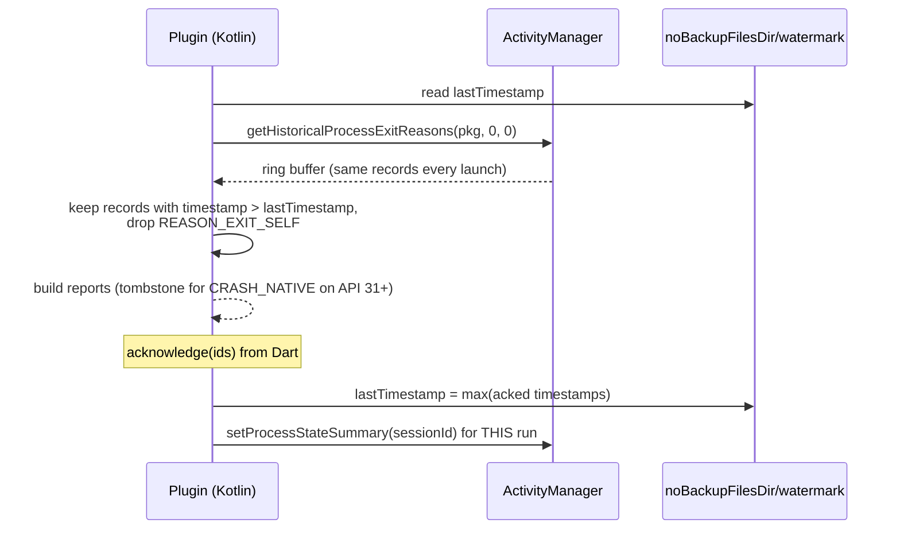

# Project Proposal — Autocad Drafting

## Project Understanding
You need assistance with: 
**Ticket: Android — read ApplicationExitInfo past a persisted watermark, decode tombstones, tag runs with setProcessStateSummary**

*Project description:*
## 1. Type

* [x] Feature
* [ ] Bug
* [ ] Refactor
* [ ] Technical debt
* [ ] Spike / Investigation
* [ ] Security
* [ ] Performance
* [ ] Documentation
* [ ] Operational task

---

## 2. Summary

We need `pending()` to return the OS's exit records for previous runs, deduplicated by a persisted timestamp watermark, because `getHistoricalProcessExitReasons` returns the same ring buffer on every launch and cannot be cleared.

Expected result:

> Native crashes (with tombstone frames on API 31+), ANRs, low-memory kills and signals from previous runs are reported once each.

---

## 3. Intent

The real intention of this ticket is:

> Use the OS's own record, which even sees SIGKILL, without ever re-sending the same record.

---

## 4. Source of Truth

* Review [webank-mobile#791](https://github.com/ADORSYS-GIS/webank-mobile/issues/791#issuecomment-5867575580), point 4
* [ApplicationExitInfo](https://developer.android.com/reference/android/app/ApplicationExitInfo)
* [setProcessStateSummary](https://developer.android.com/reference/android/app/ActivityManager#setProcessStateSummary(byte[]))
* [tombstone.proto](https://android.googlesource.com/platform/system/core/+/refs/heads/main/debuggerd/proto/tombstone.proto)

---

## 5. Current Behavior

* Not implemented.
* The #791 draft's "prune/clear what was exported" is not possible for OS records.

Evidence:

* [ApplicationExitInfo docs](https://developer.android.com/reference/android/app/ApplicationExitInfo): records are historical and system-retained

---

## 6. Expected Behavior

* Watermark persisted in `noBackupFilesDir`.
* Each run calls `setProcessStateSummary(sessionId)` so its exit record can be correlated.
* `REASON_CRASH_NATIVE` on API 31+: parse the tombstone proto (signal, abort message, crashing-thread frames: pc, build_id, function).

---

## 7. Acceptance Criteria

* [ ] Given three launches after one native crash, when each drains and acknowledges, then the crash is returned only on the first.
* [ ] Given `REASON_EXIT_SELF` / `REASON_USER_REQUESTED`, when draining, then they are skipped.
* [ ] Given `getTraceInputStream()` returns null, when draining, then the record is still returned with reason and status only.
* [ ] Given API < 30, when draining, then this source contributes nothing and does not throw.
* [ ] Error cases are handled safely.
* [ ] Existing behavior is not broken.
* [ ] Relevant tests are added or updated.
* [ ] Verification evidence is provided.

---

## 8. Out of Scope

* Symbolicating tombstone frames.
* JVM handler (separate ticket).

Do not silently implement out-of-scope work.

---

## 9. Technical Context

Relevant files, services, modules, or systems:

* `android/src/main/kotlin/.../ExitInfoSource.kt`
* tombstone proto (vendored, protobuf-lite) or a minimal hand decoder *(decide)*

Important technical notes and known constraints:

* `REASON_CRASH` gives no JVM trace; join with the JVM-handler file by timestamp/pid where possible.
* `isLowMemoryKillReportSupported()` decides whether `REASON_LOW_MEMORY` is meaningful.
* Watermark advances only on `acknowledge`.

Security impact (SSDLC):

* [ ] Authentication / authorization
* [ ] Secrets or credentials
* [x] PII or other sensitive data
* [ ] A new or changed external interface (API, webhook, import/export)

Unchecked means none apply. Any box checked makes security review mandatory.



---

## 10. Risks

Potential risks:

* Tombstone parsing adds a protobuf dependency.

Risk mitigation:

* Parse only the fields needed; vendor a lite schema.

---

## 11. Implementation Plan

1. Watermark + reason filtering.
2. setProcessStateSummary at startup.
3. Tombstone decode (API 31+).
4. Harness verification on API 30 and 34 emulators.

Before coding, the assignee must confirm whether this plan is still valid.

---

## 12. Test Plan

* [x] Unit tests
* [x] Integration tests
* [ ] End-to-end tests
* [ ] Manual verification
* [ ] Regression verification
* [ ] Security verification
* [ ] Performance verification

Commands to run:

```bash
cd example && flutter test integration_test -d emulator-5554
```

---

## 13. Verification Evidence

* Test output: _to be attached_
* Manual verification steps: _to be attached_
* Known remaining limitations: _to be attached_

---

## 14. AI Usage Declaration

AI was used for:

* [x] Drafting the ticket
* [x] Understanding code
* [x] Proposing implementation
* [ ] Generating code
* [ ] Refactoring
* [ ] Generating tests
* [ ] Reviewing the diff
* [ ] Writing documentation
* [ ] Not used

Human verification completed:

* [ ] I understood the intent
* [ ] I checked the source of truth
* [ ] I reviewed all AI-generated text/code
* [ ] I verified the implementation manually
* [ ] I verified the tests
* [ ] I checked for hallucinated assumptions
* [ ] I documented remaining risks

Drafted with Claude Code from the review of [webank-mobile#791](https://github.com/ADORSYS-GIS/webank-mobile/issues/791#issuecomment-5867575580). Code claims were checked against `otel_zone` `58a420a` (v0.2.0) and `dartastic_opentelemetry` 1.1.0-beta.15. Platform-API claims marked *(verify)* were not checked against a device. The human-verification boxes are left for the accountable owner.

Human accountable owner: @stephane-segning

---

## 15. Developer Pre-Flight Checklist

* [ ] I can explain the intent in my own words
* [ ] I know what is in scope
* [ ] I know what is out of scope
* [ ] I checked the source of truth
* [ ] I identified assumptions
* [ ] I know how to verify the work
* [ ] I know who to ask if intent is unclear

---

## 16. Reviewer Checklist

* [ ] The implementation matches the intent
* [ ] The acceptance criteria are satisfied
* [ ] Tests are meaningful, not superficial
* [ ] AI-generated code was not blindly accepted
* [ ] Error handling is appropriate
* [ ] Security and privacy risks are considered
* [ ] The change is maintainable
* [ ] The verification evidence is credible
* [ ] The PR does not include unnecessary refactoring
* [ ] The work does not exceed the ticket scope

---

## 17. Definition of Ready

* [ ] Intent is clear
* [ ] Source of truth is linked
* [ ] Acceptance criteria are testable
* [ ] Scope and out-of-scope are clear
* [ ] Dependencies are identified
* [ ] Risks are documented
* [ ] Assumptions are visible
* [ ] AI-generated content has been reviewed by a human

---

## 18. Definition of Done

* [ ] Acceptance criteria are met
* [ ] Tests pass
* [ ] Verification evidence is attached
* [ ] Code review is complete
* [ ] Documentation is updated, if needed
* [ ] Monitoring/logging is updated, if needed
* [ ] No unresolved blocker remains
* [ ] Human owner accepts responsibility for the final result


## Scope of Work
- Asset analysis and workspace initialization.
- Core modeling / development based on specifications.
- Technical validation and quality checks.
- Incorporation of review feedback.
- Clean handover of source files and documentation.

## Required Files & Inputs
1. Complete reference files (drawings, access tokens, test data).
2. Exact dimensional specs or business rules.
3. Schedule/deadline expectations.

## Estimated Price and Timeline
- **Estimated Price:** 300 - 800 USD
- **Estimated Timeline:** 3 to 7 business days (to be refined after reviewing the final assets).

## Project Questions
To help me refine this estimate, please clarify:
1. Could you describe the project scope and deliverables in detail?
2. Do you have any existing drawings or reference documents?
3. What is your target budget range?
4. What is your expected timeline?
5. Which tools/software do you prefer for this project?

## Agreement Terms
The final source files will be delivered upon approval of the milestones. Substantial revisions outside the agreed scope will require a change order.
