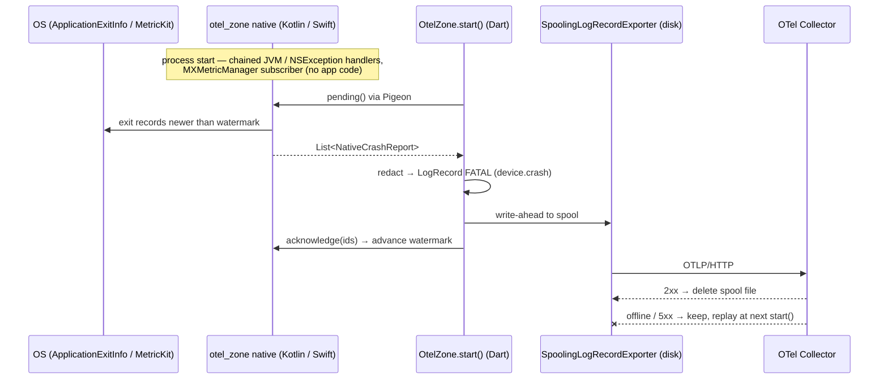
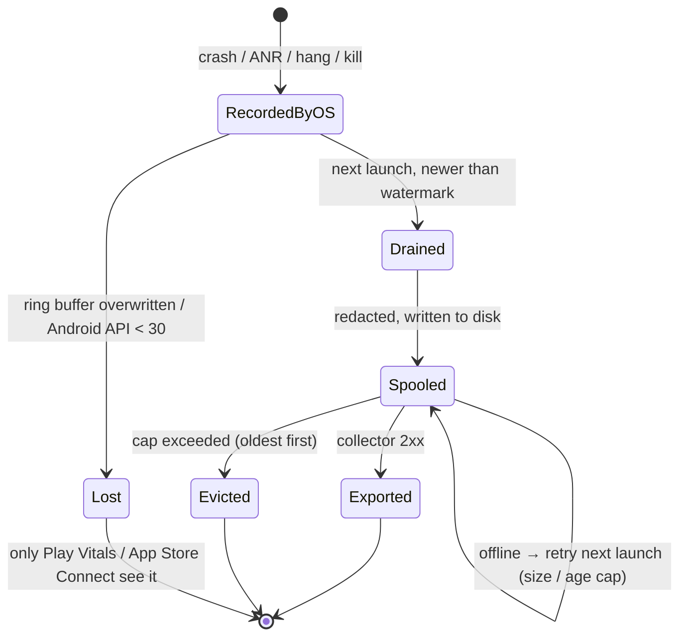

# Project Proposal — Autocad Drafting

## Project Understanding
You need assistance with: 
**Epic: native crash capture and durable export — Crashlytics parity on OpenTelemetry alone**

*Project description:*
## 1. Executive Summary

We want `otel_zone` to capture **native** crashes, ANRs and hangs, and to stop losing faults recorded offline, because it is now the only crash pipeline for its consumers. webank-mobile removed Firebase Crashlytics entirely ([#777](https://github.com/ADORSYS-GIS/webank-mobile/pull/777)), and Vaam Store, where the package came from, is in the same position.

This epic exists to solve one problem: when an app built on `otel_zone` dies below the Dart VM (JVM exception, Objective-C exception, SIGSEGV, ANR, watchdog), **nobody finds out**.

It does not exist to merely produce code, tickets, documentation, or AI-generated artifacts.

---

## 2. Strategic Intent

The intent of this epic is:

> Crashlytics parity on OpenTelemetry alone: every crash from the previous run, native or Dart, reaches the collector once, scrubbed, even if the phone was offline when it happened, and with no app-side native code.

---

## 3. Problem Statement

Currently:

* `otel_zone` is pure Dart: no `android/` or `ios/` ([pubspec](https://github.com/vaam-apps/flutter-otel-zone/blob/58a420a82a0e8c7cfc51fccd39b02b39be8ed73b/pubspec.yaml)). It sees the four Dart-level error channels only. When a native crash happens the Dart VM is already dead.
* There is no durable store. A fault raised offline dies with the in-memory batch queue, and dartastic's `forceFlush()` returns `Future<void>`, so there is no success signal to act on.
* There is no redaction point. `exception.message` is the raw `toString()`, and a `DioException` embeds request and response bodies ([ADR 0052](https://github.com/ADORSYS-GIS/webank-context/blob/master/decisions/0052-adopt-otel-zone-for-uncaught-error-channels.md) decision 6).
* `runGuarded` presents framework errors twice and ignores `presentFlutterErrors: false` ([otel-zone.dart#L218-L227](https://github.com/vaam-apps/flutter-otel-zone/blob/58a420a82a0e8c7cfc51fccd39b02b39be8ed73b/lib/src/otel-zone.dart#L218-L227)).

This causes:

* Users: crashes nobody fixes, because nobody saw them.
* Developers: blind to a whole class of fault. The only fallback is Play Vitals and App Store Connect, which are delayed, aggregated, and not correlated with the Dart telemetry.
* Compliance: exporting PII-bearing error strings from a banking app (webank) is blocked until redaction exists, so the endpoint cannot be turned on anywhere real.

---

## 4. Desired Outcome

When this epic is complete:

* A JVM crash, a native signal crash, an ANR (Android), and an ObjC exception or hang (iOS) from run N arrive at the collector during run N+1 as one `FATAL` LogRecord each.
* The same OS exit record is never exported twice.
* A fault raised offline is exported once connectivity returns, within a bounded disk budget.
* Every record passes through one app-supplied `redact` function before it is written anywhere.
* An app gets all of this by bumping its git ref, with no `AppDelegate` or `MainActivity` edits.

Success means a crash induced in the example app's harness shows up in the collector on the next launch, on both platforms, with no duplicate on the launch after that.

---

## 5. Scope

### In Scope

* Correctness fixes to the existing four-channel wiring.
* A `redact` hook applied to every exported record.
* A durable spooling exporter in front of dartastic's OTLP/HTTP exporter.
* Conversion to a Flutter plugin with a Pigeon `NativeCrashApi` (Android and iOS; web is a no-op).
* Android: a chained JVM handler, and `ApplicationExitInfo` read past a persisted watermark, with tombstones and `setProcessStateSummary`.
* iOS: a MetricKit subscriber, plus a chained `NSSetUncaughtExceptionHandler`.
* A crash harness in the example app, with emulator integration tests.

### Out of Scope

* Symbolication (dSYM, R8 mapping, NDK symbols, `flutter symbolize`). OpenObserve does not symbolicate, so this is a separate collector-side or runbook concern.
* Collector ingress authentication. It is a deployment decision; a static header baked in with `--dart-define` is public.
* App-specific scrubbing rules: each app supplies its own `redact`.
* An in-process signal handler (`sigaction`) or PLCrashReporter. Only revisit if MetricKit proves insufficient.
* Crash-free-rate analytics or a crash UI.

Anything not listed in scope must be clarified before implementation.

---

## 6. Source of Truth

* Review that motivated this epic: [webank-mobile#791 review](https://github.com/ADORSYS-GIS/webank-mobile/issues/791#issuecomment-5867575580) on [#791](https://github.com/ADORSYS-GIS/webank-mobile/issues/791)
* Architecture decision: [webank ADR 0052](https://github.com/ADORSYS-GIS/webank-context/blob/master/decisions/0052-adopt-otel-zone-for-uncaught-error-channels.md): adopt otel_zone; decision 6 defers scrubbing
* Operational evidence: [webank-mobile#777](https://github.com/ADORSYS-GIS/webank-mobile/pull/777), which removes Firebase and states native crash capture is intentionally not replaced
* Current package source: [58a420a](https://github.com/vaam-apps/flutter-otel-zone/blob/58a420a82a0e8c7cfc51fccd39b02b39be8ed73b)
* Platform APIs: [ApplicationExitInfo](https://developer.android.com/reference/android/app/ApplicationExitInfo) · [MXCrashDiagnostic](https://developer.apple.com/documentation/metrickit/mxcrashdiagnostic) · [MXHangDiagnostic](https://developer.apple.com/documentation/metrickit/mxhangdiagnostic)

---

## 7. Stakeholders

| Role | Name | Responsibility |
| --- | --- | --- |
| Product Owner | @stephane-segning | Owns product intent and priority |
| Technical Lead | @stephane-segning | Owns architecture and technical direction |
| Delivery Owner | _TBD_ | Owns planning and coordination |
| Security / Compliance | _TBD_ | Reviews the redaction contract and on-device spool |
| Engineering Team | vaam-apps / ADORSYS-GIS mobile | Implementation and verification |
| Consumers | webank-mobile, Vaam Store | Adopt via git ref bump |

---

## 8. Key Assumptions

* MetricKit delivers crash diagnostics on the next launch from iOS 15 *(verify)*. Both known consumers target iOS ≥ 15.
* `OTel.initialize(logRecordExporter:)` in dartastic 1.1.0-beta.15 accepts a custom exporter, so a spool can wrap the OTLP one (the parameter exists; behaviour not yet exercised).
* Crash-scale volume above the `warning` floor stays small enough for a few-MB disk cap.
* Aligning attribute names with opentelemetry-android (`device.crash` / `device.anr`, `exception.*`) is what collector-side queries will expect *(verify against the current semconv registry)*.

---

## 9. Constraints

* Technical: Flutter ≥ 3.24, Dart ≥ 3.8 (current floor). Android minSdk 24 (the Flutter default), so `ApplicationExitInfo` (API 30+) must be version-gated. Telemetry must never block boot or throw into the app (the package's existing rule).
* Organizational: git-pinned, not on pub.dev. Releases go through release-please.
* Conventions: metered prepaid connections (the package README's measured 96.5% chatter), so every new byte on the wire must be justified.

---

## 10. Risks

| Risk | Probability | Impact | Mitigation |
| --- | ---: | ---: | --- |
| MetricKit payload shape or timing differs from docs | Medium | Medium | Fixture-based mapper tests; manual device run with Xcode "Simulate MetricKit Payloads" |
| Chained native handlers break another reporter or the OS "app stopped" dialog | Low | High | Always call the previous handler; test with a second reporter installed |
| Spool grows unbounded on a phone that never reconnects | Medium | Medium | Byte + age cap, oldest-first eviction |
| Crash bodies (paths, messages) carry PII | High | High | `redact` runs before the spool write, not after |
| Duplicate exports from the OS ring buffer | High (without watermark) | Medium | Persisted timestamp watermark |

SSDLC: **yes**. This adds an on-device store of possibly-sensitive data (the spool) and widens what leaves the device. A short STRIDE pass on the spool and the redaction contract is required before Story 3 / Story 4 merge.

---

## 11. Non-Functional Requirements (Quality Attributes)

* Performance efficiency: native drain + spool replay add < 50 ms to `start()` on a mid-range Android device, and run after `runApp` is not blocked *(target; measure)*.
* Security: nothing reaches disk or wire without passing `redact`; the spool lives in app-private storage excluded from backup.
* Reliability: `start()` still never throws; native failures degrade to "no crash report", never to a crash.
* Observability: `start()`'s summary line reports how many native reports were drained and how many spooled records were replayed.
* Maintainability: one Pigeon definition is the only Dart↔native contract.
* Data privacy: spool is capped and evicted; no raw request bodies.

---

## 12. Success Metrics

| Metric | Current Value | Target Value | Measurement Source |
| --- | ---: | ---: | --- |
| Harness-induced native crash kinds reaching the collector | 0 / 5 | 5 / 5 | Example-app integration test + collector query |
| Duplicate exports of one OS exit record across 3 relaunches | n/a | 0 | Integration test |
| Faults raised offline that are exported after reconnect | 0% | 100% within cap | Spool integration test |
| App-side native lines needed to adopt | n/a | 0 | Consumer PR diff |

---

## 13. Child User Stories

* [ ] #3
  * [x] #4
  * [x] #5
  * [x] #6
* [ ] #7
  * [x] #8
* [ ] #9
  * [ ] #10
* [ ] #11
  * [ ] #12
  * [ ] #13
  * [ ] #14
  * [ ] #15
  * [ ] #16
  * [ ] #17

Each child story must have its own acceptance criteria and verification evidence.

---

## 14. AI Usage Declaration

AI was used for:

* [x] Drafting
* [ ] Summarization
* [x] Research
* [x] Ticket decomposition
* [x] Technical proposal
* [ ] Not used

Human verification completed:

* [ ] Intent checked against source of truth
* [ ] Scope reviewed by Product Owner
* [ ] Technical feasibility reviewed by Technical Lead
* [ ] Risks reviewed
* [ ] Acceptance criteria reviewed
* [ ] No unverified AI claim remains

Drafted with Claude Code from the review of [webank-mobile#791](https://github.com/ADORSYS-GIS/webank-mobile/issues/791#issuecomment-5867575580). Code claims were checked against `otel_zone` `58a420a` (v0.2.0) and `dartastic_opentelemetry` 1.1.0-beta.15. Platform-API claims marked *(verify)* were not checked against a device. The human-verification boxes are left for the accountable owner.

Human accountable owner: @stephane-segning

---

## 15. Definition of Ready

* [ ] The strategic intent is clear
* [ ] Scope and out-of-scope are explicit
* [ ] Source of truth is linked
* [ ] Stakeholders are identified
* [ ] Major risks are documented
* [ ] Success metrics are defined
* [ ] Child stories are identified or planned
* [ ] Human owner has reviewed all AI-generated content

---

## 16. Definition of Done

* [ ] All child stories are completed
* [ ] Acceptance criteria are satisfied
* [ ] Success metrics have been measured or scheduled for measurement
* [ ] Documentation is updated
* [ ] Operational impact is reviewed
* [ ] Security/compliance impact is reviewed
* [ ] Stakeholders have accepted the result
* [ ] Lessons learned are documented

## Scope of Work
- Asset analysis and workspace initialization.
- Core modeling / development based on specifications.
- Technical validation and quality checks.
- Incorporation of review feedback.
- Clean handover of source files and documentation.

## Required Files & Inputs
1. Complete reference files (drawings, access tokens, test data).
2. Exact dimensional specs or business rules.
3. Schedule/deadline expectations.

## Estimated Price and Timeline
- **Estimated Price:** 300 - 800 USD
- **Estimated Timeline:** 3 to 7 business days (to be refined after reviewing the final assets).

## Project Questions
To help me refine this estimate, please clarify:
1. Could you describe the project scope and deliverables in detail?
2. Do you have any existing drawings or reference documents?
3. What is your target budget range?
4. What is your expected timeline?
5. Which tools/software do you prefer for this project?

## Agreement Terms
The final source files will be delivered upon approval of the milestones. Substantial revisions outside the agreed scope will require a change order.
