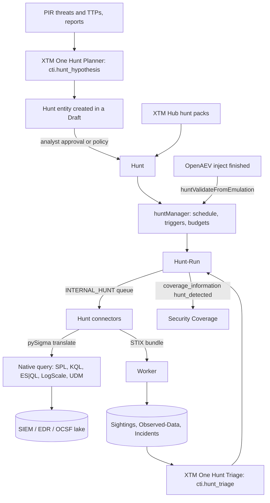
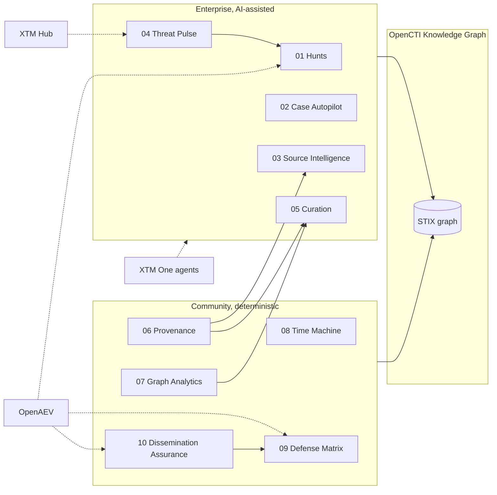

# Project Proposal — Structural Drawings

## Project Understanding
You need assistance with: 
**feat(hunt): autonomous threat hunting with hunt entities, hunt connectors, XTM One planning and OpenAEV validation**

*Project description:*
Umbrella issue for innovation 01 of the OpenCTI autonomous threat management program (ten innovations, five Enterprise AI-assisted pillars and five Community deterministic pillars). This issue carries the full implementation plan. Implementation pull requests in this repository reference it; linked issues in the connectors, XTM One and OpenAEV repositories are listed in the comments as they are created. The program index with the research baseline, the roadmap non-overlap check and the market scan is reproduced at the end of each umbrella issue.

# Innovation 01 - Autonomous Threat Hunting ("OpenCTI Hunts")

Edition: Enterprise (autonomous parts), Community keeps manual hunts and the data model. AI: yes (XTM One plans and triages; OpenCTI executes, records, scores). Cross-product: connectors repo, XTM One, OpenAEV, XTM Hub.

## 1. Pitch and positioning

OpenCTI stops telling you what to look for and starts looking. A hunt becomes knowledge: a falsifiable hypothesis, the threats and techniques it targets, a canonical Sigma logic with per-platform translations, the runs executed, the evidence found and the verdict. Standing hunts re-run when the landscape moves (a PIR gains a threat, a report adds a TTP). Results come back as sightings and incidents, OpenAEV emulations prove whether a hunt actually catches the technique, and hunt packs ship through XTM Hub. Two directions: inside-out (your telemetry) and outside-in (adversary infrastructure).

Marketing line: "OpenCTI now hunts - on any SIEM, from your own intelligence, with proof."

Competitive context: Recorded Future Autonomous Threat Operations, Microsoft Threat Hunting Assistant, Nebulock and Mallory hunt packs are vendor-locked or feed-locked. OpenCTI's version is open (any intel, any telemetry via pySigma), graph-native, shareable and verifiable.

## 2. Roadmap non-overlap (checked against opencti-roadmap-q4-2026-and-beyond.pdf)

- "Enrichment in Investigation Graph" = manual connector launch from graph nodes. Hunts are scheduled/standing executions against telemetry, not enrichment.
- "TTP Heatmap for Investigations" = visualization of TTPs. Not touched.
- "Security Coverage - Multi-OpenAEV" = display of simulation results per tenant. We only consume Security Coverage as a sink (phase F) and never change its display.
- XTM One's existing "OpenCTI Threat Hunt Creator" writes converted rules into a Grouping and never executes anything; it becomes a delegate of the new Planner.

## 3. What exists today (reuse, do not rebuild)

- Connector framework: types in `opencti-platform/opencti-graphql/src/schema/general.js` (`EXTERNAL_IMPORT`, `INTERNAL_ENRICHMENT`, `INTERNAL_ANALYSIS`, `INTERNAL_IMPORT_FILE`, `INTERNAL_EXPORT_FILE`, `INTERNAL_NOTIFICATION`, `STREAM`), registration in `src/domain/connector.ts` (`registerConnector`), queues in `src/database/rabbitmq.js` (`registerConnectorQueues`), enrichment dispatch in `src/database/repository.js` (`connectorsForEnrichment`).
- Indicator pattern types already include `sigma`, `yara`, `snort`, `suricata`, `spl`, `eql`, `shodan`, `tanium-signal`, `pcre` (`src/modules/vocabulary/vocabulary-utils.ts`).
- Indicator -> Security Platform sightings allowed since PR #11940 (Sept 28 2026); Security Platform types EDR/XDR/SIEM/SOAR/NDR/ISPM (`src/modules/securityPlatform/securityPlatform.ts`).
- Module pattern: `src/modules/pir/pir.ts` (`registerDefinition`), registered in `src/modules/index.ts`; managers in `src/manager/*Manager.ts` registered through `src/manager/managerModule.ts` (see `pirManager.ts`, `indicatorDecayManager.ts`).
- XTM One bridge: intents declared in `src/modules/xtm/one/xtm-one.ts`; agent calls and `run_as` guardrails in `src/modules/playbook/components/ai-agent-shared.ts` (`callXtmAgent`, `resolveAgentJwtUser`, `isAgentBoundToIntent`); playbook component ids in `src/modules/playbook/playbook-components.ts`.
- XTM One agents in `xtm-one/backend/app/agents/builtin_agents.py`; OpenCTI tools in `xtm-one/backend/app/integrations/providers/opencti/*.py`; output schemas validated by `backend/app/services/agentschema/`.
- OpenAEV coverage pipeline: `openaev-api/src/main/java/io/openaev/service/stix/SecurityCoverageService.java`, `SecurityCoverageInjectService.java`, `scheduler/jobs/SecurityCoverageJob.java`, `opencti/connectors/impl/SecurityCoverageConnector.java`.
- Connectors SDK: `connectors/connectors-sdk/connectors_sdk/connectors/external_import/external_import_connector.py` (base-class pattern), templates under `connectors/templates/`.

## 4. Architecture

## 5. Data model

New module `opencti-platform/opencti-graphql/src/modules/hunt/` (files: `hunt.ts`, `hunt-types.ts`, `hunt-domain.ts`, `hunt-resolvers.ts`, `hunt-graphql.ts`, `hunt.graphql`, `hunt-converter.ts`, `huntRun/*` same layout).

- `Hunt` (Stix Domain Object category so it carries markings, authors, labels, containers and travels in bundles)
  - `name`, `description`, `hypothesis` (falsifiable statement), `hunt_type` enum `telemetry | infrastructure`
  - `sigma_rule` (canonical YAML, validated with a Sigma schema at save), `native_queries` (array `{platform, language, query, pipeline}` overrides)
  - `scope` (FilterGroup over Security Platforms / Systems), `schedule` (cron or `standing`), `trigger_filters` (FilterGroup: re-run when a matching entity changes), `time_window_hours`
  - `expected_observables`, `benign_patterns`, `escalation_threshold` (hits -> Incident), `status` (`draft | active | paused | retired`), `source_kind` (`agent | analyst | hub`)
  - refs: `targets_threats` (Intrusion Set, Malware, Campaign, Threat Actor), `covers_techniques` (Attack Pattern), `based_on` (Indicator, Report)
- `Hunt-Run` (internal object): `hunt_id`, `platform_id`, `connector_id`, `work_id`, `time_window`, `translated_query`, `status` (`queued | running | completed | failed | timeout`), `hits_count`, `distinct_entities`, `evidence_sample` (redacted, size-capped), `verdict` (`true_positive | benign | inconclusive | pending`), `analyst_feedback`, `cost_ms`, `aev_inject_id`
- Results reuse existing types: `stix-sighting-relationship` from Attack Pattern / Indicator to Security Platform or System, `Observed-Data` (with `number_seen`), optional `Incident` above threshold. Add `x_opencti_hunt_run_id` on created objects for traceability.
- STIX: register `extension-definition--opencti-hunt` in the 2.1 converter so hunts export/import (hunt packs).

## 6. Workstreams for coding agents

### WS-A OpenCTI backend
- Add `CONNECTOR_INTERNAL_HUNT = 'INTERNAL_HUNT'` in `src/schema/general.js`; accept it in `registerConnector` (`src/domain/connector.ts`), create queues in `registerConnectorQueues` (`src/database/rabbitmq.js`), add `connectorsForHunt(scope)` in `src/database/repository.js` (scope = platform slugs: `splunk`, `microsoft-sentinel`, `elastic-security`, `crowdstrike-logscale`, `google-secops`, `opensearch`, `clickhouse`, `s3-ocsf`, `internet`).
- Dispatch: `pushHuntRun(runId)` publishing `{hunt_run_id, sigma_rule, native_query, pipeline, time_window, platform_config_ref}` to the connector queue (mirror of enrichment push). Track with a `work` so the existing Works UI shows progress.
- `src/manager/huntManager.ts`: cron scheduling, standing hunts (subscribe to stream events matching `trigger_filters` and to `in-pir` relation events emitted by `pirManager`), run budgets (max concurrent per platform, daily quota), timeouts, verdict defaults (0 hits -> `benign`, >= threshold -> Incident draft), Security Coverage write-back (WS-F).
- GraphQL: CRUD on Hunt/Hunt-Run, `huntTestQuery(huntId, platformId)` (translation preview through the connector without execution), `huntRunRetry`, `huntRunSetVerdict`.
- EE gating: `checkEnterpriseEdition(context)` for `schedule != manual`, standing hunts and agent calls; manual hunts remain CE.
- Telemetry: `addHuntRunCount(channel)` in `src/manager/telemetryManager.ts`.
- Tests: unit tests for Sigma validation and scheduling; integration test with a mock hunt connector (reuse connector test harness).

### WS-B Connectors repo
- SDK: `connectors-sdk/connectors_sdk/connectors/internal_hunt/internal_hunt_connector.py` with `InternalHuntConnector` (listen on the hunt queue, `translate(sigma, pipeline) -> native` using `pysigma` + backend plugin, `execute(native, window) -> HuntResult`, `to_stix(result) -> bundle` producing sightings/observed-data with hashed or truncated evidence). Template `connectors/templates/internal-hunt/`.
- First connectors: `internal-hunt/splunk` (`pysigma-backend-splunk`), `internal-hunt/microsoft-sentinel` (`pysigma-backend-kusto`), then `internal-hunt/elastic-security` (ES|QL/EQL), `internal-hunt/crowdstrike-logscale`, `internal-hunt/google-secops`, `internal-hunt/opensearch-ocsf`. Reuse credential conventions of the sibling `stream/*-intel` connectors.
- Each connector ships `__metadata__/connector_manifest.json` so Composer deploys it in one click; pycti pinned to the latest release; SDK installed from `master` (repo rule).
- Add `pycti` helper in `opencti-app/client-python/pycti/connector/opencti_connector_helper.py`: `listen_hunt(callback)` and `report_hunt_run(run_id, status, hits, evidence)`.

### WS-C Frontend (`opencti-platform/opencti-front/src/private/components/hunts/`)
- List + detail (tabs: Overview, Logic with Sigma editor and per-platform translation preview, Runs, Evidence, Coverage), creation drawer (manual) and "Hunt this" quick action on Attack Pattern, Intrusion Set, Malware, Report, Indicator and PIR pages.
- Nav entry in `nav/LeftBar.tsx`; widgets (hits over time, runs per platform, verdict distribution); Ask Ariane prompt suggestion "Plan a hunt for this threat".
- Draft-first UX: agent-generated hunts land in a Draft and use the existing draft approval workflow.
- Design system gate: run `node fds-migration/scripts/check-mui-regression.mjs --explain` before UI work.

### WS-D XTM One
- `builtin_agents.py`: "OpenCTI Hunt Planner" bound to `cti.hunt_hypothesis` (inputs: threat/TTP set, Security Platforms with log sources, benign patterns; output strict JSON hunt spec: hypothesis, sigma_rule, expected_observables, escalation_threshold) and "OpenCTI Hunt Triage" bound to `cti.hunt_triage` (reads Hunt-Run evidence, proposes verdict + incident draft text). Re-point the prompt-only "OpenCTI Threat Hunt Creator" to delegate to the Planner.
- OpenCTI provider tools: `create_opencti_hunt`, `list_opencti_hunt_runs`, `set_hunt_run_verdict`, `preview_hunt_translation`.
- Register both intents in OpenCTI's `xtm-one.ts` intent list.

### WS-E Standing hunts and playbooks
- Playbook components in `src/modules/playbook/components/`: `hunt-component.ts` (`PLAYBOOK_HUNT_COMPONENT`: run hunts matching the bundle's TTPs/indicators) and `hunt-result-filter-component.ts` (`PLAYBOOK_HUNT_RESULT_FILTER`: branch on verdict). Register ids and categories in `playbook-components.ts` / `playbook-utils.ts`.
- PIR coupling: when `pirManager` creates/removes an `in-pir` relation for a threat, `huntManager` activates/deactivates standing hunts whose `targets_threats` match.

### WS-F OpenAEV validation loop
- OpenCTI mutation `huntValidateFromEmulation(techniqueId, platformId, injectId, window)` executed by `huntManager` on matching hunts.
- OpenAEV: in `SecurityCoverageInjectService` / `SecurityCoverageJob`, after an inject for technique T completes on an asset whose security platform is P, call the mutation (through `OpenCTIClient`). OpenCTI writes `coverage_information` kind `hunt_detected` (`securityCoverageResult-types.ts`) on the `has-covered` relation so letter grades reflect hunt efficacy.

### WS-G Outside-in hunting and hunt packs
- `internal-hunt/infrastructure-tracker`: pivots through existing enrichment APIs (Censys, Shodan InternetDB, Silent Push, urlscan, Team Cymru Scout) using fingerprint rules stored as `native_queries` with `platform=internet` (JARM/JA4X, certificate fields, HTTP banners, ASN); emits `Infrastructure`, `IPv4-Addr`, `Domain-Name` observables + Indicators with `x_opencti_detection`.
- Hunt packs: STIX bundles with hunts shared through XTM Hub (reuse the playbook library flow in `src/modules/xtm/hub/`), import creates hunts in `draft` status.

## 7. Phasing
- MVP: WS-A + WS-B (Splunk) + WS-C.
- v1: + WS-D + WS-E + Sentinel/Elastic connectors.
- v2: + WS-F + WS-G.

## 8. Guardrails
- No raw telemetry stored: evidence samples are hashed/truncated, size-capped, marking-inherited from the hunt.
- Budgets per platform and per day; run timeouts; retries with backoff; failures never create knowledge.
- Autonomous actions allow-list: run hunt, create sighting/observed-data, create Incident draft; anything else requires approval (Ask Ariane approval route).
- `run_as` restricted to self or service accounts (existing guardrail).

## 9. KPIs
Hunts run per week without human action; hunt true-positive rate; time from report ingestion to first hunt; techniques with validated hunt coverage; incidents originated by hunts.

---

## Program: the ten innovations

- #18671 - 01 feat(hunt): autonomous threat hunting with hunt entities, hunt connectors, XTM One planning and OpenAEV validation
- #18672 - 02 feat(case): autonomous investigation and attribution runs (Case Autopilot)
- #18673 - 03 feat(ingestion): intelligence ROI scorecards and autonomous collection management (Source Intelligence)
- #18674 - 04 feat(xtm-hub): collective intelligence network with privacy-preserving prevalence and trends (Threat Pulse)
- #18675 - 05 feat(curation): self-healing knowledge graph with reversible merges, detectors and adjudication
- #18676 - 06 feat(datamodel): provenance assertions, corroboration, conflicts and knowledge freshness on every fact
- #18677 - 07 feat(graph): knowledge graph analytics with path finder, structural similarity and clustering
- #18678 - 08 feat(history): knowledge time machine with as-of views, entity and landscape diffs
- #18679 - 09 feat(security-coverage): threat-informed defense matrix across telemetry, detections and OpenAEV validation
- #18680 - 10 feat(stream): dissemination assurance with indicator deployment lifecycle and OpenAEV IOC validation

## Program index (research baseline and cross-cutting rules)

# OpenCTI Autonomous Threat Management: ten innovations, ten plans (index)

Each innovation has its own plan file in this folder (`opencti_innovation_NN_*.plan.md`). This file keeps the shared research baseline and the one-paragraph summaries only.

## Research baseline

**Repos synced to latest default branches:** opencti-app `master` @ `183acbc7f8`, xtm-one `main` @ `c0d7c47cd`, openaev-app `main` @ `d1248c926`, connectors `master` @ `4cc0ea2256`.

**Roadmap PDF (`opencti-roadmap-q4-2026-and-beyond.pdf`) - everything below is OFF-LIMITS for us:**
- NOW (Q4 2026): SSVC vulnerability prioritization, Custom Fields, Dashboard Variables, Enterprise Workflow Engine, Domain-Specific Platform Configuration, Integration Monitoring & Alerting, Independent Connector Upgrades, Multi-OpenAEV Security Coverage, Enrichment in Investigation Graph, Complex Nested Filters.
- NEXT (2027): PIR Actionable & AI-Assisted, MTTD/MTTR & custom metrics, Pre-Processing engine, Fintel template improvements, Indicator custom scoring rules, TTP Heatmap for Investigations.
- UNDER CONSIDERATION: Granular Markings, Conditional Inference Rules, MITRE Attack Flow, Enhanced case experience, Human-readable case numbers.

**What OpenCTI already has (reused, never rebuilt):** Ask Ariane (XTM One chat, HITL approvals), AI Insights, NLQ and text helpers (`src/modules/ai/`), XTM One registration with `cti.*` intents (`src/modules/xtm/one/xtm-one.ts`), playbook AI-agent components, PIR with criteria scoring (EE), Security Coverage with OpenAEV (CE), Security Platform entity and Indicator -> Security Platform sightings (#11940), decay rules, drafts and draft workflows, form intakes, fintel, custom views, data sanity, 29 inference rules, history with JSON reverse patches, MITRE Data Sources / Data Components with `detects`, rule connectors (`sigmahq`, `valhalla`, `dogesec-siemrules`), 182 external-import / 79 enrichment / 40 stream connectors. XTM One has prompt-only "OpenCTI Threat Hunt Creator" and "Deep Investigation Agent"; OpenAEV has detection remediation, AI Autonomous Runs, native DNS / network / file-drop payloads and detection / prevention expectations.

**Market signal (Oct 2026):** Gartner's inaugural CTI Magic Quadrant (May 4 2026) Leaders are CrowdStrike, Google, Group-IB, Recorded Future, ZeroFox; Filigran is not among the 17 evaluated. Gartner's 2026 top trend is Preemptive Cybersecurity / Predictive Threat Intelligence; its April 2026 note "Feeds to Agents" says agentic CTI needs clean, provenance-rich data first. Recorded Future ships Autonomous Threat Operations, MCP (80+ tools) and Autonomous Defense (GA early 2027); Microsoft ships Threat Hunting Assistant and Dynamic Threat Detection agents. Funded entrants: Qevlar ($30M), Scanner ($22M), Nebulock ($25M), Mate ($35M A), Kai ($125M), Kyberis, Mallory. Forrester: ~26 paid feeds per organization and most cannot measure value. OpenCTI backlog confirms the data-quality gap (#12059, #15198, #11794, #14997). The September 2026 PIR digest shows all top-20 threats tied at 67/100.

**Launch narrative:** "OpenCTI goes autonomous" with two layers. Enterprise, AI-assisted pillars: Hunt, Investigate, Measure, Connect, Curate. Community, deterministic pillars that make the open edition itself a leap forward: Provenance, Graph Analytics, Time Machine, Defense Matrix, Dissemination Assurance. Suggested order: ship Provenance (06), Curation (05) and Source Intelligence (03) first (trust and measurement), then Hunts (01), Defense Matrix (09) and Dissemination Assurance (10), then Case Autopilot (02), Threat Pulse (04), Graph Analytics (07) and Time Machine (08).

## The ten innovations (one paragraph each, details in the plan files)

### Enterprise Edition, AI-assisted
- **01 Autonomous Threat Hunting ("OpenCTI Hunts")** - `opencti_innovation_01_autonomous_hunting.plan.md`. Hunts as first-class graph objects (hypothesis, Sigma logic, per-platform queries, runs, evidence, verdicts), a new `INTERNAL_HUNT` connector type executing pySigma-translated queries on SIEM/EDR/data lakes, XTM One hypothesis planning and triage, standing hunts re-triggered by PIR changes, OpenAEV emulations validating hunt efficacy, outside-in infrastructure tracking, hunt packs via XTM Hub.
- **02 Autonomous Investigation and Attribution ("Case Autopilot")** - `opencti_innovation_02_case_autopilot.plan.md`. `Investigation-Run` with plan, step ledger, enrichment fan-out through installed connectors, timeline, ACH attribution matrix with calibrated confidence, recommendations and draft report, all written through Drafts with approval gates and a feedback loop.
- **03 Intelligence ROI and Autonomous Collection Management ("Source Intelligence")** - `opencti_innovation_03_source_intelligence.plan.md`. Per-source scorecards (uniqueness, lead time, accuracy, relevance, impact, noise, cost), overlap matrix, recommendation engine tuning confidence / decay / schedules / quarantine, PIR collection gaps with XTM Hub catalog suggestions.
- **04 Collective Intelligence Network ("Threat Pulse")** - `opencti_innovation_04_threat_pulse.plan.md`. Opt-in, hash-only, k-anonymous aggregation across the fleet via XTM Hub; community prevalence, network first-seen and sector trends on entities; benchmarks, early-warning triggers, inputs to hunts and source scoring.
- **05 Self-Healing Knowledge Graph ("Autonomous Curation")** - `opencti_innovation_05_autonomous_curation.plan.md`. Deterministic detectors (normalization, similarity, behavior anchoring, contradictions, staleness, relationship conflicts) producing explained proposals, LLM adjudication only in the ambiguous band, reversible merges with alias provenance, policies, curation inbox, Knowledge Health score.

### Community Edition, deterministic, no AI
- **06 Provenance, Corroboration and Freshness ("Every fact knows who said it")** - `opencti_innovation_06_provenance_corroboration.plan.md`. `x_opencti_assertions` on entities and relationships, corroboration counts, per-field conflicts, procedure-preserving `uses` relationships, knowledge decay rules for relationships, Sources panel and filters, STIX provenance extension.
- **07 Knowledge Graph Analytics ("Paths, Similarity, Clusters")** - `opencti_innovation_07_graph_analytics.plan.md`. Path finder between any two entities, structural similarity with shared evidence, infrastructure and campaign clustering, centrality metrics as sortable attributes, optional Python analytics worker, Similar tab and Clusters page.
- **08 Knowledge Time Machine and Landscape Diff ("What changed since")** - `opencti_innovation_08_time_machine_diff.plan.md`. As-of reconstruction from history reverse patches plus compact snapshots, entity and landscape diffs between dates, "new since your last visit", scheduled change digests.
- **09 Threat-Informed Defense Matrix ("See it. Detect it. Prove it.")** - `opencti_innovation_09_defense_matrix.plan.md`. Per-technique posture from telemetry (Data Components), detections (rule Indicators and deployment) and validation (OpenAEV Security Coverage results), threat overlay, gap backlog and one-click validation requests.
- **10 Dissemination Assurance with OpenAEV ("Prove your intel is live")** - `opencti_innovation_10_dissemination_assurance.plan.md`. `deployed-on` lifecycle per indicator and security platform written back by stream connectors, hit counting through sightings, IOC-level validation scenarios in OpenAEV (DNS, safe network, URL HEAD, file surrogate, log injection) with detection / prevention expectations, lifecycle dashboard and triggers.

## Cross-cutting rules for every plan
- OpenCTI is the system of record; XTM One agents (plans 01-05) propose through intents registered in `src/modules/xtm/one/xtm-one.ts` and act through OpenCTI tools and Drafts; HITL via the existing approval route; `run_as` guardrails from `ai-agent-shared.ts` apply.
- Community plans (06-10) use no LLM and no Enterprise gate; they rely on managers, connectors, triggers/digests and OpenAEV's existing CE integration.
- Autonomy is a policy, not a default: allow-lists of autonomous actions, blast-radius preview, audit entries, rollback.
- Repo conventions: module pattern of `src/modules/pir`, managers registered in `src/manager/managerModule.ts`, design-system-first front end (`fds-migration/scripts/check-mui-regression.mjs --explain`), Conventional Commit titles with issue references, connectors built on the connectors SDK with catalog manifests and the latest pycti.

## Scope of Work
- Asset analysis and workspace initialization.
- Core modeling / development based on specifications.
- Technical validation and quality checks.
- Incorporation of review feedback.
- Clean handover of source files and documentation.

## Required Files & Inputs
1. Complete reference files (drawings, access tokens, test data).
2. Exact dimensional specs or business rules.
3. Schedule/deadline expectations.

## Estimated Price and Timeline
- **Estimated Price:** 800 - 2000 EUR
- **Estimated Timeline:** 3 to 7 business days (to be refined after reviewing the final assets).

## Project Questions
To help me refine this estimate, please clarify:
1. Avez-vous déjà réalisé l'étude de sol géotechnique pour les fondations ?
2. Quelles sont les charges d'exploitation particulières (machines, toiture végétalisée) ?
3. Fournissez-vous les plans d'architecte définitifs au format DWG ?
4. Quels sont les détails d'exécution attendus (nomenclatures d'acier, détails de ferraillage) ?
5. Quel est votre calendrier souhaité pour la validation des plans ?

## Agreement Terms
The final source files will be delivered upon approval of the milestones. Substantial revisions outside the agreed scope will require a change order.
