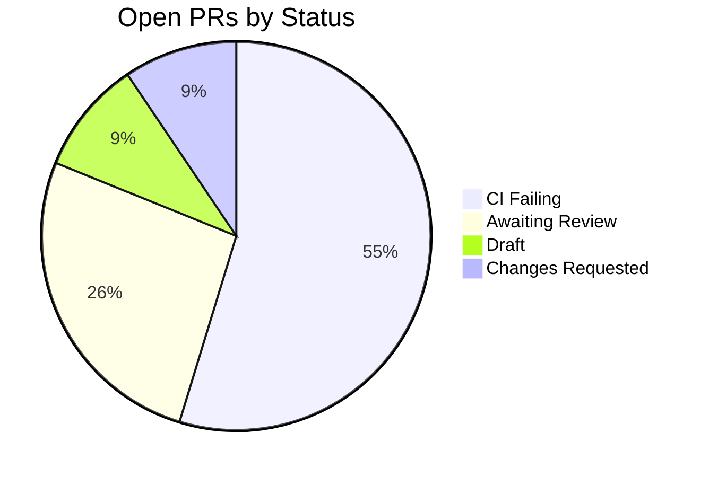
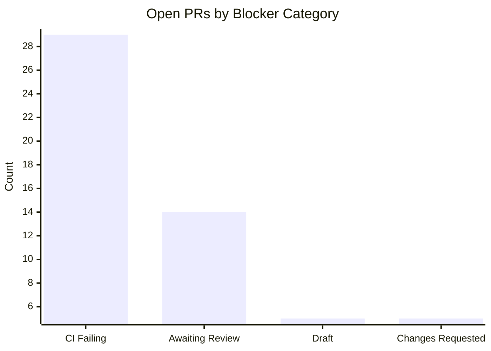
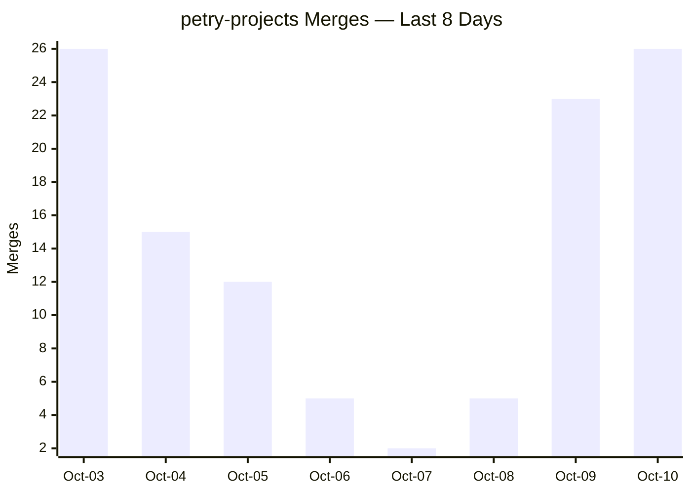

# Project Proposal — Structural Drawings

## Project Understanding
You need assistance with: 
**Org Status — 2026-10-10**

*Project description:*
@org-leads

## Org Summary — 2026-10-10

| Metric | Value |
|---|---|
| Total open PRs | 53 |
| PRs needing rebase | 7 |
| Total open issues | 429 |
| PR merges (last 8 days) | 114 |
| Open discussions | 0 |

## Open PRs — Why They're Unmerged (53 total)

```mermaid
xychart-beta
    title "Open PRs per Repo by Category"
    x-axis [".github-private", ".github", "TalkTerm", "repo-template", "broodly", "broodminder-data", "google-app-scripts", "empower-personal-dashboard", "ContentTwin", "bmad-bgreat-suite", "incubator", "markets"]
    y-axis "PRs"
    bar [0, 0, 0, 0, 0, 0, 0, 0, 0, 0, 0, 0]
    bar [0, 4, 1, 5, 0, 2, 0, 1, 0, 1, 0, 0]
    bar [13, 4, 5, 1, 0, 1, 3, 0, 1, 0, 0, 1]
    bar [0, 0, 0, 0, 0, 0, 0, 0, 0, 0, 0, 0]
```

## PR Merge Activity — Last 8 Days

| Repo | Oct-03 | Oct-04 | Oct-05 | Oct-06 | Oct-07 | Oct-08 | Oct-09 | Oct-10 | Total |
|---|---|---|---|---|---|---|---|---|---|
| [petry-projects/.github-private](https://github.com/petry-projects/.github-private) | 4 | 1 | 1 | 3 | 1 | 2 | 18 | 9 | **39** |
| [petry-projects/empower-personal-dashboard](https://github.com/petry-projects/empower-personal-dashboard) | 9 | 2 | 1 | 0 | 0 | 0 | 2 | 4 | **18** |
| [petry-projects/.github](https://github.com/petry-projects/.github) | 6 | 3 | 1 | 0 | 1 | 1 | 1 | 4 | **17** |
| [petry-projects/broodminder-data](https://github.com/petry-projects/broodminder-data) | 5 | 0 | 1 | 0 | 0 | 2 | 1 | 1 | **10** |
| [petry-projects/broodly](https://github.com/petry-projects/broodly) | 0 | 3 | 2 | 0 | 0 | 0 | 0 | 1 | **6** |
| [petry-projects/google-app-scripts](https://github.com/petry-projects/google-app-scripts) | 0 | 3 | 1 | 0 | 0 | 0 | 1 | 0 | **5** |
| [petry-projects/markets](https://github.com/petry-projects/markets) | 0 | 0 | 1 | 2 | 0 | 0 | 0 | 2 | **5** |
| [petry-projects/ContentTwin](https://github.com/petry-projects/ContentTwin) | 2 | 0 | 1 | 0 | 0 | 0 | 0 | 1 | **4** |
| [petry-projects/incubator](https://github.com/petry-projects/incubator) | 0 | 1 | 1 | 0 | 0 | 0 | 0 | 2 | **4** |
| [petry-projects/repo-template](https://github.com/petry-projects/repo-template) | 0 | 1 | 1 | 0 | 0 | 0 | 0 | 2 | **4** |
| [petry-projects/bmad-bgreat-suite](https://github.com/petry-projects/bmad-bgreat-suite) | 0 | 1 | 1 | 0 | 0 | 0 | 0 | 0 | **2** |
| **TOTAL** | 26 | 15 | 12 | 5 | 2 | 5 | 23 | 26 | **114** |

Grand total: **114** merges over 8 days. Trend: **Increasing**.

## Open PRs — Needs Human Review

| Repo | PR | Opened | CI | Approvals |
|---|---|---|---|---|
| petry-projects/TalkTerm | [#8 — feat: Epic 13 (Structured Questions) + Epic 14 (Native STT)](https://github.com/petry-projects/TalkTerm/pull/8) | 2026-03-24 | FAIL | 0 |
| petry-projects/TalkTerm | [#468 — feat: implement issue #466 — [Fleet Monitor] petry-projects/TalkTerm — .github/workflows/pr-auto-review.yml](https://github.com/petry-projects/TalkTerm/pull/468) | 2026-08-31 | PASS | 0 |
| petry-projects/.github-private | [#1730 — feat: implement issue #1713 — [#1269 split 1/2] shadow_mode input + total PR-output suppression (inert, nothing dispatched)](https://github.com/petry-projects/.github-private/pull/1730) | 2026-09-08 | FAIL | 0 |
| petry-projects/.github | [#1116 — feat: implement issue #1115 — [bug] dismiss-stale-bot-reviews is missing from this repo — a stale bot CHANGES_REQUESTED blocks PRs forever (blocking #1094)](https://github.com/petry-projects/.github/pull/1116) | 2026-09-12 | PASS | 1 |
| petry-projects/.github-private | [#1770 — feat: implement issue #1766 — [bug] pr-review approves PRs with unresolved threads (violates its own decision gate 4) and double-reviews the same SHA](https://github.com/petry-projects/.github-private/pull/1770) | 2026-09-12 | FAIL | 0 |
| petry-projects/.github | [#1117 — feat: implement issue #1103 — cmd_rollback moves the bare <agent>/<ring> tag, not <agent>/v<M>-<ring> — the emergency lever is a silent no-op for every v-scoped agent](https://github.com/petry-projects/.github/pull/1117) | 2026-09-13 | PASS | 1 |
| petry-projects/google-app-scripts | [#584 — feat(classifier): add Gemini AI semantic classifier, Drive ingester, and strict No-PII guards](https://github.com/petry-projects/google-app-scripts/pull/584) | 2026-09-13 | FAIL | 0 |
| petry-projects/incubator | [#144 — feat: implement issue #143 — [Fleet Monitor] petry-projects/incubator — .github/workflows/ci.yml](https://github.com/petry-projects/incubator/pull/144) | 2026-09-20 | PASS | 1 |
| petry-projects/.github | [#1218 — feat: implement issue #1202 — [Phase 1] safety-checks lib with sc_description_missing](https://github.com/petry-projects/.github/pull/1218) | 2026-10-01 | PASS | 0 |
| petry-projects/broodminder-data | [#176 — chore(deps): bump SonarSource/sonarqube-scan-action from 8.2.2 to 8.3.0](https://github.com/petry-projects/broodminder-data/pull/176) | 2026-10-08 | FAIL | 5 |
| petry-projects/.github-private | [#2158 — feat: implement issue #2143 — dev-lead test-regression guard runs PR test code as the harness user: job secrets are still readable via /proc and the real checkout](https://github.com/petry-projects/.github-private/pull/2158) | 2026-10-09 | FAIL | 0 |
| petry-projects/.github-private | [#2191 — feat: implement issue #2185 — dev-lead fix-bot-comment edits a verbatim org-standard stub on a standards-sync PR when a bot suggests it — the PR drifts from the template it syncs](https://github.com/petry-projects/.github-private/pull/2191) | 2026-10-10 | FAIL | 0 |
| petry-projects/repo-template | [#235 — chore: seed org baseline file scaffold](https://github.com/petry-projects/repo-template/pull/235) | 2026-10-10 | FAIL | 1 |

## Open PRs — Automation (Dependency Bumps)

| Repo | # Dep PRs |
|---|---|
| [petry-projects/TalkTerm](https://github.com/petry-projects/TalkTerm) | 1 |
| [petry-projects/broodminder-data](https://github.com/petry-projects/broodminder-data) | 1 |

## Open Issues (429 total)

### [petry-projects/.github](https://github.com/petry-projects/.github) (showing 25 of 114 issues)

| Issue | Opened | Labels | Linked PR |
|---|---|---|---|
| [#1277 — Standards sweep reports a drifted initiative-driver.yml as compliant — the template gained a `uses:` step, so the stub is no longer compared verbatim (repo-template still on `ref: v1`)](https://github.com/petry-projects/.github/issues/1277) | 2026-10-10 | bug, dev-lead | [#1278](https://github.com/petry-projects/.github/pull/1278) |
| [#1272 — auto-rebase updates every behind PR on every push even where being behind blocks nothing: gate it on the effective up-to-date requirement, a merge queue, or a label](https://github.com/petry-projects/.github/issues/1272) | 2026-10-09 | enhancement, dev-lead | [#1273](https://github.com/petry-projects/.github/pull/1273) |
| [#1270 — ci-failure-analyst can never reach stable: its ring1 members pin v1-stable, so the ring1->stable gate has no sample to count (stable frozen on v1.0.0 since 2026-07-10)](https://github.com/petry-projects/.github/issues/1270) | 2026-10-09 | bug | — |
| [#1268 — deploy-standard-workflows commits an EMPTY stub and reports OK when base64 encoding fails (macOS)](https://github.com/petry-projects/.github/issues/1268) | 2026-10-09 | bug | — |
| [#1265 — Compliance audit — 2026-10-09](https://github.com/petry-projects/.github/issues/1265) | 2026-10-09 | compliance-audit, dev-lead | — |
| [#1264 — Org Status — 2026-10-09](https://github.com/petry-projects/.github/issues/1264) | 2026-10-09 | daily-report | — |
| [#1259 — canary-rollout: gate evaluation ~40% slower since #1238 — 5 of 9 complete scheduled runs now hit the 30-minute timeout](https://github.com/petry-projects/.github/issues/1259) | 2026-10-07 |   | — |
| [#1256 — Scorecard: Binary-Artifacts (9/10)](https://github.com/petry-projects/.github/issues/1256) | 2026-10-05 | scorecard | — |
| [#1249 — canary-rollout: decide the triage for a pending pair with an unresolvable source commit in _frontier_state_resilient (#1244 item 14)](https://github.com/petry-projects/.github/issues/1249) | 2026-10-04 |   | — |
| [#1247 — canary-rollout: role-scope the stale-release check and bound the candidate-window ingress read (#1244 items 4, 5)](https://github.com/petry-projects/.github/issues/1247) | 2026-10-04 |   | — |
| [#1246 — canary-rollout: close the remaining fail-open gaps in ingress attribution (#1244 items 3, 11, 12, 10)](https://github.com/petry-projects/.github/issues/1246) | 2026-10-04 |   | — |
| [#1244 — canary-rollout: ingress attribution follow-ups from the #1238 review (pre-adoption runs, decision-class read failures, role scoping)](https://github.com/petry-projects/.github/issues/1244) | 2026-10-03 |   | — |
| [#1236 — Compliance audit — 2026-10-02](https://github.com/petry-projects/.github/issues/1236) | 2026-10-02 | compliance-audit, dev-lead | [#1237](https://github.com/petry-projects/.github/pull/1237) |
| [#1233 — agent-rate-limit.sh rejects valid offset timestamps that cross UTC midnight, so the weekly glide gate degrades to allow](https://github.com/petry-projects/.github/issues/1233) | 2026-10-02 | bug | — |
| [#1223 — canary-rollout promote targets whatever `next` is when the run executes, not the commit its dry run showed — a queued override can force-move the wrong ring to an unverified commit](https://github.com/petry-projects/.github/issues/1223) | 2026-10-01 |   | — |
| [#1219 — Tracking: third-party PR review tools paused (billing/usage limits)](https://github.com/petry-projects/.github/issues/1219) | 2026-10-01 |   | — |
| [#1213 — [Phase 4] Release the reusable feature-ideation change via its channel tag](https://github.com/petry-projects/.github/issues/1213) | 2026-09-29 | dev-lead:hands-off, initiative, initiative:hold | — |
| [#1212 — [Phase 3] Add a model-version-pin lint check wired into CI](https://github.com/petry-projects/.github/issues/1212) | 2026-09-29 | initiative | — |
| [#1211 — [Phase 2] Update ci-standards.md section 9 and the feature-ideation stub comments to the family rule](https://github.com/petry-projects/.github/issues/1211) | 2026-09-29 | initiative | — |
| [#1210 — [Phase 2] Switch feature-ideation-reusable.yml model default to the opus family and verify alias resolution](https://github.com/petry-projects/.github/issues/1210) | 2026-09-29 | dev-lead, initiative | [#1245](https://github.com/petry-projects/.github/pull/1245) |
| [#1208 — Adopt the model-family standard (name a family, never pin a version) in petry-projects/.github](https://github.com/petry-projects/.github/issues/1208) | 2026-09-29 | initiative, initiative:auto | — |
| [#1207 — [Phase 6] Stale backstop for needs-info and weekly reporting](https://github.com/petry-projects/.github/issues/1207) | 2026-09-29 | initiative | — |
| [#1206 — [Phase 5] DRY_RUN soak, threshold tuning without overfitting, and go/no-go to enable label/close](https://github.com/petry-projects/.github/issues/1206) | 2026-09-29 | dev-lead:hands-off, initiative, initiative:hold | — |
| [#1205 — [Phase 4] Repo-local standard document for spam-pr-guard](https://github.com/petry-projects/.github/issues/1205) | 2026-09-29 | initiative | — |
| [#1204 — [Phase 3] spam-pr-guard workflow in DRY_RUN, with the section 4 row and interaction contract](https://github.com/petry-projects/.github/issues/1204) | 2026-09-29 | initiative | — |

### [petry-projects/.github-private](https://github.com/petry-projects/.github-private) (showing 25 of 208 issues)

| Issue | Opened | Labels | Linked PR |
|---|---|---|---|
| [#2204 — dev-lead has no sanctioned path to change an existing test that is legitimately wrong: prompts forbid applying the bot suggestion outright, and issue-mandated behaviour changes are not recognised as justification](https://github.com/petry-projects/.github-private/issues/2204) | 2026-10-10 | bug | — |
| [#2203 — solution-architect PR advisories are invisible to dev-lead and the approval gate (same persona-marker exemption as qa-lead)](https://github.com/petry-projects/.github-private/issues/2203) | 2026-10-10 | enhancement | — |
| [#2202 — qa-lead PR advisories are invisible to dev-lead and the approval gate: the persona marker exempts them, so even "Escalate? yes — fix before merge" is never dispositioned](https://github.com/petry-projects/.github-private/issues/2202) | 2026-10-10 | bug, enhancement | — |
| [#2201 — dev-lead does not disposition every review comment: COMMENTED review bodies, push-cleared maintainer threads and ambiguity skips end with no recorded outcome](https://github.com/petry-projects/.github-private/issues/2201) | 2026-10-10 | bug | — |
| [#2200 — dev-lead retry sweep posts blank-looking PR comments: dispatch guards and retry markers are marker-only bodies that stay on the PR](https://github.com/petry-projects/.github-private/issues/2200) | 2026-10-10 | bug | — |
| [#2199 — SonarCloud findings neither block merge nor reach dev-lead: the quality gate is never waited on, and no pass reads the actual Sonar issues](https://github.com/petry-projects/.github-private/issues/2199) | 2026-10-10 | bug | — |
| [#2197 — The fleet and every session share one GitHub API quota (don-petry, 5,000/hour) and the fleet alone uses about that much: it ran out on 2026-10-10 and failed a workflow](https://github.com/petry-projects/.github-private/issues/2197) | 2026-10-10 | bug | — |
| [#2196 — persona-runner discards a finished advisory when the posting-identity read fails — an API error body is read as a wrong login (first router-served PR dispatch, #2188)](https://github.com/petry-projects/.github-private/issues/2196) | 2026-10-10 | bug, dev-lead | [#2198](https://github.com/petry-projects/.github-private/pull/2198) |
| [#2195 — Stalled PR candidate(s) detected 2026-10-10](https://github.com/petry-projects/.github-private/issues/2195) | 2026-10-10 | health-check, automated-report | — |
| [#2194 — Runaway PR candidate(s) detected 2026-10-10](https://github.com/petry-projects/.github-private/issues/2194) | 2026-10-10 | health-check, automated-report | — |
| [#2193 — PR Review Agent — failures detected 2026-10-10](https://github.com/petry-projects/.github-private/issues/2193) | 2026-10-10 | health-check, automated-report | — |
| [#2189 — pr-review: leave a visible PR note when posting fails, and decide the risk-class rule for tier-3 approvals (follow-up to #2169)](https://github.com/petry-projects/.github-private/issues/2189) | 2026-10-10 | enhancement | — |
| [#2186 — Merge-queue dequeue: retry the live-state read and surface a failed read in the step summary (follow-up to the dequeue change)](https://github.com/petry-projects/.github-private/issues/2186) | 2026-10-10 | enhancement | — |
| [#2185 — dev-lead fix-bot-comment edits a verbatim org-standard stub on a standards-sync PR when a bot suggests it — the PR drifts from the template it syncs](https://github.com/petry-projects/.github-private/issues/2185) | 2026-10-10 | bug, dev-lead | [#2191](https://github.com/petry-projects/.github-private/pull/2191) |
| [#2184 — dev-lead rebase: the post-resolution integrity gate fails on a clean resolution and hides why (false escalation on PR 2180)](https://github.com/petry-projects/.github-private/issues/2184) | 2026-10-10 | bug | — |
| [#2181 — dev-lead repeats a refused pass indefinitely: after a test guard refuses a push, the next pass redoes the same work with no knowledge of the refusal](https://github.com/petry-projects/.github-private/issues/2181) | 2026-10-10 | bug | — |
| [#2178 — dev-lead never dispositions a neutral bot overview (CodeAnt "PR Risk: Low Risk"), but pr-review's comment gate still counts it — the PR can never be approved](https://github.com/petry-projects/.github-private/issues/2178) | 2026-10-10 | bug, dev-lead | [#2192](https://github.com/petry-projects/.github-private/pull/2192) |
| [#2177 — [Decision] Fan out the ADR-0007 ingress collapse to the rest of the fleet: go/no-go, repo order, and runbook, using the markets pilot evidence](https://github.com/petry-projects/.github-private/issues/2177) | 2026-10-10 | initiative, initiative:hold | — |
| [#2176 — markets ingress pins ci-failure-analyst by bare commit SHA (DEFECTIVE PIN): move it to a channel once stable is no longer frozen](https://github.com/petry-projects/.github-private/issues/2176) | 2026-10-10 | enhancement | — |
| [#2175 — ci-failure-analyst caller: the self-exclusion guard never matches a real check name, and no-PR failures still start the analyst](https://github.com/petry-projects/.github-private/issues/2175) | 2026-10-10 | bug | — |
| [#2173 — pr-review process defects found driving the ADR-0007 pilot (false hard-stop, empty fix-requested, silent no-op, gate counts maintainer comments, unwired bypass, edited-comment deadlock, self-dismissed approvals)](https://github.com/petry-projects/.github-private/issues/2173) | 2026-10-10 | bug | — |
| [#2170 — Retry and sweep crons run every 4–8 hours instead of every 2 h / 15 min, while PR comments promise specific retry times](https://github.com/petry-projects/.github-private/issues/2170) | 2026-10-09 | bug | — |
| [#2169 — pr-review reaches approve but cannot post it (approval marker missing), and the same head gets approve/LOW in one run and escalate/HIGH in the next](https://github.com/petry-projects/.github-private/issues/2169) | 2026-10-09 | bug, dev-lead | [#2190](https://github.com/petry-projects/.github-private/pull/2190) |
| [#2168 — A pr-review fix request has no route to dev-lead: bot comment untrusted, fix-reviews skips its marker, and @dev-lead from the owner account is a self-comment](https://github.com/petry-projects/.github-private/issues/2168) | 2026-10-09 | bug | — |
| [#2167 — pr-review escalation fails with nothing posted when the repo has no needs-human-review label (not provisioned fleet-wide)](https://github.com/petry-projects/.github-private/issues/2167) | 2026-10-09 | bug | — |

### [petry-projects/ContentTwin](https://github.com/petry-projects/ContentTwin) (7 issues)

| Issue | Opened | Labels | Linked PR |
|---|---|---|---|
| [#482 — dev-lead: deferred review findings](https://github.com/petry-projects/ContentTwin/issues/482) | 2026-10-09 |   | — |
| [#465 — Compliance: stub-surface-drift-agent-shield.yml-on](https://github.com/petry-projects/ContentTwin/issues/465) | 2026-09-25 | compliance-audit, dev-lead, dev-lead:needs-human, compliance-finding | — |
| [#459 — [Fleet Monitor] petry-projects/ContentTwin — .github/workflows/ci.yml](https://github.com/petry-projects/ContentTwin/issues/459) | 2026-09-19 | dev-lead, fleet-tracker, health-check | — |
| [#335 — Scorecard: Pinned-Dependencies (3/10)](https://github.com/petry-projects/ContentTwin/issues/335) | 2026-07-14 | scorecard | — |
| [#326 — ContentTwin Audit — content pipeline issues 2026-07-13](https://github.com/petry-projects/ContentTwin/issues/326) | 2026-07-13 | content-audit, automated-report | — |
| [#158 — Scorecard: Code-Review (3/10)](https://github.com/petry-projects/ContentTwin/issues/158) | 2026-05-17 | scorecard | — |
| [#157 — Scorecard: Branch-Protection (5/10)](https://github.com/petry-projects/ContentTwin/issues/157) | 2026-05-17 | scorecard | — |

### [petry-projects/TalkTerm](https://github.com/petry-projects/TalkTerm) (15 issues)

| Issue | Opened | Labels | Linked PR |
|---|---|---|---|
| [#531 — dev-lead: deferred review findings](https://github.com/petry-projects/TalkTerm/issues/531) | 2026-10-10 |   | — |
| [#527 — Remove classic branch protection requiring 'Analyze (python)' — blocks PRs CodeQL skips; standard requires rulesets only](https://github.com/petry-projects/TalkTerm/issues/527) | 2026-10-02 |   | — |
| [#519 — Compliance: stub-surface-drift-dependency-audit.yml-on](https://github.com/petry-projects/TalkTerm/issues/519) | 2026-09-25 | compliance-audit, dev-lead, compliance-finding | [#520](https://github.com/petry-projects/TalkTerm/pull/520) |
| [#508 — Compliance: stub-surface-drift-pr-auto-review.yml-concurrency](https://github.com/petry-projects/TalkTerm/issues/508) | 2026-09-18 | compliance-audit, dev-lead, compliance-finding | [#521](https://github.com/petry-projects/TalkTerm/pull/521) |
| [#507 — Compliance: non-stub-pr-auto-review.yml](https://github.com/petry-projects/TalkTerm/issues/507) | 2026-09-18 | compliance-audit, dev-lead, compliance-finding | [#509](https://github.com/petry-projects/TalkTerm/pull/509) |
| [#443 — Adopt canonical apply-repo-settings stub; delete diverged fork (org std .github#984)](https://github.com/petry-projects/TalkTerm/issues/443) | 2026-08-19 |   | — |
| [#361 — Scorecard: Pinned-Dependencies (2/10)](https://github.com/petry-projects/TalkTerm/issues/361) | 2026-07-14 | scorecard | — |
| [#358 — 🧭 Idea Promotion Queue](https://github.com/petry-projects/TalkTerm/issues/358) | 2026-07-13 | idea-triage | — |
| [#338 — [Phase 4] Onboarding activation instrumentation and funnel report](https://github.com/petry-projects/TalkTerm/issues/338) | 2026-07-01 | initiative | — |
| [#337 — [Phase 4] Role-adaptive tutorial content with a safe default](https://github.com/petry-projects/TalkTerm/issues/337) | 2026-07-01 | initiative | — |
| [#336 — [Phase 3] The five tutorial steps producing a real persisted 3-item artifact](https://github.com/petry-projects/TalkTerm/issues/336) | 2026-07-01 | initiative | — |
| [#335 — [Phase 2] Scripted tutorial step engine driving avatar prompts and awaiting user interaction](https://github.com/petry-projects/TalkTerm/issues/335) | 2026-07-01 | initiative | — |
| [#334 — [Phase 1] Gated tutorial session type: first-launch detection, skip, and replay](https://github.com/petry-projects/TalkTerm/issues/334) | 2026-07-01 | initiative | — |
| [#333 — Guided Interactive Onboarding: avatar-led learn-by-doing first session](https://github.com/petry-projects/TalkTerm/issues/333) | 2026-07-01 | initiative | — |
| [#177 — Scorecard: Branch-Protection (8/10)](https://github.com/petry-projects/TalkTerm/issues/177) | 2026-05-17 | scorecard | — |

### [petry-projects/bmad-bgreat-suite](https://github.com/petry-projects/bmad-bgreat-suite) (11 issues)

| Issue | Opened | Labels | Linked PR |
|---|---|---|---|
| [#498 — dev-lead: deferred review findings](https://github.com/petry-projects/bmad-bgreat-suite/issues/498) | 2026-10-10 |   | — |
| [#479 — [Fleet Monitor] petry-projects/bmad-bgreat-suite — .github/workflows/ci-failure-analyst.yml](https://github.com/petry-projects/bmad-bgreat-suite/issues/479) | 2026-09-19 | dev-lead, fleet-tracker, health-check | — |
| [#478 — [Fleet Monitor] petry-projects/bmad-bgreat-suite — .github/workflows/dev-lead.yml](https://github.com/petry-projects/bmad-bgreat-suite/issues/478) | 2026-09-19 | dev-lead, fleet-tracker, health-check | — |
| [#440 — Adopt canonical apply-repo-settings stub; delete diverged fork (org std .github#984)](https://github.com/petry-projects/bmad-bgreat-suite/issues/440) | 2026-08-19 |   | — |
| [#395 — Copy-paste errors in workflow step-05 validation (DR/chaos/incident/... reference wrong plan's checks)](https://github.com/petry-projects/bmad-bgreat-suite/issues/395) | 2026-07-18 | bug | — |
| [#378 — Scorecard: Pinned-Dependencies (1/10)](https://github.com/petry-projects/bmad-bgreat-suite/issues/378) | 2026-07-14 | scorecard | — |
| [#369 — 🧭 Idea Promotion Queue](https://github.com/petry-projects/bmad-bgreat-suite/issues/369) | 2026-07-13 | idea-triage | — |
| [#350 — SonarCloud: GitHub Actions / dependency hardening (×3)](https://github.com/petry-projects/bmad-bgreat-suite/issues/350) | 2026-07-03 | enhancement, security, dev-lead | — |
| [#336 — Scorecard: Code-Review (9/10)](https://github.com/petry-projects/bmad-bgreat-suite/issues/336) | 2026-06-22 | scorecard | — |
| [#157 — Scorecard: Branch-Protection (0/10)](https://github.com/petry-projects/bmad-bgreat-suite/issues/157) | 2026-05-17 | scorecard | — |
| [#60 — feat: Add multi-agent operations party mode for cross-domain review](https://github.com/petry-projects/bmad-bgreat-suite/issues/60) | 2026-04-06 | enhancement | — |

### [petry-projects/broodly](https://github.com/petry-projects/broodly) (9 issues)

| Issue | Opened | Labels | Linked PR |
|---|---|---|---|
| [#591 — PR #34 follow-ups: SonarCloud new-code coverage & duplication quality gate](https://github.com/petry-projects/broodly/issues/591) | 2026-10-09 |   | — |
| [#589 — Scorecard: Code-Review (9/10)](https://github.com/petry-projects/broodly/issues/589) | 2026-10-05 | scorecard | — |
| [#578 — Compliance: stub-surface-drift-agent-shield.yml-on](https://github.com/petry-projects/broodly/issues/578) | 2026-09-25 | compliance-audit, dev-lead, dev-lead:needs-human, compliance-finding | — |
| [#568 — Compliance: ruleset-drift-pr-quality-dismiss_stale_reviews_on_push](https://github.com/petry-projects/broodly/issues/568) | 2026-09-18 | compliance-audit, compliance-finding, dev-lead:hands-off | — |
| [#567 — Compliance: ruleset-drift-pr-quality-require_code_owner_review](https://github.com/petry-projects/broodly/issues/567) | 2026-09-18 | compliance-audit, compliance-finding, dev-lead:hands-off | — |
| [#556 — Compliance: ruleset-drift-pr-quality-require_last_push_approval](https://github.com/petry-projects/broodly/issues/556) | 2026-09-11 | compliance-audit, compliance-finding, dev-lead:hands-off | — |
| [#447 — Scorecard: Vulnerabilities (5/10)](https://github.com/petry-projects/broodly/issues/447) | 2026-07-27 | scorecard | — |
| [#395 — Scorecard: Pinned-Dependencies (5/10)](https://github.com/petry-projects/broodly/issues/395) | 2026-07-14 | scorecard | — |
| [#196 — Scorecard: Branch-Protection (0/10)](https://github.com/petry-projects/broodly/issues/196) | 2026-05-17 | scorecard | — |

### [petry-projects/broodminder-data](https://github.com/petry-projects/broodminder-data) (14 issues)

| Issue | Opened | Labels | Linked PR |
|---|---|---|---|
| [#173 — Scorecard: Code-Review (5/10)](https://github.com/petry-projects/broodminder-data/issues/173) | 2026-10-05 | scorecard | — |
| [#169 — Tracking: deferred CI-workflow review follow-ups from PR #168](https://github.com/petry-projects/broodminder-data/issues/169) | 2026-10-03 |   | — |
| [#166 — Spec: hive notes response shape and tag schema differ from live API; apiary-level notes not exposed](https://github.com/petry-projects/broodminder-data/issues/166) | 2026-10-03 | documentation | — |
| [#161 — Tracking: deferred PR review follow-ups (AI-reviewer service limits & SonarCloud new-code coverage)](https://github.com/petry-projects/broodminder-data/issues/161) | 2026-10-02 |   | — |
| [#153 — Verify petry-projects/.github v1 channel ships scripts/agent-rate-limit-gate.sh (initiative-driver gate)](https://github.com/petry-projects/broodminder-data/issues/153) | 2026-10-02 |   | — |
| [#45 — Epic: Python code-quality & security remediation (SonarCloud)](https://github.com/petry-projects/broodminder-data/issues/45) | 2026-07-14 | enhancement | — |
| [#44 — Scorecard: Pinned-Dependencies (2/10)](https://github.com/petry-projects/broodminder-data/issues/44) | 2026-07-14 | scorecard | — |
| [#40 — CI: formalize minimal-CI stance — add secret-scan or codify the exemption](https://github.com/petry-projects/broodminder-data/issues/40) | 2026-07-13 |   | — |
| [#33 — Scorecard: Security-Policy (9/10)](https://github.com/petry-projects/broodminder-data/issues/33) | 2026-07-06 | scorecard | — |
| [#29 — Scorecard: Branch-Protection (0/10)](https://github.com/petry-projects/broodminder-data/issues/29) | 2026-07-06 | scorecard | — |
| [#24 — SonarCloud: misc cleanup (mixed findings) (×2)](https://github.com/petry-projects/broodminder-data/issues/24) | 2026-07-03 | enhancement, dev-lead | — |
| [#23 — SonarCloud: GitHub Actions / dependency hardening (×1)](https://github.com/petry-projects/broodminder-data/issues/23) | 2026-07-03 | enhancement, dev-lead, security | — |
| [#21 — SonarCloud: security review — path escape (S8707) (×2)](https://github.com/petry-projects/broodminder-data/issues/21) | 2026-07-03 | enhancement, dev-lead, security | — |
| [#5 — Apply pr-quality ruleset (blocked by .github-private#1027)](https://github.com/petry-projects/broodminder-data/issues/5) | 2026-07-03 |   | — |

### [petry-projects/empower-personal-dashboard](https://github.com/petry-projects/empower-personal-dashboard) (11 issues)

| Issue | Opened | Labels | Linked PR |
|---|---|---|---|
| [#75 — feat(transactions): prune archived records inside the fetched window that the API no longer returns (stale pending duplicates)](https://github.com/petry-projects/empower-personal-dashboard/issues/75) | 2026-10-10 | enhancement | — |
| [#74 — feat(transactions): add a timeout and a waiting message to the --merge archive lock](https://github.com/petry-projects/empower-personal-dashboard/issues/74) | 2026-10-10 | enhancement | — |
| [#71 — Compliance: gitignore_baseline](https://github.com/petry-projects/empower-personal-dashboard/issues/71) | 2026-10-09 | compliance-audit, compliance-finding, dev-lead | [#72](https://github.com/petry-projects/empower-personal-dashboard/pull/72) |
| [#70 — Follow-ups deferred from PR #69 (Beancount reconstruction)](https://github.com/petry-projects/empower-personal-dashboard/issues/70) | 2026-10-09 |   | — |
| [#59 — Scorecard: Security-Policy (9/10)](https://github.com/petry-projects/empower-personal-dashboard/issues/59) | 2026-10-05 | scorecard | — |
| [#58 — Scorecard: Pinned-Dependencies (2/10)](https://github.com/petry-projects/empower-personal-dashboard/issues/58) | 2026-10-05 | scorecard | — |
| [#57 — Scorecard: Code-Review (2/10)](https://github.com/petry-projects/empower-personal-dashboard/issues/57) | 2026-10-05 | scorecard | — |
| [#56 — Scorecard: Branch-Protection (0/10)](https://github.com/petry-projects/empower-personal-dashboard/issues/56) | 2026-10-05 | scorecard | — |
| [#55 — feat(auth): support OS keyring and pluggable credential helpers for unattended background syncs](https://github.com/petry-projects/empower-personal-dashboard/issues/55) | 2026-10-05 |   | — |
| [#54 — feat(auth): distinguish USER_REMEMBERED from MFA_REQUIRED and streamline password-only re-auth](https://github.com/petry-projects/empower-personal-dashboard/issues/54) | 2026-10-05 |   | — |
| [#48 — Beancount reconstruction: shorts, partial windows, backward appends, deficit floor](https://github.com/petry-projects/empower-personal-dashboard/issues/48) | 2026-10-04 | dev-lead | [#69](https://github.com/petry-projects/empower-personal-dashboard/pull/69) |

### [petry-projects/google-app-scripts](https://github.com/petry-projects/google-app-scripts) (16 issues)

| Issue | Opened | Labels | Linked PR |
|---|---|---|---|
| [#615 — Scorecard: Code-Review (9/10)](https://github.com/petry-projects/google-app-scripts/issues/615) | 2026-10-05 | scorecard | — |
| [#604 — PR #584 follow-ups: extract drive-ai-ingester to testable module + centralize GitHub repo config](https://github.com/petry-projects/google-app-scripts/issues/604) | 2026-09-27 |   | — |
| [#600 — Compliance: ruleset-drift-pr-quality-dismiss_stale_reviews_on_push](https://github.com/petry-projects/google-app-scripts/issues/600) | 2026-09-25 | compliance-audit, dev-lead:hands-off, compliance-finding | — |
| [#595 — Deploy page 'Copy error' button re-parses error text as HTML — strips <…> from copied stack traces and creates an injection sink](https://github.com/petry-projects/google-app-scripts/issues/595) | 2026-09-23 |   | — |
| [#591 — Compliance: stub-surface-drift-pr-auto-review.yml-concurrency](https://github.com/petry-projects/google-app-scripts/issues/591) | 2026-09-18 | compliance-audit, dev-lead, compliance-finding | [#594](https://github.com/petry-projects/google-app-scripts/pull/594) |
| [#583 — Compliance: ruleset-drift-pr-quality-require_last_push_approval](https://github.com/petry-projects/google-app-scripts/issues/583) | 2026-09-11 | compliance-audit, dev-lead:hands-off, compliance-finding | — |
| [#549 — Adopt canonical apply-repo-settings stub; delete diverged fork (org std .github#984)](https://github.com/petry-projects/google-app-scripts/issues/549) | 2026-08-19 |   | — |
| [#491 — Feature Proposal: AI-Powered Gemini Semantic Email Classifier & Auto-Filter Generator](https://github.com/petry-projects/google-app-scripts/issues/491) | 2026-07-28 |   | — |
| [#480 — autofix workflow fails on any PR touching .github/workflows/ (App lacks workflows permission) — blocks standards-sync convergence](https://github.com/petry-projects/google-app-scripts/issues/480) | 2026-07-22 |   | — |
| [#444 — SonarCloud modernization (3/3): gas-installer & deploy HTML](https://github.com/petry-projects/google-app-scripts/issues/444) | 2026-07-15 | enhancement | — |
| [#443 — SonarCloud modernization (2/3): test-utils & build scripts](https://github.com/petry-projects/google-app-scripts/issues/443) | 2026-07-15 | enhancement | — |
| [#440 — Epic: JavaScript code-quality remediation (SonarCloud — ~72 findings)](https://github.com/petry-projects/google-app-scripts/issues/440) | 2026-07-14 | enhancement | — |
| [#439 — Scorecard: Pinned-Dependencies (5/10)](https://github.com/petry-projects/google-app-scripts/issues/439) | 2026-07-14 | scorecard | — |
| [#421 — SonarCloud: JavaScript code-quality modernization (×68)](https://github.com/petry-projects/google-app-scripts/issues/421) | 2026-07-03 | enhancement | — |
| [#375 — main branch protection deadlocks workflow-only PRs (app-pinned build-and-test required by ruleset + classic protection, no bypass)](https://github.com/petry-projects/google-app-scripts/issues/375) | 2026-06-08 |   | — |
| [#278 — Scorecard: Branch-Protection (8/10)](https://github.com/petry-projects/google-app-scripts/issues/278) | 2026-05-17 | scorecard | — |

### [petry-projects/incubator](https://github.com/petry-projects/incubator) (8 issues)

| Issue | Opened | Labels | Linked PR |
|---|---|---|---|
| [#163 — initiative-driver gate tooling: `git clone --branch <SHA>` cannot check out a commit (fix in source-of-truth standard)](https://github.com/petry-projects/incubator/issues/163) | 2026-10-06 |   | — |
| [#143 — [Fleet Monitor] petry-projects/incubator — .github/workflows/ci.yml](https://github.com/petry-projects/incubator/issues/143) | 2026-09-20 | dev-lead, fleet-tracker, health-check | [#144](https://github.com/petry-projects/incubator/pull/144) |
| [#28 — Scorecard: Pinned-Dependencies (3/10)](https://github.com/petry-projects/incubator/issues/28) | 2026-07-14 | scorecard | — |
| [#20 — SonarCloud: CI scan conflicts with Automatic Analysis (disable AA on petry-projects_incubator)](https://github.com/petry-projects/incubator/issues/20) | 2026-07-14 |   | — |
| [#17 — Scorecard: Security-Policy (9/10)](https://github.com/petry-projects/incubator/issues/17) | 2026-07-13 | scorecard | — |
| [#14 — Scorecard: Code-Review (3/10)](https://github.com/petry-projects/incubator/issues/14) | 2026-07-13 | scorecard | — |
| [#13 — Scorecard: Branch-Protection (0/10)](https://github.com/petry-projects/incubator/issues/13) | 2026-07-13 | scorecard | — |
| [#3 — Wire the decision-brief agent stage (Mary → brief.md at "Ripe")](https://github.com/petry-projects/incubator/issues/3) | 2026-07-12 |   | — |

### [petry-projects/markets](https://github.com/petry-projects/markets) (11 issues)

| Issue | Opened | Labels | Linked PR |
|---|---|---|---|
| [#519 — dev-lead: deferred review findings](https://github.com/petry-projects/markets/issues/519) | 2026-10-09 |   | — |
| [#518 — Scorecard: Code-Review (9/10)](https://github.com/petry-projects/markets/issues/518) | 2026-10-05 | scorecard | — |
| [#506 — [ADR-0007] Collapse per-role Class-1 stubs into agent-ingress.yml (pilot)](https://github.com/petry-projects/markets/issues/506) | 2026-10-01 | dev-lead | — |
| [#505 — SonarCloud: shell script hygiene](https://github.com/petry-projects/markets/issues/505) | 2026-09-29 | dev-lead, sonarcloud-audit, priority:major | — |
| [#504 — SonarCloud: miscellaneous findings](https://github.com/petry-projects/markets/issues/504) | 2026-09-29 | security, dev-lead, sonarcloud-audit, priority:major | — |
| [#499 — Compliance: stub-surface-drift-agent-shield.yml-on](https://github.com/petry-projects/markets/issues/499) | 2026-09-25 | compliance-audit, dev-lead, dev-lead:needs-human, compliance-finding | — |
| [#482 — Compliance: ruleset-bypass-dependabot-code-quality](https://github.com/petry-projects/markets/issues/482) | 2026-09-11 | compliance-audit, dev-lead:hands-off, compliance-finding | — |
| [#481 — Compliance: ruleset-bypass-orgadmin-code-quality](https://github.com/petry-projects/markets/issues/481) | 2026-09-11 | compliance-audit, dev-lead:hands-off, compliance-finding | — |
| [#428 — Adopt canonical apply-repo-settings stub; delete diverged fork (org std .github#984)](https://github.com/petry-projects/markets/issues/428) | 2026-08-19 |   | — |
| [#320 — Scorecard: Pinned-Dependencies (4/10)](https://github.com/petry-projects/markets/issues/320) | 2026-07-14 | scorecard | — |
| [#175 — Scorecard: Branch-Protection (5/10)](https://github.com/petry-projects/markets/issues/175) | 2026-05-17 | scorecard | — |

### [petry-projects/repo-template](https://github.com/petry-projects/repo-template) (5 issues)

| Issue | Opened | Labels | Linked PR |
|---|---|---|---|
| [#232 — Advisory review-bot notices (Qodo trial ended) — org-admin follow-up](https://github.com/petry-projects/repo-template/issues/232) | 2026-10-08 |   | — |
| [#230 — Scorecard: Code-Review (9/10)](https://github.com/petry-projects/repo-template/issues/230) | 2026-10-05 | scorecard | — |
| [#50 — Scorecard: Pinned-Dependencies (2/10)](https://github.com/petry-projects/repo-template/issues/50) | 2026-07-14 | scorecard | — |
| [#6 — Scorecard: Security-Policy (0/10)](https://github.com/petry-projects/repo-template/issues/6) | 2026-06-29 | scorecard | — |
| [#1 — Scorecard: Branch-Protection (0/10)](https://github.com/petry-projects/repo-template/issues/1) | 2026-06-29 | scorecard | — |

## Open Discussions

_none_

## Scope of Work
- Asset analysis and workspace initialization.
- Core modeling / development based on specifications.
- Technical validation and quality checks.
- Incorporation of review feedback.
- Clean handover of source files and documentation.

## Required Files & Inputs
1. Complete reference files (drawings, access tokens, test data).
2. Exact dimensional specs or business rules.
3. Schedule/deadline expectations.

## Estimated Price and Timeline
- **Estimated Price:** 800 - 2000 EUR
- **Estimated Timeline:** 3 to 7 business days (to be refined after reviewing the final assets).

## Project Questions
To help me refine this estimate, please clarify:
1. Avez-vous déjà réalisé l'étude de sol géotechnique pour les fondations ?
2. Quelles sont les charges d'exploitation particulières (machines, toiture végétalisée) ?
3. Fournissez-vous les plans d'architecte définitifs au format DWG ?
4. Quels sont les détails d'exécution attendus (nomenclatures d'acier, détails de ferraillage) ?
5. Quel est votre calendrier souhaité pour la validation des plans ?

## Agreement Terms
The final source files will be delivered upon approval of the milestones. Substantial revisions outside the agreed scope will require a change order.
